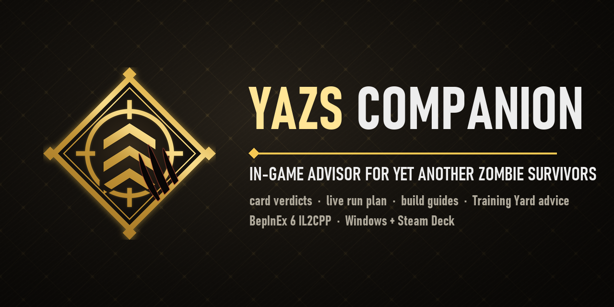

# YAZS Companion — in-game mod (BepInEx 6 IL2CPP)



The mod version of the companion: it runs inside *Yet Another Zombie Survivors*, reads every
selection screen, the squad and the run clock straight from the game's objects, ranks the offered
cards with a C# port of the PC app's rules (`lib/engine.js` → `Ranker.cs`) and draws the verdict
above each card. No OCR, no overlay, no save-file polling. It never writes to the game's saves
and never picks for you.

Status (2026-09-25): **0.12.2 — fixes from a round of Steam Deck logs** (not released yet):
- the rescue (SOS) cards have their RECOMMENDED ribbon and reason line back. The game's patch of 2026-09-23 gave them
  a card class of their own (`UIPowerupButtonSOS`), which the badges did not know: only the gold frame was drawn, and
  every rescue card logged a warning. A card class the mod has never seen now borrows the card's first label (said
  once per class), and at load the log lists the game's card classes (`[badge] card classes: ...`);
- the fifth weapon of every survivor (Grenade Launcher, Super Shotgun, Plasma, Toxic Arrows, Soul Reaper, Syringer,
  Axerangs, Spanner Spammer, Flarebolt) is a THIRD branch of the fork, as the game's data has it (it follows the tier-2
  weapon like the other two tier-3 weapons), not a "final weapon": a build may name it (the editor cycles three
  branches; up to 0.12.1 a build pack naming it was cut back to "decided live"), and the Training Yard no longer
  pushes points into it ahead of rank III abilities while the build takes another branch - the other two branches
  come last. The SWAT's Grenadier and the Tank's Shotgunner presets, written around their fifth weapon, now name it
  as their branch (they were "decided live", so the Training Yard put the guides' weapon first), and no preset text
  promises a second tier-3 weapon after its branch any more;
- two recruits that score the same are ordered the same way on the SOS cards and in the readout's SOS row (the
  guides' rescue tier, then bought synergies, then a fixed class order) - the card used to follow button position;
  a recruit's team passive reads `team passive: +Armor` instead of the game's sentence cut after 41 characters;
- when a level-up offers only the evolution your build does NOT name, the card still comes first and now says why
  (`only X is offered - your build prefers Y; still the biggest spike`), and the readout says `evolve Arrow Rain
  (Downpour preferred)` rather than naming one evolution as if the other were wrong;
- a reroll or a banish that refills the same screen is recognised (`[offer] ... replaced (reroll): gone ...; new ...`)
  and no longer counted as another level-up by the pace estimate;
- NEW: a **reroll hint on the rescue screen** - when a survivor who could still come rates clearly higher than every
  card on offer and the game still has a reroll for the screen, its Reroll button gets a gold frame and a line:
  `REROLL - Tank would rate higher (5.9 vs 4.6)`. A switch on the ADVICE tab (`[Advice] RerollHint`, on by default);
  see "The reroll hint on the rescue screen".
The ranking scores themselves are unchanged; only exact ties between recruits are ordered anew.
**0.12.1 — display names from other mods** (2026-09-23): another mod can lend the names
the Companion SHOWS for a class, a powerup or an item (`RegisterDisplayNames`, extension API version 2). The PLAN
readout, the reasons under the cards, the BUILDS tab and the Training Yard strip draw them; the ranking, the builds
and the `[card]` / `[pick]` log lines keep the game's own names, so the advice is exactly what it was. Nothing
changes while no mod lends names (the pure rule files and the offline bench are untouched). Compiled, and the API
driven through reflection against the built DLL outside the game; not seen in the game yet.
**0.12.0 — extensions** (2026-09-20): other mods can add options of their own to the
mod menu (a fourth tab, MODS, that exists only while one does) and lend build guides per survivor that stand next
to the presets - see "Extensions (for other mods)". Nothing changes while no mod registers anything: the offline
bench prints the same 772 lines before and after. Seen in the game before the release: the MODS tab and a lent
build driving Auto in a run.
**0.10.2 — the readout after the mod menu** (a follow-up to the performance pass, found in the
log of a full run: using the mod menu from the pause menu left the old readout behind under the HUD and brought the
new one up with a search through every label in the scene, a 27 - 28 ms frame; now 4 ms, and nothing is left behind;
nothing you see changes; see "What the mod costs").
**0.10.1 — the performance pass** (nothing you see or read changes; see "What the mod costs").
**0.10.0 — the advice review, build guides and the mod menu.** An independent review of the
ranking (a fresh-eyes audit of the code against a logged run, the game's own data dumped from the running game, and
the published guides re-read and graded) rebuilt it around four things read live: the BUILD you follow per survivor,
the SQUAD's synergy as the run stands, the run CLOCK, and the game MODE - see "How it ranks". A mod menu (a
COMPANION entry in the main menu and the pause menu, or F10; mouse, keyboard and controller) picks a build per
survivor, edits your own, and sets the standing orders of the advice and what the mod draws - see "The mod menu".
The mod has its own artwork now (`art/make_art.py`). Verified in the game: the menu at 3440x1440 and in a real
1280x800 window, real keyboard input, the entry in both menus, the mod menu over a paused run (the pause menu
survives closing it), and the new ranking on a live level-up offer; chests, SOS, military and Research Pod offers
ran through the offline bench and the live plan rows but not yet through a live offer of their own.
**0.9.0 — the motion pass**, see "Motion" below: verified frame by frame on the Training Yard and for the
PLAN readout's entrance and change cue; the card badges' entrance uses the same primitives but has not been seen on a
real selection screen yet. **0.8.0 — Training Yard advice.** On "Train your survivors" the mod numbers the nodes worth
buying with the points on hand (gold diamonds, in purchase order), rings the node to save for next, and prints a
SPEND / THEN / WHY strip under the tree; see "Training Yard advice" below. Checked on all nine tabs at 3440x1440
and in a real 1280x800 window (the Steam Deck's layout and pixels) by a preview walk that opens the Training Yard
from code. **0.7.0 — the PLAN readout gets out of the way.** The user's verdict on 0.6.0: polished, but
"over-opaque/sized - it's blocking essential awareness of surroundings". So the framed, nearly opaque 800-unit
panel at the right edge became a HUD readout in the style of the game's quest tracker: a small gold title over a
fading rule, the rows on a soft dark wash (42 % at most) that dissolves towards the middle of the screen, no
frame; it sits in the empty bottom-left corner under the weapon / ability icons, is only as wide as its text,
shows one row per survivor (`PanelDetail = Compact`), and dims to 70 % when nothing has changed for a few seconds.
Checked with the preview mode over real gameplay frames at the PC's and the Deck's pixels (new: a backdrop image
behind the preview): on the Deck a full squad covers about 22 % x 21 % of the screen, see-through, where 0.6.0
covered up to 30 % x 65 %, opaque. `PanelPosition = Right` and `PanelDetail = Full` bring the old place and the
two-rows-per-survivor plan back. **0.6.0 (2026-09-16) — the design pass: the PLAN sidebar is a framed panel in the game's own style (body,
gold hairline, corner diamonds, header band, label column, hairlines between groups, fade in/out), the card
badges and the restart strip share its palette and primitives (`Ui.cs`), and a preview mode renders the sidebar
on the main menu with sample plans so the look can be checked from screenshots without a run - verified this
way at the PC's and the Deck's pixel sizes. 0.5.5:** card verdicts and the PLAN sidebar working on PC and Steam Deck; auto-update
validated on both.** Deck screenshots of 0.5.2 confirmed the sidebar in play at the enlarged size, gone on the pause
menu, and the scaled badges under the cards; 0.5.3 keeps a long plan above the minimap by shrinking the block (down
to 0.75x) and widens it to 700 units; 0.5.4 makes the plan compact (two lines per survivor, nine lines for a full
squad, see below) and highlights the lines whose advice changed after a pick. A PC run of 0.5.4 captured with the
new debug screenshots (below) confirmed the highlight timing (gold at 0.3 s, mid-fade at 1.5 s, white by 3.5 s),
the gating on the pause menu and the pick transition, and the PC geometry (canvas 5161x2160 at 3440x1440, scale
1.00, the font lacks "›" so ">" is used); 0.5.5 stops the ability line from wrapping (evolution names only from one
level below max) and ships the screenshot flag. The sidebar had appeared only on the results screen in 0.4.1 because it was gated on
`GameplayMaster.IsGameplayUIVisible()`, which the Deck log of 0.5.0 proved to mean "a UI view is showing"
(false during play; true on the pause menu, the selection screens and the results): the diagnostic builds
0.4.2–0.5.1 logged every candidate flag (`[panel] players=1 active=True paused=False pauseMenu=False
defeat=False hudVisible=False selecting=False screen=False hud=True` is play), and 0.5.2 hides the sidebar on
any of `players == 0`, an open selection screen (our tracker or `UIGameplay.IsDisplayingUpgradeSelection()`),
`GameplayMaster.IsPaused`, `IsPauseMenuFlowActive`, `IsDefeatResultsFlowActive` or `IsGameplayUIVisible()`.
The flags are still logged when they change, with `[panel] shown` / `hidden` / `created ... x1.45 canvas WxH
screen WxH`. 0.5.2 also scales the sidebar and the card badges up on small screens (the Deck's 1280x800 gets a
3840x2400 canvas, so a canvas unit is a third of a pixel there). 0.5.0 added the auto-updater and the public
repository; 0.5.1 ranked the Research Pod reward cards, scored chest items against what the squad actually
deals, added a `TAGS` line to the plan and an offline bench.

## The mod menu (0.10.0)

Open it with the **Companion** entry the mod adds to the main menu and to the pause menu (a clone of one of the
game's own buttons, wired into their up / down navigation), or with **F10** (`[Menu] MenuKey`). Mouse, keyboard
(arrows or WASD, Enter, Esc, Q / E for the tabs) and controller (the game's own `UISubmit`, `Cancel`,
`GoNextTab` / `GoPrevTab` actions and the move axes). While it is open the game's menu underneath holds still.

- **BUILDS** - the nine survivors on the left, the builds of the one in focus on the right; select one and the
  advice follows it: its **weapon branch** (one of the three tier-3 weapons), the **order of the abilities** (#1
  is the one to focus), the **evolution** to take when both are offered, its **level-up style**, and what it **wants from items**. `Auto`
  (the default for everyone) fixes nothing and reads the squad instead. Presets are labelled honestly:
  `GUIDE PICK` = a build human guide writers describe, `ALTERNATIVE` = an option read from the game's own data where
  the guides are silent (Medic and Mechanic have ONE build in the guides; their alternatives say so). The footer
  explains the build in focus.
- **MAKE MY OWN BUILD** - copies the selected build and opens the editor: level-up style, weapon branch (any of the
  three tier-3 weapons, or "decided live"), a rank or SKIP per ability, an evolution per ability (or "live"), item
  leanings as toggles, "start over from" any preset. Saved as you change it (`builds.json` next to the DLL; presets stay in the DLL, so
  updates refresh them without touching your own).
- **ADVICE** - the standing orders for every survivor: level-up style for survivors on Auto (weapon first /
  balanced / abilities first), how strongly the run clock moves the advice, whether the game mode steers it, the
  weight of squad synergy, the damage type tag plan (auto-stack / spread / a fixed type), what the run is for
  (win it / balanced / farm progress), caution, what to do with SOS signals late in a run, and (0.12.2) the reroll
  hint on the rescue screen. Stored in the `[Advice]` section of the config file, so they can be hand-edited too.
- **DISPLAY** - what the mod draws: card verdicts, the PLAN readout (size, detail, position, backing, idle
  opacity), Training Yard advice, motion. Next to the settings sits the readout itself (0.11.0): the same widget
  the HUD gets, built with the settings as they stand, in a window of the menu - the menu's canvas has the HUD
  canvas's geometry, so the text has exactly the pixels it will have in play (the caption says how many). It is
  rebuilt on every change, runs through sample plans so the gold change highlight and the settling to the idle
  opacity can be seen, and sits on a stand-in field with bright effects where the readout can be placed.
- **MODS** (0.12.0) - only there while another mod has registered an option (see "Extensions (for other mods)"): a
  header per mod, a sub-header per group, and under them the same left / right rows as on the other tabs. A list
  longer than the tab scrolls with the focus and the mouse wheel. Builds another mod lends show up on the BUILDS
  tab instead, tagged with that mod's title; with more than five cards the row keeps the cards readable and scrolls
  with the focus. A survivor on Auto whose lender names a default reads `Auto: <build>` and the card says `VIA AUTO`.

Every change is written as it is made (BepInEx saves the config file inside the setter; `builds.json` is written by
`Builds`), the header says `SAVED - applies at once` for a moment (or `NOT SAVED` when the file could not be
written), and the log gets a `[config] General.PanelSize = 1.2 (saved)` line. The readout is rebuilt with the new
settings while the game is still paused, so it is there when play resumes. Input is armed only once the click or
key that opened the menu has been released: a double click on the COMPANION button used to land on whatever
control lay under the cursor (a logged run has a build chosen 75 ms after the menu opened), and a frame with a
mouse click never also counts as Submit.

The Training Yard advice follows the selected build as well (its branch, and its ability order in place of the
guides' tiers).

Artwork: the crest, a 5 x 5 atlas of glyphs, a chamfered 9-slice panel, the focus glow and the backdrop are
generated by `art/make_art.py` (Pillow + numpy, supersampled) into `YazsCompanion.Mod/Art`, embedded in the DLL
and decoded by `Art.cs`; portraits and weapon / ability icons are the game's own sprites. `[Debug] PreviewMenu`
walks the menu on the main menu and photographs every screen (with `PreviewResolution = 1280x800` in a real
Deck-sized window); `[Debug] PreviewPause` starts a Quick Run (clicking through the run wizard when it comes up),
plays thirty seconds, pauses, opens the menu over the pause menu, changes the readout's detail and size through
the DISPLAY tab's own controls, closes it, resumes so the log and a screenshot show the readout coming back with
those settings, and puts the settings back - well under fifty seconds of play, so no save is written.

## The PLAN readout (during play)

Since 0.11.0 the ability in a survivor's row is the one the cards will rank first: the readout asks the ranker
(`Ranker.TopAbility`: the next level of every owned ability and the best missing one, by the very scores the cards
get) instead of keeping a rule of its own. Before, "next Minefield" stood in the row for fourteen minutes of a
logged run while the cards ranked Minefield first in none of eighteen offers. An ability of a class rank the
survivor had not reached when the run began (ranks open at class level 20 / 40 / 60 / 80) is not announced: the
game does not offer it.

A HUD readout in the empty bottom-left corner, under the weapon and ability icons (0.7.0; up to 0.6.0 it was a
framed panel at the right edge, which hid too much of the field). It is drawn like the game's quest tracker, not
like a menu panel: a small gold diamond and `PLAN` over a gold rule that fades out, then the rows on a soft dark
wash that is solid only under the text, dissolves towards the middle of the screen and is feathered at the top
and bottom - no frame, no box. Every row has a label column (the survivor's name in bold white, `TAGS` / `SOS` /
`GRAB` in gold) and a value column that wraps under itself, names never breaking across lines. The block is only
as wide as its text (at most 640 units in Compact, 800 in Full), fades in and out (0.25 / 0.15 s), is at full
strength for a few seconds after new advice (a pick, a recruit, coming back from a pause) and then settles at
`PanelIdle` (70 %).

```
◆ PLAN
────────────────────────────── ─ ─  ─
TANK      Pump-Action Shotgun 3/4  ·  Sawblade Drone 2/4
PYRO      Fireaxe 1/4  ·  Molotov 3/4
─────────────────────── ─ ─  ─
TAGS      Kinetic 8/10
SOS       SWAT, Huntress
GRAB      Accumulator, Bleeding Edge
```

**Compact (the default):** one row per survivor with only what to pick next. The weapon item is the level to
finish (`Pump-Action Shotgun 3/4`), or the next tier in gold once the weapon is maxed (`› Rocket Launcher`), or
nothing when the line is complete; the ability item is, in priority order, a maxed ability whose unlocked
evolution is waiting (`evolve Arrow Rain`, gold; `evolve Arrow Rain (Downpour preferred)` when your build or the
squad favours one of the two - either one is the spike of its level-up, and the cards rank whichever the game offers
first), the ability to keep feeding (`Sawblade Drone 2/4`), or the next
ability worth taking (`next Minefield`). `TAGS` shows the highest damage-type tag count and `stack X` only when
the type to stack at the next Research Pod is another one. A full squad is five or six rows.

**Full (`PanelDetail = Full`):** two rows per survivor with a hairline between the groups, as in 0.5.4 - 0.6.0:

```
TANK      Pump-Action Shotgun 3/4 › Rocket Launcher
          Sawblade Drone 2/4  ·  next  Minefield
PYRO      Fireaxe 1/4 › Blowtorch
          Molotov 3/4 › Napalm / Cocktail Party  ·  next  No Pain, No Gain
TAGS      Kinetic 8/10, Slashing 4/10
```

The weapon line shows the current weapon and its next step (gold once the weapon is maxed; `take Shotgun` for a
recruit without one; `next tier locked` / `line complete` at the end of a line). The ability line holds at most
two items in priority order: a maxed ability waiting for its unlocked evolution card (`Minefield 4/4 › Shrapnel /
Taunt`, gold), the ability to keep feeding (with its evolutions once it is one level below max and the Training Yard
unlocked them; earlier the names only made the line wrap), and the next ability worth taking. `TAGS` shows the two
highest tag point counts. A full squad is nine lines.

In both: `SOS` is the two best rescues by the SOS-card rules, exact ties settled as on the cards (hidden with a
full squad); `GRAB` the two best items worth a chest slot (S/A tier or quest target, not held). When a rebuild changes a line (a pick, a recruit, a
Research Pod), that row's value comes back gold and eases to white over `PanelHighlight` seconds (default 3,
0.8 s of it held gold; the block itself never grows or jumps for it); the log names the changed lines (`[plan] ... [changed: Tank.plan]`).
The `›` and `·` glyphs are checked against the HUD font at creation and replaced by `>` and `|` when missing
(`[panel] glyphs: ...`). It is driven by
the HUD's own `UIGameplay.Update`, rebuilds only when the squad state changes (a cheap key of the squad text,
the active quest and the tag points; a rebuild walks every tree node and item), hides while a selection screen,
the pause menu, the results screen or any other game view is up, and dies with the HUD when the run ends.

Config (`[General]`, canvas units; the canvas is 3840 wide on every screen, 2160 tall on 16:9, 2400 on the Deck's
16:10): `ShowPanel`; `PanelPosition` = `BottomLeft` (with `PanelLeft` 44 / `PanelBottom` 70; the block grows up
and to the right and stays under 62 % of the screen height, where the icon column ends) or `Right` (with
`PanelRight` 44 / `PanelTop` 780; the block grows down and to the left, stays above the minimap, and its backing
dissolves to the left); `PanelDetail` = `Compact` / `Full`; `PanelOpacity` (0.42; 0 = text only); `PanelIdle`
(0.7; 1 = never dims); `PanelHighlight`. Every change is logged as a `[plan] 03:31: ...` line; `[panel]
created under UIGameplay using label 'GameTimer_Txt' at (44, 70) x1.45 canvas 3840x2400 screen 1280x800` shows
which HUD text it cloned for the font, the scale and the geometry.

**Size (0.11.0).** The readout follows the screen: its body text is 1.875 % of the screen's height and never
under 15 px - 15 px on the Steam Deck (x1.45, as before), 20 px at 1080p, 27 px at 1440p, 40 px at 4K (x1.31
each; an ultrawide screen counts by its height, like the game's own HUD). Up to 0.10.2 the block was only
enlarged until its text reached 15 px, which left every desktop at x1.00: 21 px at 3440x1440, smaller than the
HUD's own quest text and hard to read from a desk. `PanelSize` (the menu's **Readout size**, 70 % - 200 % in steps
of ten) multiplies the automatic size; `PanelScale`, when set, replaces the automatic part for hand-tuning. A
plan too tall for its corner still shrinks to stay clear of the HUD (`[panel] scale x...` in the log).

## Training Yard advice (0.8.0)

On the Training Yard (`UIViewSkillTree`, "Train your survivors") every tab gets, read-only:

- a **gold diamond with a number** on the top-right corner of each node worth buying with the points on hand, in
  purchase order (the game's own green "can buy" diamond sits on the top-left), and a **hollow gold diamond** on the
  node to save for next;
- a strip in the empty band under the tree, between the legend and the Reset points button:
  `SPEND 9   1 Blowtorch 3>4 · 2 No pain no gain Evolutions 0>1` / `THEN   save 4 more for Rocket Launcher 3>4 ·
  after that Tank <-> Pyro, Bombing Strike` / `WHY   Blowtorch — Levels of the first two weapons are cheap and speed
  up the start.` The WHY row follows the cursor when the node under it is part of the advice, and otherwise says
  where that node stands ("later in the plan (step 14 of 41)", "its rank is still locked", "maxed").

The plan is a port of the PC app's "Spend now" (`lib/engine.js`) without its run-history tailoring (`TreePlan.cs`,
pure): the General tab follows a fixed order (economy, then the strongest multipliers, survivability in between);
a survivor's tab follows a rule sequence - starting abilities to 2 then 3, the cheap first two weapons, the evolutions
of the starting abilities, the main weapon branch (one of the three tier-3 weapons: your build's, else the guides'
branch from `knowledge.json`, else the one levelled most), abilities maxed, rank III abilities, badges and synergies
as their ranks open, rank V passives by impact, then the two other branches for the runs that offer them, then
everything that is left; abilities inside a group go by the guides' tier. The weapon nodes are sorted by the weapon
they boost, not by their column (0.12.2): the fifth weapon's node sits one column further right, and up to 0.12.1
the plan took it for "the final weapon of the line" and put points into it before rank III abilities - on the Deck
it advised exactly that for a Pyro whose build takes Infernax. The walk spends
the points level by level (from level L to L + 1 costs `levelUpCosts[L]`, levels below `levelMin` are free), skips
locked ranks (the node shows its lock) and unmet prerequisites, keeps the first step that does not fit as the thing
to save for and lets leftover points go to cheaper steps further down, like the PC app. `TreeState.cs` reads the
tab on screen (`currentContainer._columns[].nodes[].attachedSkillTreeUpgrade`; kind from the upgrade's class; the
points from the number the view prints, so it is right for the General tab too); `TreeUi.cs` draws (post-fixes on
`UIViewSkillTree.Update` and `OnHighlighted`; recomputed only when the tab, the points or a level changes; logged
as `[yard] Pyro: 9 points; buy 1 Blowtorch 3>4 (4), ...`). The strip enlarges its text to 15 px on small screens
and, where the band is short (the Deck letterboxes this 16:9 view), shrinks to 13 px at most and then says less
(drops the "after that" tail, then the WHY row) rather than let the text get small. `ShowYard = false` turns it off.

`[Debug] PreviewYard = true` opens the Training Yard from the main menu about 6 s after launch
(`UIViewMainMenu.OnClickUpgrades()`), walks the nine tabs with the game's own tab change (`ChangeTabIdx(1)`),
saves `yard1_general` .. `yard9_mechanic` and `yard10_highlight` (the cursor moved onto a node) into the shots
folder and goes back. With `PreviewResolution = 1280x800` the walk runs in a window of that size - the real Deck
layout and pixels - and restores the display mode afterwards (`[preview] yard: display back to ...`).

## Motion (0.9.0)

`Fx.cs` is a small tween runner (ticked once per frame from `GameMaster.Update`, `UIGameplay.Update` and
`UIViewSkillTree.Update`; every tween has its own clock advanced by the frame time capped at 50 ms, so a hitch delays
an entrance instead of swallowing it; unscaled, so it runs on paused selection screens) plus effects made from the
game's own vocabulary:

- **Training Yard:** on a tab change the gold rule draws itself from the left and its diamond spins in, the SPEND /
  THEN / WHY rows type on (TMP `maxVisibleCharacters`, 240 characters a second), and the order diamonds stamp in one
  after the other - 2.3x to 1x with an overshoot and a half turn (the number stays upright), then a **ping**: a
  hollow gold diamond that expands and fades like a sonar ring. Diamond 1 keeps breathing and pings every 2.8 s,
  the hollow "save for" diamond glows slowly, a glint runs along the rule every 6 s. After a purchase only the
  diamonds that changed stamp again, and the rows type again only when SPEND / THEN changed.
- **PLAN readout (during play): only when it matters.** On appearing, the rule draws, the title diamond spins in
  and the groups slide in from the screen edge (0.3 s, staggered); when the advice changes, the title diamond spins
  and pings once while the changed values do their gold-to-white fade. Nothing loops over the field.
- **Cards:** the gold frame settles onto the recommended card (fade + 5 % scale), the RECOMMENDED ribbon unfolds
  from its middle with an overshoot, and its two diamond tips ping.

Fail-safes: with `Motion = false`, or when no tween clock has ticked in the last half second, every element is put
straight into its end pose (nothing can wait, hidden, for a tween that will not run); a step that throws ends its
tween in the end pose. The previews capture the entrances frame by frame (`fxyard0..7`, `fxplan0..4`,
`fxpulse0..3`; captures whose label starts with `fx` may be 50 ms apart).

## What you see in the game

- **The recommended card is framed** with a thin gold line on exactly the rect the game's own orange
  hover frame uses (the card root inset 5 canvas units), with a small gold diamond on each corner.
- **A `RECOMMENDED` ribbon hangs under that card**, diamond-tipped like the game's `NEW` / `UPGRADE`
  label, in the card's own font.
- **Every card gets one reason line** just below it (`2ND   new ability`, `finish the weapon: 2 to 3
  of 4`, `S-tier rescue, 2 synergies with the squad`), grey on the others, warm on the pick, dull red
  when a card is worth avoiding. Scores stay in the log.
- Screens covered: level-up (including the stat cards of Endless level-ups), chest, military training,
  SOS rescue (survivors and Liberate), and the Research Pod reward (damage type tag points).

Placement comes from the card prefab read out of the game's asset files (`tools`-free, see
*How it hooks the game*): every card root is 832 x 1462 canvas units on a 3840 x 2160 canvas, the
game's ribbon overhangs the bottom edge, and about 170 units of free band lie below the card before
the divider line. Everything is parented to the card root, so it rises with a hovered card and
vanishes with the screen. Nothing captures clicks.

Turn the badges off with `ShowBadges = false` in `BepInEx\config\bidoi.yazs.companion.cfg`
(the file appears after the first launch). The log keeps working either way. `BadgeScale` (default 0 =
automatic) enlarges the ribbon and the reason lines on small screens (up to 1.3, so they stay inside the band
under the card; about 1.2 on the Deck, 1.0 on a desktop monitor); the frame is not scaled.

## The reroll hint on the rescue screen (0.12.2)

In a round of Steam Deck logs the rescue cards were rerolled five times on four screens, each time until the
survivor the readout's `SOS` row named came up. So the rescue screen now says when a reroll is worth it:

```
REROLL  -  Tank would rate higher (5.9 vs 4.6)
```

- **When.** The best survivor who could still come rates at least **0.75** above the best card on the table (a
  recruit, or Liberate when the cards rank it first), and the game still has a reroll for the screen. Everyone is
  scored by the very rules of the SOS cards, so the hint, the cards and the readout's `SOS` row always agree. Why
  0.75: early in a run one guide tier apart is 0.5 and one bought synergy 1.1, so a tier alone, a trained level or
  an exact tie stay silent (a reroll is spent for the run, and the next draw may be no better), while a synergy, or a
  tier together with shared damage types, speaks. On the Deck's four screens the gap was 0.96 - 1.29 each time. When
  two survivors clear the margin the line names both (`SWAT or Tank would rate higher`). No hint late in a run,
  when the cards say Liberate anyway (a recruit no longer has the time to grow).
- **Who could still come** follows how the game draws the cards: every survivor unlocked in your profile who is not
  on the squad, not on the cards, and not held back after a reroll (the cards shown before one); where the game's
  own availability check of a survivor's unlock card can be read, it must agree.
- **The reroll count is the game's own** for that screen: the number it hands the screen's action buttons, else the
  number on the Reroll button, else the team's `Rerolls available`; a FREE reroll counts too.
- **Where.** The Reroll button gets the recommended card's gold frame, and the line stands over the button in the
  band between the cards' reason lines and the button - measured on screen 0.6 s after the cards came, never over
  a card's text; when that band is too low it goes under the button, and without room for either only the frame
  shows. Motion only when it appears (the frame settles, the line unfolds from its left tip and types on); nothing
  loops.
- **After a reroll** the screen is judged again (the replaced offer); the pick takes the hint away. It never rerolls
  for you.
- **Off:** the ADVICE tab's "Reroll hint on the rescue screen" (`[Advice] RerollHint = false`).
- **The log**, one line per judgement with the scores:
  `[squad] reroll hint: SHOWN - Tank would rate higher (5.93 vs Huntress 4.64, +1.29) | rerolls 3 (the Reroll
  button's count) | on the cards: Huntress 4.64, Ghost 2.98, Liberate 1.00 | could still come: Tank 5.93, Engineer
  4.03, Ranger 3.78 | margin 0.75, recruit value 1.00`, or `not shown - the best survivor is on the cards ...` /
  `... only 0.60 above the cards - under the 0.75 margin` / `no reroll left (0 ...)`; then where it was drawn
  (`[squad] reroll hint: drawn over the Reroll button - ... band N units ...`).

## How it ranks (0.10.0: the build, the squad, the clock, the mode)

What a card is worth is read live from four things. Every score is logged with its reasons (`[ctx]`, `[card]`), so
a verdict you disagree with can be traced, and the menu or `knowledge.json` adjusted.

**Sources, graded** (2026-09 review). Most "1.0 wikis" for this game are auto-generated and contradict the game's
own data (wrong weapon forks, abilities that do not exist), so they only count where a human source agrees.
*Official*: the Steam patch notes 0.3 - 1.0.1a and developer forum replies (modes, tag rules, item changes).
*Human*: Kudesnik's "0.7 General guide" (Steam id 3345006120), GoldMath's "Synergy Guide" (id 3352985777; the mod
recomputes its counts from the game's own nodes), JHG's achievements guide, the Steam forum threads on builds,
weapons and modes, Destructoid's 1.0 tier list. *Wiki*: yetanotherzombiesurvivors.wiki's tier lists, kept as a weak
prior. The game's own data - damage types, powerup tags, tag points per level, weapon range modifiers, mode masks,
dumped from the running game by `[Debug] Probe` - always wins over any of them. The human guides DISAGREE on
"weapon first" (one goes ability-first for five survivors), which is why the level-up style is yours to set.

- **The build** (mod menu). A selected build ranks its abilities (#1 +1.6, #2 +1.0, #3 +0.5, skipped -2.0), picks
  the weapon branch - one of the three tier-3 weapons (the other two drop to 2.0: the branches exclude each other) -,
  picks the evolution (+1.0 / -0.5, so its pick is on top when both are offered; offered alone, the other one still
  outranks any tier-up and its card says `only X is offered - your build prefers Y`) and sets the level-up style.
  On Auto: the guides' ability tiers (S +1.2, A +0.6, C -0.8), and the branch that shares damage types with the REST of the squad, then your
  Training Yard investment (+0.5 a paid level), then the guides' branch (+0.9).
- **Level-up styles.** Evolutions (7.6 and up), a recruit's first weapon (7.2) and the next weapon tier (6.6) are
  always on top. Below them a weapon level scores `floor + 0.1 x level`: floor 6.0 *weapon
  first* (every weapon level before any ability level), 4.3 *balanced* (default), 3.3 *abilities first*. Abilities:
  a new one 3.6 / 3.1 / 2.4 (fewer than two / up to four / after) - "take each ability once" early beats another
  level of an old one - a level 2.6, +1.0 for the focus ability (the build's highest-ranked open one, else the one
  furthest along), +0.5 for the level that completes it, up to +0.9 toward an unlocked evolution; all soft-capped
  under the weapon-first band so strong abilities keep their order instead of tying. Under *balanced* (0.11.0) the
  first level of an ability the survivor does not have yet is lifted by up to +1.5 while a fresh ability can still
  grow up (`Reach(10)`: the full lift through the first half of a 20:00 run, nothing from about 11:50 on), squeezed
  in under 6.1 so it never passes a tier-up, a recruit's first weapon or an evolution: "each ability once early,
  then the weapon and the focus ability side by side" is now what the scores do - in a logged run the first seven
  level-ups had all gone to the weapon and half the ability slots were still empty at 20:00.
- **The squad, live.** Every level of a weapon or ability adds ONE tag point to each damage type it deals (an
  evolution too, including the types it adds); a point is +2 % for everything dealing that type and the special
  switches on at 10. So a level is worth more the larger the share of the squad's damage that carries its type
  (weapons count 1, abilities 0.5, each scaled by its level; an evolved ability counts once), +0.9 when it carries
  a type over the threshold, +0.3 within three of it. Team passives that are BOUGHT and whose owner is on the squad
  (Grenade / Turret / Trap Expertise, Cold Chain) add +0.5 to every powerup carrying their tag - including the
  evolutions that add one (Helicopter Strike: Chemtrails throws grenades, Automatic Turret: Provocation taunts).
  Bought synergy nodes with the partner on the team +2.0. **Evolutions** are chosen by exactly this: Bombing Strike
  goes Supercharge next to an Engineer and Bioweapon next to a Medic. A type an evolution adds that nobody else on
  the squad deals costs 0.15 (0.11.0): two evolutions that are otherwise level are settled by the tag doctrine
  (stay inside the stacked type), not by card position. A weapon branch's reason names only a damage type that sets
  it apart from the other branch ("shares Kinetic with Bow" said nothing when both branches deal Kinetic); else it
  says the guides or your Training Yard investment decided.
- **The clock** (`Context.cs`). `Reach(n)` = can a plan that needs n more picks of one powerup still finish, from
  the level-up pace of the last three minutes and the time left. It scales a new ability, the pull toward an
  evolution, an unfinished weapon (late, a weapon that cannot be finished falls back to the balanced floor: a
  level-1 bow with ninety seconds left is not a carry) and a recruit. Economy - XP, luck, pickup range, chest and
  upgrade quality, items that grow over the run - is worth x1.5 at the start, x1 a third in, x0.3 near the end;
  cash only ever buys Training Yard levels; survival weighs more as the clock runs, on higher difficulties and
  while the squad is hurting.
- **The mode.** The goal comes from the game (`TimeRequiredForSuccess`: Default 20:00, Hardcore and Boss Rush
  10:00, One Hit 5:00), Extermination counts waves, Endurance and Infinite are open-ended (economy never fades).
  Boss damage x2 in Boss Rush and x1.3 in Endurance; survival x1.25 in Hardcore and nothing in One Hit, where
  crowd control counts x1.6 instead. The game already withholds what is pointless per mode (no health, armor or
  dodge cards in One Hit; no XP, luck or pickup range in Extermination), so the mode only steers what is left.
- **Chests** (`ItemRules.cs`, pure). Guide tier (S +3, A +2, B +1, C -1.5; 59 items tiered, human go-to picks
  added), then the fit: damage types by the squad's share; turret / melee / taunt / deployable / grenade by
  whether the squad OWNS such a powerup (the game's powerup tags, not a class table); Silencer and Dartboard by the
  squad's weapons' own range modifiers; Magazine Clip and Last Round by clip sizes (with no magazine on the squad
  they keep a fifth of their tier and no fit - 0.11.0: Last Round had been RECOMMENDED with the reason "no weapon on
  the squad uses a magazine"); Glass Cannon by an owned Energy Shield. An item about a type the squad does not deal keeps 30 % of its tier; an item that is ONLY about the
  economy follows the clock with its whole tier. Items that grant tag points are judged from the run's live
  points (+1.2 when a +N reaches the special; Ultra Instinct needs a tag at 30 and is judged by what pooling the
  tags gains against the stack and the specials it wipes, -1.5 .. +3.0, no longer a flat +3; One For All is a malus
  on a stacked type), pairs the items name are worth more once the other half is held (Accumulator and the magnet
  items, Golden Key and Silver Padlock, the Parca set), and what your builds want adds +0.5. Malus clauses count
  against the squad; an enemy's malus ("enemy projectiles deal -50 %") does not. A health word in the text of an
  item the game does not flag as healing (Electric Personality's "Healthpaks") no longer keeps an economy item from
  fading with the clock, and an item with a line per squad size (Duct Tape) is scored by the line for the squad as
  it is. +3 for the quest target, -1 for a
  single-slot item already held. The GRAB row only lists what can still drop (`stillAvailableItems`).
- **Research Pod rewards**: 1 + 0.15 per point, +2.5 scaled by the squad's share of that type, +1.0 for the type
  you stack (or the type fixed on the ADVICE tab; nothing with "Spread"), +1.5 when the card reaches the special.
  The reason states the share ("Slashing: 51% of the squad's damage") and says when a card takes a type past 30.
- **SOS**: a recruit is a third gun and +20 % XP for the rest of the run (2.0), plus the guides' rescue tier, +1.1
  per BOUGHT synergy node either way (an unbought node does nothing in a run), shared damage types, team passives
  either way, how trained the recruit is - all scaled by the time a newcomer still has to grow. Liberate: 5 with a
  full squad, else 1.0 rising to 4.2 as that time runs out. Two recruits that score the same (an A-tier rescue with
  a team passive ties an S-tier one once both are fully trained) go by the guides' tier, then bought synergies, then
  the class order - on the cards and in the readout's SOS row alike (0.12.2; the cards used to take the one further
  left, the row the class order).
- **Military training**: `1 + rarity x weight x 2` (Common 1, Rare 2, Endless 2.6, Legendary 3 - the cards' own
  numbers go about 1 : 2 : 3 by rarity; up to 0.10.2 it was 1 / 1.6 / 2 / 2.3, and both times a logged run's player
  overrode the mod it was a Legendary or Rare the mod had under a Common: rarity multiplies the stat instead of
  outvoting it), weights by the card's real asset name, weapon stats scaled by how
  much of the squad's levels are weapons and ability stats likewise, XP / luck / pickup range by the clock, health
  / armor / regeneration by how much survival matters right now, +20 % when a selected build wants it.

Run history is deliberately not used.

### Offline bench

`tools\bench.cmd [path\to\gamedata.json] [--probe path\to\probe.json] [--all]` compiles the pure rule files
(`ItemRules.cs`, `Tags.cs`, `Knowledge.cs`, `Context.cs`, `Synergy.cs`, `Builds.cs`, `BuildPresets.cs`, and since
0.12.2 `TreePlan.cs`) into a console app (`tools\ItemBench`). With a `probe.json` (the `[Debug] Probe` dump; by default next to
`gamedata.json`) it first VALIDATES every preset and kit name against the game's own names - a misspelt evolution
would silently never match - and that a preset's text and its branch agree (a tier-3 weapon its summary names is its
branch; no text promises another tier-3 weapon after it) - then shows the run clock at work (the same items at 02:00 / 10:00 / 18:30), the
modes side by side, which evolution fits which squad and which branch fits the rest of the squad. Since 0.12.2 it
also checks every survivor's weapon fork against the game's data (three tier-3 weapons after the tier-2 one, each
accepted in a build), walks the Training Yard plan of every survivor over the tree in `gamedata.json` (Auto, and a
build on the fifth weapon), and replays the recruit ties and evolution headlines of a round of Steam Deck logs, and
the reroll hint on that round's rescue screens (the four the player rerolled must speak, the offers after the reroll
must not) and on made-up screens for its edges (the margin, ties, no reroll left, late, Liberate on top). It
also scores every item of the game for a few squads, listing the top picks, any item that reaches the `GRAB` threshold (3.0) on keywords alone, the bottom of
the list, and how a Research Pod screen would rank. It reads the PC app's extracted `data\gamedata.json`
(from `tools\extract_gamedata.py` in the project root, outside this repository); pass the path if it lives
elsewhere. Use it before changing a rule or a tier.

## Get it

Fresh install: download the `YazsCompanion-<version>-BepInEx-...-SteamDeck-Windows.zip` from the
[latest release](https://github.com/bidoingg/YazsCompanion/releases/latest) and extract it into the game
folder (steps in the zip's `README-INSTALL.txt`, Steam Deck included). From then on the mod updates itself.

## Auto-update

At every launch the mod fetches `https://github.com/bidoingg/YazsCompanion/releases/latest/download/latest.json`
in the background (`Updater.cs`). If it names a newer version, the DLL is downloaded next to the running one as
`YazsCompanionMod-<version>.dll`, verified against the published SHA-256 and checked to be a managed assembly.
Nothing in use is replaced: BepInEx loads only the highest `[BepInPlugin]` version of a GUID and skips the
others ("because a newer version exists"), so the next launch runs the new file, which deletes the older copies
on load. From the download until that restart a gold strip at the top of the screen reads `YAZS COMPANION
x.y.z DOWNLOADED - RESTART THE GAME TO APPLY` (`Notice.cs`, on its own overlay canvas that survives scene
changes, ticked from `GameMaster.Update`). `knowledge.json` is refreshed with a build's new defaults only if
you never edited it (a hash stamp in `knowledge.json.stamp`; the old file is kept as `.bak`). Config:
`AutoUpdate` (default on) and `UpdateUrl` in `BepInEx\config\bidoi.yazs.companion.cfg`. Offline launches just
skip the check; a bad download is discarded on a hash or assembly check failure. Log lines: `[update] ...`,
`[notice] ...`. Validated on the PC with a local feed and with a real newer build next to the running one;
the Steam Deck (0.5.0 hand-installed) gets its first automatic update with 0.5.1.

## Prerequisites (already done on this machine)

- The Nexus "BepInEx 6 IL2CPP Pack" (6.0.0-be.725) extracted into the game folder
  `J:\SteamLibrary\steamapps\common\Yet Another Zombie Survivors`, launched once so that
  `BepInEx\interop\*.dll` exist (the generated managed views of the game code we compile against).
- .NET SDK 8, installed user-locally (no admin) with Microsoft's `dotnet-install.ps1` into
  `%LOCALAPPDATA%\Microsoft\dotnet`. `build.cmd` puts it on `PATH` for you.

## Build and deploy

```bash
mod\build.cmd
```

That compiles `YazsCompanion.Mod\YazsCompanion.Mod.csproj` (net6.0, matching the .NET 6 runtime
BepInEx ships) and copies `YazsCompanionMod.dll` into `BepInEx\plugins\YazsCompanion\`.
Pass `-p:Deploy=false` to build without copying, `-p:GameDir=...` for another install.
No NuGet packages are needed: it references the BepInEx core and interop DLLs from the game folder.

## Package for Steam Deck / another PC

```bash
mod\package.cmd
```

builds the mod and writes `mod\dist\YazsCompanion-<version>-BepInEx-<build>-SteamDeck-Windows.zip`
(about 53 MB): the exact BepInEx build from this install (core, bundled .NET 6 runtime, `winhttp.dll`,
`doorstop_config.ini`), the Unity base libraries and the interop assemblies already generated for the
current game build (so the Deck needs no download and no slow first launch), `BepInEx\config\BepInEx.cfg`
with the console window turned off, the mod DLL, `knowledge.json`, this README, and a `README-INSTALL.txt`
with the Deck steps. Entry names use forward slashes, so Linux extracts real folders.

Install on the Deck: Desktop Mode, extract the zip into the game folder (Steam > Manage > Browse local
files), set the launch option `WINEDLLOVERRIDES="winhttp=n,b" %command%`, use Proton Experimental or 9+,
launch. `BepInEx/LogOutput.log` proves it loaded. Verified on the user's Deck (Wine 11, SD card path
`S:\steamapps\...`): the card verdicts and the log work as on Windows.

## Publish a release

```bash
mod\release.cmd -Notes "what changed"
```

`release.ps1` refuses to run on an uncommitted tree or an existing tag, builds and deploys, runs `package.ps1`,
copies the DLL to `dist\YazsCompanionMod-<version>.dll`, writes `dist\latest.json` (version, download URL,
SHA-256, zip URL, notes, date), tags `v<version>`, pushes, creates the GitHub release with the three assets, and
copies the zip into the Drive folder. Bump `VERSION` in `Plugin.cs` first; the tag and the feed come from it.
`-Draft` publishes later, `-NoBuild` reuses the build. Load-test the build in the game before releasing: a
build that fails to load leaves every auto-updated install without the mod until the next release.

## Logs

- `BepInEx\plugins\YazsCompanion\companion.log` — only this mod's lines, appended across launches:
  `[offer] LevelUp 03:31 (Normal horde 1)`, `[squad] Tank* L57 Pump-Action Shotgun:4 Sawblade Drone:4 | SWAT L80 ...`,
  `[tags] points: Explosive 7/10, Kinetic 3/10 (special at 10) | deals: Explosive (Rocket Launcher, Minefield),
  Kinetic (Assault Rifle) | stack Explosive`, one `[card] #1 PICK Rocket Launcher (weapon, Tank) 6.40 - next
  step of the weapon line` per card, then `[pick] LevelUp 03:31: Rocket Launcher (#1, the pick)` when the
  screen closes. A screen refilled by a reroll or a banish (0.12.2) says so on its offer line:
  `[offer] LevelUp 01:52 (Normal horde 1) replaced (reroll): gone Molotov Cocktail; new Fireaxe` (the kind comes
  from the game's own flags when it sets them; a replaced level-up is not counted again by the pace estimate).
  A rescue screen adds `[squad] reroll hint: SHOWN - ...` or `not shown - <why>` with the scores on the cards and of
  everyone who could still come (see "The reroll hint on the rescue screen").
  At load, `[badge] card classes: Hashtag, Item, Military, SOS, Skill - all have a label template`; a card class
  the badges do not know is named in a warning (a game build older than the rescue card class says so once, and its
  rescue cards borrow their first label; the other cards are not affected).
- `BepInEx\LogOutput.log` — everything BepInEx logged this launch (overwritten per launch).
- Set `Verbose = true` in the config to also log every raw field of every card and survivor
  (`[raw]` lines) when a verdict looks wrong.
- Set `Screenshots = true` under `[Debug]` in the config to have the game save a PNG of its own frame
  (`BepInEx\plugins\YazsCompanion\shots\HHmmss_fff_<label>.png`, logged as `[shot] ...`) at the moments that matter
  for judging the UI: each offer with its badges (`offer`), each pick (`pick`), the sidebar 0.3 / 1.5 / 3.5 s into
  a change highlight (`hl1`..`hl3`), every show / hide / creation of the sidebar, and one a minute during play
  (`base`). At most 90 per session; a 3440x1440 frame is about 4 MB, a Deck frame about 1 MB. This is how the
  0.5.4 highlight was verified without anyone watching the screen. Off by default; delete the folder afterwards.
- Set `Preview = true` under `[Debug]` to see the sidebar without playing: about 5 s after launch, on the main
  menu, it is built on an overlay canvas with sample plans - two survivors, then a pick's change highlight
  (PNGs at 0.35 / 1.5 / 3.6 s), then a full squad, then the fade-out - and a PNG of each stage goes to the shots
  folder whatever the Screenshots setting (`[preview] ...` and `[panel] layout: ...` log lines mark the stages).
  Put a gameplay frame next to the DLL as `preview_bg_<WIDTH>x<HEIGHT>.jpg` (or `.png`; `preview_bg.jpg` without a
  target resolution) and it is drawn behind the readout at that screen's pixels, so the captures show how much of
  the field the readout hides - the menu art cannot tell. Stages since 0.7.0: `preview_a`, `preview_hl1..3`,
  `preview_squad` (full squad, compact), `preview_idle` (settled at `PanelIdle`), `preview_detail` (Full),
  `preview_fade`.
  `PreviewResolution = 3440x1440` (or `1280x800`) makes those PNGs show the sidebar with the pixels it has on that
  screen even when the game runs on another desktop: the frame is rendered at a whole multiple of the window and
  the block scaled to match, so only the menu art around it differs. This is how 0.6.0 was checked for the PC and
  the Deck from a 1024x768 remote desktop. Off by default.

To disable the mod without uninstalling BepInEx, delete or rename `BepInEx\plugins\YazsCompanion\YazsCompanionMod.dll`.
To disable BepInEx entirely, set `enabled = false` in `doorstop_config.ini` in the game folder.

## What the mod costs (0.10.1: the performance pass)

The rule: during play the mod does nothing per frame beyond a fade and a few time checks, polls cheaply, and does
its heavy work while the game is paused anyway. What 0.10.1 changed to get there - none of it changes what is drawn,
ranked or logged:

- **No object searches during play.** Up to 0.10.0 the upkeep of the COMPANION buttons looked for the main menu and
  the pause menu with `Resources.FindObjectsOfTypeAll` twice every half second - also in the middle of a run, where
  that walks every loaded object - and every frame while the mod menu was open. The menus now report themselves: the
  hold-still prefixes on `UIViewMainMenu.Update` / `UIPauseMenu.Update` run every frame a menu is live, so the view
  they saw within the last three frames is the live one. The search remains as a fenced-in fallback (the main menu
  before its first Update of the session; the pause menu only while the game's `IsPauseMenuFlowActive` is on and its
  Update has never been seen; an explicit open the hooks cannot place). MEASURED with `[Debug] Perf` on the PC, on
  the run-setup screens (no main menu, no run): one search costs about 41 ms - with the search still running there
  twice a second the mod took 4,524 - 4,951 ms of every minute (worst single frame 145 ms); fenced in, 41.7 ms a
  minute (worst 0.14 ms), 0.012 ms a frame. In 0.10.0 two such searches ran every half second of every run.
- **The plan is rebuilt while the game is still paused.** A new plan re-scores every item that can still drop and
  every recruit: 4-5 ms on the PC (measured from the log: `[panel] shown` to `[plan]`), more on the Deck - and it
  ran on the first tick back in play after every pick. It now runs in the `Hide` post-fix, in the second the screen
  takes to animate out, and the tick only puts it up (`Panel.PlanAhead`). If the run moved on in between, the tick
  rebuilds as before.
- **A fingerprint instead of a snapshot every two seconds.** `G.QuickKey()` hashes who is on the squad, every powerup
  and item with its level or count, the tag points and the active quest in a few dozen calls; the full snapshot
  (names, the tree, the tag profile - over a thousand calls into the game) is only taken when it moved.
- **Asset data is read once.** The Training Yard's node list and its split per class (it was walked once per
  recruitable class per plan, 245 nodes a time) and the team passives among them are kept for the run, levels are
  still read live; an item's English text, statistics and carry limit are kept for the session (by item id, checked
  against the name); inside one offer or one plan build (`using (G.Cache())`) names and powerup facts are fetched
  once per object instead of thousands of times (`G.Same` falls back to comparing names).
- **The item rules parse each description once**: the rich-text strip, the clause split and some sixty pattern
  matches per item are kept per description (`ItemRules.Parse`); only the part that depends on the squad and the
  clock runs per score. The offline bench prints the same 753 lines before and after.
- **The first plan of a session is prepared on the main menu.** It cost 170 - 190 ms in the first second of the
  first run of every game session (six sessions in the log; 7 - 9 ms for every later plan): patterns being set up,
  every item text read for the first time, code compiled on first use. Two things: the item rules' 33 patterns are
  no longer `RegexOptions.Compiled` - with each description parsed once, a pattern runs a few hundred times a
  session and compiling cost more than it saved (offline, `tools\bench.cmd --time`: first pass over all items 89 ms
  compiled, 28 ms interpreted; later passes 0.3 - 0.5 ms either way) - and `Warmup.cs` builds two throw-away plans
  on the main menu four seconds after it is up, on separate frames (an empty squad: the GRAB row scores every item,
  ~50 ms; then a stand-in survivor from the game's class data: weapon line, abilities, recruits, ~44 ms). Measured
  with the first step alone: first plan 174 ms -> 70 ms (`plan.build` 133 -> 42 ms, `read` 30 -> 12 ms); with both
  steps, on a real run: 31 ms.
- **Small things**: one per-frame Harmony hook less (the fallback tick on `GameplayMaster.Update` now rides on the
  `GameMaster.Update` hook and only steps in when the HUD's own tick goes quiet), the gating flags are compared as a
  number and only put into words when they change, the gold highlight re-renders only the groups that hold a changed
  row and only when the colour moved, a label is only written to when its text differs, the menu key's name is parsed
  when the setting changes rather than every frame.

`[Debug] Perf = true` measures it on a real run: once a minute a line of the shape
`[perf] 60 s, <frames> frames: tick.hud <calls>x <total> ms (max <worst>) | tick.master ... | refresh ... | read ...
| plan.build ... | offer ... | plan.ahead ...` - calls, total and the worst single call per section (sections nest:
a tick contains the refresh it triggered). `offer` and `plan.ahead` run while the game is paused; `tick.*`,
`refresh`, `read`, `plan.build` and `panel.create` (the readout's widget being made: once a run, and once after
each use of the mod menu) are what play pays; `yard.read` / `yard.advise` / `yard.marks` / `yard.strip` split the
Training Yard's tick (a menu). Taken on the PC (3440x1440, 60 fps) from two scripted
thirty-second runs (`[Debug] PreviewPause`: it presses Start on the team leader screen, takes the recommended card
of every offer, then pauses; one SWAT, so a late three-survivor squad will cost more per poll and per plan):

| what | 0.10.0 | 0.10.1 |
|---|---|---|
| object searches during a run | 2 every 0.5 s, ~41 ms each | none |
| per frame in play (`tick.hud`, without the one-off first tick) | not measured | ~0.011 ms |
| the two-second change poll (`refresh`) | a full snapshot each time | 0.17 ms (14 polls = 2.4 ms) |
| after a pick, back in play: `[panel] shown` -> `[plan]` | 4 - 5 ms (three survivors, from the log) | 2 ms: the plan was built while paused (`plan.ahead` 2.2 ms) |
| first offer of a session, ranked while paused (`offer`) | not measured | 27 ms |
| first plan of a session | 170 - 190 ms | 70 ms with the item warm-up alone; 31 ms with both steps (the real run below) |

And from a real run on the same PC the same day (Normal, 19:49 on the clock, three survivors at the end, 74 offers of
all five kinds, 110 minutes of session, 394,589 frames, no warnings): `tick.hud` 0.0081 ms a frame on average
(3.1 s in all), `tick.master` 0.0087 ms; 622 change polls at 0.21 ms; 70 of the 74 plans came from `plan.ahead`
while the game was paused (2.2 ms on average, worst 52 ms), only 4 were built in play (`plan.build` 4.9 ms on
average); `[panel] shown` -> `[plan]` after a pick: 1 ms median over 53 picks (worst 8 ms); an offer ranked in
5.2 ms on average (worst 25 ms, paused). The three worst frames in play all belonged to the readout being created:
57 ms as the run began, 27 and 28 ms when it came back after the mod menu had been used from the pause menu - each
time with a search through every label in the scene for one to clone. That is what 0.10.2 is about.

### 0.10.2: the readout after the mod menu

Closing the mod menu takes the readout down so it comes back with the display settings and builds as they are now.
Up to 0.10.1 that only *forgot* the old one: every use of the mod menu during a run left an inactive `YazsPlan`
object under the HUD until the run ended, and the new readout was made on the first tick back in play - a label
search over everything loaded, the widget, a full snapshot and a plan, all in one frame of play. Now:

- **The old readout is destroyed** (`Panel.Rebuild` from `Menu.Close`; `Panel.Reset`, from the HUD's `OnDestroy`,
  does the same - the object is dying there anyway, destroying it twice is harmless).
- **The label it was cloned from is kept** across the menu while it still lives under the same HUD, so the new
  readout needs no search at all (`[panel] created ... using label 'GameTimer_Txt' (kept)`) and looks exactly like the
  one before - the search used to come back with 'Quest_Obj1' instead of 'GameTimer_Txt' once a quest was up.
- **The plan is worked out when the menu closes**, while the game is still paused (`plan.ahead`), and only put up on
  the first tick back in play - the same route a pick takes since 0.10.1.
- **`Ui.FindLabel` asks the canvas before it asks the world**: the active labels under the HUD canvas (or the menu
  view) come from `GetComponentsInChildren` on that object; `Resources.FindObjectsOfTypeAll` remains as the fallback
  when it has none, and for the callers without a canvas (the restart notice, the design preview - menus only). Same
  order of preference: the named HUD labels first, then any active label under it.

Measured on the PC with both searches run side by side in the game (a temporary diagnostic, removed again):

| where | the walk under the canvas | the search through everything | label found |
|---|---|---|---|
| HUD, as the run begins | 2.0 - 3.0 ms (first call) | 19.8 ms | the same object, `HUD/CanvasTop/GameTimer_Txt` |
| pause menu (mod menu opening) | 0.15 - 0.48 ms | 19.0 - 20.6 ms | a button caption `Name` each: same font, material, size, spacing (the search picked the caption of the mod's own COMPANION button, the walk picks the first button's) |
| main menu (mod menu opening) | 2.4 ms | 55.3 ms | as above |

And the frame it was about (one survivor; `[Debug] Perf`), from the scripted pause walk and from the same steps done
by hand on the released build (resume, a level-up, pause, COMPANION, close, resume):

| the readout coming back after the mod menu | 0.10.1 (the real run, one survivor) | 0.10.2 |
|---|---|---|
| worst `tick.hud` frame | 26.7 and 28.3 ms | 4.3 ms scripted, 5.3 ms by hand |
| making the widget (`panel.create`) | with the search, ~20 ms | 1.4 - 2.0 ms, no search |
| snapshot + plan in that frame | `read` + `plan.build` 4.9 ms | none: `plan.ahead` 2.4 - 3.8 ms when the menu closed, paused |
| `[panel] created` -> `[plan]` | 7 ms | 1 - 2 ms |
| objects left under the HUD per use of the mod menu | one inactive `YazsPlan` | none |

Still the most expensive frame of a session, and not changed here: the very first readout of the first run, at 00:00
on the clock - `panel.create` 27 ms (code compiled on first use, the backing's textures, the glyph check; less when
the mod menu or the Training Yard was used before, which warms the same code) plus the first plan, 30 ms.

The Training Yard's one slow tick per visit (49 - 58 ms, in a menu) was looked at as well: it is not a search - the
strip clones the view's own description label - but first-use cost spread over everything (`yard.read` 7 ms,
`yard.advise` 8 ms, `yard.marks` 15 ms, `yard.strip` 19 ms on the first tab; 0.5 ms a poll afterwards). Left alone.
The mod menu's own opening (`ReadGameArt`, ~30 ms once a session, and building its shell, ~50 ms) happens over a
paused game or the main menu and was left alone too.

Quick Run sometimes starts the run after the team leader screen and sometimes opens the whole run wizard. Since
0.11.0 the walk clicks through all of it with the game's own handlers (`UIViewChooseHero.OnClickStart`,
`UIViewChooseArena.OnClickStartArena` / `OnClickStartGameMode(button)` - which also continues -,
`UIViewRunSetup.OnClickDifficulty(button)`, then `UIStartGameBar.OnClickStartGame()`), taking what each screen
proposes (the profile's last arena, mode and difficulty; else the game's default; else the first unlocked) - those
choices are stored in the profile, which is why it was left to hands before. Seen in the game: Quick Run to a
running round in 22 s. It still gives up 200 s after pressing Quick Run. The game also opens its pause menu by
itself when its window is not the focused one as the run comes up, as happens after a launch from a script: the
walk resumes once when it sees the pause menu before it asked for it. After closing the mod menu it resumes the
run for five seconds so the log shows the readout coming back (`[panel] created` / `shown`, `[plan]`).

Outside the mod: BepInEx's console window (`[Logging.Console] Enabled = true` in `BepInEx.cfg`, as on the
development PC) makes every log line of every plugin and of the game a synchronous console write; the packaged
zip ships with it off.

## Extensions (for other mods)

Since 0.12.0 another BepInEx plugin can put options into the mod menu and lend build guides; since 0.12.1 it can
also lend the names the Companion shows. The one public class is `YazsCompanion.Api.Extensions`
(`Api/Extensions.cs`); its signatures use BCL types only, so it is called through reflection, without a reference to
this DLL (a plugin that referenced it would not load where the Companion is missing). Nothing changes for anyone
while nothing is registered.

```csharp
public static int  ApiVersion { get; }      // 2 (0.12.1); 1 = 0.12.0, which has the first three calls below
public static void RegisterOption(string owner, string group, string label, string description,
                                  Func<string[]> choices, Func<int> get, Action<int> set);
public static void RegisterBuildProvider(string owner, Func<string, string> buildPackPathForClass);
public static void RegisterDisplayNames(string owner, Func<string, string, string> nameFor);   // 2
public static void InvalidateDisplayNames();                                                   // 2
public static void Unregister(string owner);
```

- **`RegisterOption`** adds a row to the **MODS** tab: `owner` is your mod's display name (the section header),
  `group` a sub-header under it (may be empty), `description` the footer text while the row has the focus.
  `choices()` is asked every time the row is drawn or changed, so the list may change at run time; `get()` is the
  index shown; `set(index)` is called when the player changes the value - save it there. The menu then reads
  `get()` again (for every MODS row: one option may move another) and shows `SAVED - applies at once`, or
  `NOT SAVED` when `set` threw. The same owner + group + label again replaces the row in place.
- **`RegisterBuildProvider`** lends builds. The function is asked with a survivor's name as `builds.json` has it -
  `SWAT`, `Tank`, `Engineer`, `Huntress`, `Ghost` (the class the game's code calls Ninja), `Medic`, `Pyro`,
  `Mechanic`, `Ranger` - and answers the full path of a build pack file, or `null` for "none right now". It is asked
  whenever a survivor's build is resolved (an answer stands for one second: the ranking asks dozens of times per
  offer) and every time the BUILDS tab is drawn or a MODS option changes, so the answer may change at run time.
  Files are parsed once per path and write time. One provider per owner.
- **`RegisterDisplayNames`** lends the names the Companion SHOWS - in the PLAN readout (survivor labels, weapons,
  abilities, evolutions, SOS and GRAB rows), the reasons under the cards, the BUILDS tab (survivors, branches,
  abilities, evolutions, skips, summaries) and the Training Yard strip. `nameFor(kind, key)` answers the name to show,
  or `null` for the game's own:

  | kind | key |
  | --- | --- |
  | `"class"` | the game's class enum name: `SWAT`, `Tank`, `Engineer`, `Huntress`, `Ninja` (the class shown as Ghost), `Medic`, `Pyro`, `Mechanic`, `Ranger` |
  | `"powerup"` | the powerup's asset name (`PowerupBase.name`, e.g. `KatanaUpgrade`) - weapons, abilities, evolutions |
  | `"item"` | the item's asset name (`ItemBase.name`, e.g. `Item_BloodyAxe`); answering `null` for every item is fine |

  Only what is drawn changes: the ranking, the builds (`builds.json` and build packs still name things by their
  English names), the plan's keys and the `[card]` / `[pick]` / `[yard]` log lines keep the game's names, so the
  advice is the same whatever is shown (the `[plan]` log line records the readout as drawn). Names are plain text:
  markup and line breaks are dropped, an empty answer counts as `null`. Where a sentence of the rules names a game
  name ("first weapon for Ghost", "then Katana Splash"), whole words in the game's spelling are swapped; a longer
  game name you did not rename stays whole even when it contains one you did. Every answer is kept - per class,
  powerup and item, until the run ends, a new one starts or the mod menu closes - so `nameFor` is asked about once
  per name and run, always on the game's main thread, and must be quick. Several mods may lend names: they are asked
  in the order they registered and the first answer that is not `null` wins. One function per owner: a second call
  replaces it and keeps its place.
- **`InvalidateDisplayNames`** says your answers changed (another look chosen in your options, say): everything kept
  is asked again, and the PLAN readout on screen is redrawn within two seconds. Cheap; any thread.
- **`Unregister`** takes back everything the owner registered, display names included.
- A call never throws back at you, and your callbacks may throw: each failure is caught and logged once (`[ext]`
  lines; `[builds]` for the pack files). Registrations may come before or after the Companion's own `Load()`, while
  the menu is open, from any thread. Declare the soft dependency below so that the Companion's assembly is loaded
  before your `Load()` looks for it.

```csharp
[BepInPlugin("my.mod", "My Mod", "1.0.0")]
[BepInDependency("bidoi.yazs.companion", BepInDependency.DependencyFlags.SoftDependency)]   // load after it, when it is there
public class MyMod : BasePlugin
{
    static Type _companion;
    bool Companion(string method, params object[] args)
    {
        try
        {
            if (_companion == null)
                foreach (var asm in AppDomain.CurrentDomain.GetAssemblies())
                    if ((_companion = asm.GetType("YazsCompanion.Api.Extensions", false)) != null) break;
            if (_companion == null) return false;                   // no Companion, or one older than 0.12.0
            _companion.GetMethod(method).Invoke(null, args);
            return true;
        }
        catch (Exception e) { Log.LogWarning("YAZS Companion: " + e.Message); return false; }
    }

    public override void Load()
    {
        var style = Config.Bind("Ghost", "BladeStyle", 0, "0 = Classic, 1 = Wind");
        Companion("RegisterOption", "My Mod", "Ghost", "Blade style", "Which moveset the blade uses.",
            (Func<string[]>)(() => new[] { "Classic", "Wind" }),
            (Func<int>)(() => style.Value),
            (Action<int>)(i => style.Value = i));                   // BepInEx saves inside the setter
        string dir = Path.GetDirectoryName(Assembly.GetExecutingAssembly().Location);
        Companion("RegisterBuildProvider", "My Mod",
            (Func<string, string>)(survivor => survivor == "Ghost" ? Path.Combine(dir, "ghost-builds.json") : null));
        // ApiVersion 2 and later: what the Companion shows for the class and its blade (null = the game's own name)
        Companion("RegisterDisplayNames", "My Mod", (Func<string, string, string>)((kind, key) =>
            kind == "class" && key == "Ninja" ? "Shade" : kind == "powerup" && key == "KatanaUpgrade" ? "Moonblade" : null));
    }
}
```

Check `ApiVersion` (a static property: `_companion.GetProperty("ApiVersion").GetValue(null)`) before calling
`RegisterDisplayNames` - a 0.12.0 Companion has no such method (the helper above would log a warning and return false).

**A build pack** is a JSON file for ONE survivor: `"builds"` holds the same objects as `"custom"` in `builds.json`
(comments and trailing commas are fine), plus two optional keys:

| key | |
| --- | --- |
| `title` | shown on the cards of these builds (where a preset says GUIDE PICK / ALTERNATIVE) and in the header over them; default: the owner |
| `default` | the `id` or `name` of the build that **Auto** follows for this survivor while the pack is lent; without it Auto stays Auto |
| `builds[].id` | your own id, used for `default` and kept in `builds.json` as `ext:<owner>:<id>` when the player selects the build |
| `builds[].name`, `summary` | the card's title, and the footer text while the card has the focus |
| `builds[].glyph` | card art, one of `crosshair bullets blast flame bolt snow flask blade turret shield cross paw gear magnet chevrons clock skull link coin heart hash radio eye diamond up` |
| `builds[].style` | `Weapon` (every weapon level first), `Balanced` or `Ability` (abilities first) |
| `builds[].branch` | the weapon branch - any of the survivor's three tier-3 weapons, by its English name; `""` = decided live |
| `builds[].abilities` | priority order, the first is the ability to focus; abilities left out come after these |
| `builds[].skip` | abilities the build does not want |
| `builds[].evolution` | ability -> the evolution to take when both are offered (`"Kunai Dance: Microbombs"`, or just `"Microbombs"`); an ability left out is decided live |
| `builds[].wants` | item leanings: `weapons abilities critical armor healing slow turret melee`, other `ItemRules` tags, damage types |

Names are the game's English names, as in `Builds.Kits` (`Builds.cs`); they are checked against the survivor's kit
when the file is read, and what does not fit is dropped and named in the log - a misspelt name would otherwise
silently never match. For Ghost (weapon line Katana, Katana Splash, then Thousand Cuts, Windcutter OR Soul Reaper;
abilities Pulsar, Shuriken, Holo-bait, Kunai Dance):

```json
{
  "title": "My Mod",
  "default": "gale",
  "builds": [
    {
      "id": "gale",
      "name": "Gale",
      "summary": "Weapon first: the katana line into Windcutter, Pulsar as the ability to focus.",
      "glyph": "up",
      "style": "Weapon",
      "branch": "Windcutter",
      "abilities": [ "Pulsar", "Shuriken", "Holo-bait", "Kunai Dance" ],
      "skip": [],
      "wants": [ "weapons", "critical", "Slashing" ],
      "evolution": { "Pulsar": "Pulsar: Unstoppable" }
    },
    {
      "id": "bomber",
      "name": "Kunai Bomber",
      "summary": "Abilities first: Kunai Dance to its last level, then Microbombs; the blade fills in.",
      "glyph": "blast",
      "style": "Ability",
      "branch": "",
      "abilities": [ "Kunai Dance", "Shuriken", "Pulsar", "Holo-bait" ],
      "skip": [],
      "wants": [ "abilities", "Explosive", "Slashing" ],
      "evolution": { "Kunai Dance": "Kunai Dance: Microbombs" }
    }
  ]
}
```

Lent builds are listed on the BUILDS tab after the presets, selected and saved like any of them, and followed
through the same `Build` object as a preset - the ranking, the PLAN readout and the Training Yard advice have no
code of their own for them. When the pack goes away (the provider answers `null`, or the mod unregisters) a
survivor that followed one of its builds reads as Auto again, without a word; `builds.json` keeps the selection, so
it is back in force when the pack returns. `[Debug] PreviewMenu` photographs the MODS tab too while there is one.

## How it hooks the game

The game code is not obfuscated. The selection screens are `UIGameplayLevelUp`, `UIGameplayChestOpened`,
`UIGameplayMilitaryTraining`, `UIGameplayHashtagEvent` (the Research Pod reward) and `UIGameplayCharacterRescue`
(SOS), all deriving from `UIGameplayUpgradeSelection`. Each overrides `AssignGeneratedElements()`, which fills
the `powerupButtons` array; the mod post-fixes each override, reads `attachedPowerup` / `attachedItem` /
`attachedHashtagEvent` from every active button, ranks, and draws. The base `Hide(clicked)` runs once per screen
for every type and is the pick event. The rescue screen's `SetActionButtonsInteractivity(numRerolls, numBanishes)`
is post-fixed too: the reroll count the game hands it is the one the reroll hint trusts first. Squad state comes from `GameplayMaster.s_instance.gamePlayers` (the game
stores every survivor's powerups on the leader's player object; they are regrouped by
`targetClassProperties.characterType`), the Training Yard from the nodes reachable through each powerup
(`skillTreeRequirement`, `skillTreeAbilityBoost`) and each class's `skillTreeSynergies`, the run clock from
`currentGameMode`, the damage types from each powerup's `hashtagTypes` and the tag points from
`GameplayMaster.hashtagSystem` (`GetNumType`, `NumRequiredForSpecial`). The sidebar ticks from a post-fix on
`UIGameplay.Update` (the HUD object that owns the gameplay canvas, confirmed in the scene file `level2`: a
GameObject named `UIGameplay` with a Canvas, four `Ability_0n` slots per survivor) and forgets its objects on
`UIGameplay.OnDestroy`. The game's own auto-pick lives in `GameOptions.AutoselectionModes` (Off / On / Skip /
Liberate per category), which a later version could drive with this ranking.

Every patch is a post-fix that only reads state, so a game update that renames a member breaks the build
(compile error), not the game.

## Layout

```
mod/                              (the GitHub repository bidoingg/YazsCompanion is this folder)
  build.cmd                       build + deploy
  package.cmd / package.ps1       Steam Deck / Windows zip with BepInEx bundled
  release.cmd / release.ps1       tag + GitHub release + latest.json for the auto-updater + Drive copy
  tools/bench.cmd, tools/ItemBench/   offline bench: preset validation, clock / mode / evolution / branch scenarios, item scores
  art/make_art.py, art/banner.png     the artwork generator (Pillow + numpy) and the repository banner
  YazsCompanion.Mod/
    YazsCompanion.Mod.csproj      references BepInEx\core + BepInEx\interop from the game folder
    Plugin.cs                     BepInEx entry point, config, Harmony bootstrap, per-mod log file
    Advisor.cs                    Harmony patches; collects the cards, ranks, draws, logs offers and picks
    GameState.cs                  live squad / clock / Training Yard / damage-tag readers over the IL2CPP objects
    Ranker.cs                     the ranking rules: the build, the squad, the clock, the mode
    Context.cs                    the run context (mode, clock, pace, health), the player's doctrine, the timing curves (pure)
    Synergy.cs                    tag value of a level, team-passive boosts, evolution and branch fit, the recruit order, the reroll call (pure)
    Builds.cs / BuildPresets.cs   the build model, the nine kits, builds.json, build packs lent by other mods; the presets and where each comes from (pure)
    Knowledge.cs                  guide-derived tiers, item pairs, scaling items, stat weights; knowledge.json
    ItemRules.cs                  the pure item score: exact squad fit, the clock, live tag points, pairs, build leanings
    Tags.cs                       damage type tag profile of the squad and the Research Pod card score (pure)
    Menu.cs                       the mod menu: builds, editor, advice, display, other mods' options; its own focus and input; the COMPANION buttons
    Api/Extensions.cs             the one public class: other mods register menu options, lend build packs and display names (reflection-friendly)
    Names.cs                      the names drawn for classes / powerups / items: lent by another mod, else the game's; the rules never see them
    Art.cs + Art/                 the embedded artwork (crest, glyph atlas, 9-slice panel, glow, backdrop) as sprites
    Probe.cs                      [Debug] Probe: dumps items, powerups, input actions and the menu layout to probe.json
    Perf.cs                       [Debug] Perf: times the mod's own sections and logs the sums once a minute
    Warmup.cs                     two throw-away plans on the main menu, so a session's first plan is not built cold in the run
    Fx.cs                         motion: the tween runner and the effects (stamp-in, ping, rule draw, type-on, spin, glint)
    Ui.cs                         the shared look (Theme: the game's gold, panel body, hairlines) and uGUI primitives
    Badge.cs                      gold frame on the game's selection rect, RECOMMENDED ribbon, reason line
    RerollHint.cs                 the reroll hint on the rescue screen: who could still come, the game's reroll count, frame + line (0.12.2)
    Plan.cs                       the run plan, Compact or Full (keyed rows with label / value / group; sample plans for the preview)
    Panel.cs                      the PLAN readout during play (soft backing, corner placement, text-hugging width, fade, idle dimming, highlight)
    TreePlan.cs                   Training Yard advice, pure: node model, the General order, the survivor rules, simulate / advise
    TreeState.cs                  reads the Training Yard tab on screen into TNode values
    TreeUi.cs                     the order diamonds on the nodes and the SPEND / THEN / WHY strip under the tree
    Preview.cs                    the design previews (config [Debug] Preview / PreviewYard / PreviewResolution)
    Updater.cs                    release-feed check, hash-verified download next to the running DLL, old-build cleanup
    Notice.cs                     the "restart to apply" strip on its own overlay canvas
    Shots.cs                      debug screenshots of the game frame at UI moments (config [Debug] Screenshots)
    Describe.cs                   verbose raw-field dump (config Verbose)
```

## Next steps

1. Play 0.10.0 and judge it: the new default level-up style (Balanced; ADVICE tab puts "weapon first" back), the
   card headlines, a build selected for the leader. With `[Debug] Screenshots = true` a run leaves the offers on disk.
2. Still unseen on a live offer of their own: chests, SOS (Liberate late), military training and Research Pod cards
   under the new rules, and an evolution offer with both cards up (the `[card]` lines carry the reasons).
3. Controller input in the menu was built against the game's own action names but only the keyboard was driven in
   a test; check it on the Deck (the pad uses `GameMaster.GetButtonDown("UISubmit" / "Cancel" / "GoNextTab")`).
4. Item tiers cover 59 of 136 items; the rest score on fit alone. Boss Rush's item pool mask is not understood yet.
5. Later: a cycle key for the readout (hidden / compact / full), run history in-process, optional autoselect.
6. 0.12.0's extension point has only been driven outside the game (reflection against the built DLL, the pack
   parser in a console): see the MODS tab and a lent build with a real second plugin - four tabs in the header, the
   rows with mouse / keyboard / controller, a list long enough to scroll, six or more build cards, `VIA AUTO`.
7. 0.12.1's display names have only been driven outside the game: see them with a second plugin that lends names -
   the readout's rows and a label longer than HUNTRESS (the label column widens), the card reasons, the BUILDS tab,
   the Training Yard strip, a switch of names mid-run (`InvalidateDisplayNames`), and `[card]` lines unchanged.
8. 0.12.2: see a rescue offer with `[Debug] Screenshots = true` - the ribbon and the reason line on the new SOS card
   class (its root size and the new synergy row under the portrait were never measured: ribbon centre at -48, reason
   at -134 below the card), a reroll and a banish (`replaced (reroll)` / `replaced (banish)`), and one Training Yard
   tab per survivor with a build on each kind of branch.
9. 0.12.2's reroll hint was built and replayed offline (the bench) but not seen in the game: on a rescue screen with a
   better survivor off the cards, check the frame on the Reroll button, the line in the band over it (or under it -
   the `drawn ...` line says which and how tall the band was), that it never covers a card's text, that it is judged
   again after a reroll and gone after the pick, and which reroll count the log names (`the screen's count` = the
   game's own hook answered).
