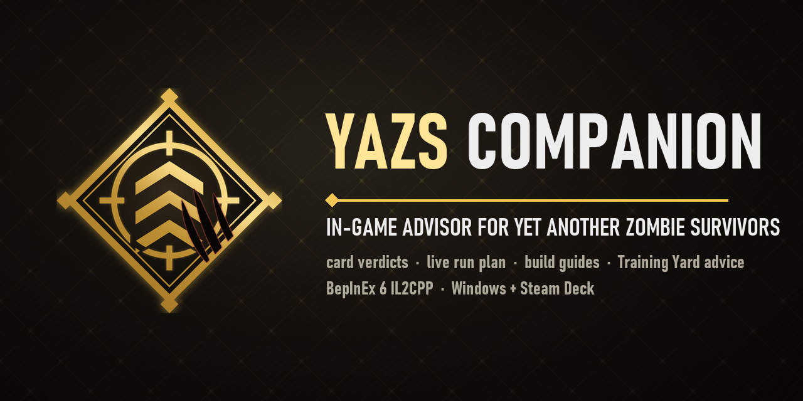

# YAZS Companion — in-game mod (BepInEx 6 IL2CPP)



The mod version of the companion: it runs inside *Yet Another Zombie Survivors*, reads every
selection screen, the squad and the run clock straight from the game's objects, ranks the offered
cards with a C# port of the PC app's rules (`lib/engine.js` → `Ranker.cs`) and draws the verdict
above each card. No OCR, no overlay, no save-file polling. It never writes to the game's saves
and never picks for you - the one exception is yours to switch on: the one-click EQUIP ADVICE button of the run setup
screen (0.13.0, off by default) presses the game's own badge buttons when you click it, as your own clicks would.

Status (2026-10-05): **0.14.0** (released 2026-10-05) - the review of a live run:
- **the reason under a card keeps its `>`**: an ability's level step was logged as `focus 2>3 of 4` and drawn as
  `focus 23 of 4` - the line passed a filter that dropped both angle brackets, on about a quarter of all card lines
  since 0.10.0. The filter now drops only `<` (the one that opens a text tag), and the step reads `2 to 3 of 4`, like
  the weapon line;
- **the reason under a card in plain words**. The card drew the ranking's own headline, written for the log (`focus
  2>3 of 4 toward its evolution - #2 in Rifleman`, `Endless: Ability Size - Rifleman (Auto) wants it`, `B-tier item`);
  it now says what the pick does and why, in the game's words, every number with what it counts, in 50 characters at
  most: `Level 3 of 4 - evolution unlocks at level 4`, `The Rifleman build's main ability`, `The Rifleman build wants
  ability area`, `Mixed: boosts Ice, weakens Kinetic and Explosive`, `Unlocked synergy with Medic - A-tier in the
  guides`, `Turns on the Ice 10-tag effect`. Each line is measured as it will be drawn - beside its `2ND` / `AVOID`, and
  with the names another mod lends (they run up to 19 characters longer than the game's) - and two cards of one offer
  never draw the same line: the lower one says its next reason. The `[card]` log lines keep the headline as before; a
  new `[shown]` line logs what was drawn. With it: the RECOMMENDED ribbon steps aside while the game shows its own
  `Skill Tree 3 / 5` label under the hovered card; the reason line follows the card's own scale (about 13 px on the Steam Deck, 12 before); the
  reroll hint says `REROLL - Tank would fit this squad better` (the scores stay in the log); SELECT LOADOUT says
  `level 2 · score 6.8`, `replaces Thunder (+17 score)`, `Hardcore: survival picks count 31% more`, `+20% Kinetic, +2
  Kinetic tags`; the PLAN readout says `next Pod: Explosive` and `max tier`, draws `»` where its font lacks `›`, and orders
  a survivor's row the way the cards will rank it (`Handgun later` while the abilities come first); the DISPLAY tab
  explains `TAGS` / `SOS` / `GRAB`;
- **Endless stat cards are weighed by what they give**. The Endless cards of a level-up are the game's filler (Ability
  Area +2.5 % where the Common card gives +10 %), but they were scored like a near-Legendary (x2.6) and came first over
  the build's own abilities: in a logged run `Zone of Action` 6.07 over `Experiment 21` 4.72 (the player took the
  ability), and the player overrode 8 of the 13 such offers in the logs. An Endless card now counts its own value
  against the Common card of its stat (a quarter to a half; 0.4 when it cannot be read) - that card scores 1.49.
  Common, Rare and Legendary are unchanged; two Endless cards of different stats may swap places. The log gives the
  weight once per stat: `[rank] Endless stat cards: weight x0.25 for Ability Size (the card's own +0.025 vs Common +0.1)`;
- **a class rank reached mid-run no longer opens an ability**. Abilities of a class rank (II at class level 20, III at
  40, ...) come only if the survivor had the rank when the run began, and the class level climbs during a run: once it
  passed 40 the readout named a rank III ability as `next` for the rest of the run (`next Resuscitation` on a Medic
  that started at 37 - the card never came in eleven offers), and "abilities first" lost its weapon lift with it. The
  level a survivor had at its first sight in a run now counts until the next run;
- **`AVOID` in words**: a card scored under 1 said so only by the dull red of its line; it now reads `AVOID   ...` in
  place of its `2ND` / `3RD` (the colour stays as the second cue) - its reason keeps 48 of the 56 characters the Steam
  Deck shows;
- **companion.log is rotated**: at load, a log over 4 MB moves to `companion.log.1` (the older copies to `.2` and
  `.3`, three kept) and a fresh one begins with the session header; the line after it says so (`[log] the log was
  8.4 MB: moved to companion.log.1 ...`);
- the `an active quest (...) and no forced badge on the screen ... (worth a look)` note is a `[Logging] Verbose` line
  now - it came on every quest's first setup visit, and most quests have no badge objective;
- **the active quest steers the cards** (`QuestRules.cs`). A quest asks more than a team size: a weapon finished at
  max level, an ability or an evolution held at the end, a health item, kills with one survivor, tag points, Rare
  trainings, armor - or that something is NOT taken. Up to 0.13.0 all of it was logged `advice unchanged`: in a logged
  run under the Engineer's *Heroic Theory* (finish with the tier-3 weapon at max level in hand, 2000 kills with the
  Engineer) the Taser came last of three on every offer under an "abilities first" build, and the player took it
  against the advice. Now what the quest asks for comes first with a `Quest: ...` line under the card - `Quest: leads
  to the tier-3 weapon (Level 2 of 4)` on the Taser and the Tesla, `Quest: max the tier-3 weapon (Level 2 of 4)` on the
  tier-3 weapon itself, over the abilities (under evolutions and a recruit's first weapon), `Quest: hold a health item
  (0 of 1)` (+2.0 until one is held), `Quest: Electric tags to 40 (22 now)`; a pick that would fail it reads AVOID
  (`Quest: any Pyro ability fails it`, `Quest: taking any item fails it`, a tier-3 branch the quest does not count);
  kills with a survivor and the like weigh a little and never pass the build's own core abilities. The build and its tag plan stay. The PLAN readout gets a `QUEST` row while a rule changes something
  (`QUEST  Taser to tier 3, max level · Engineer kills to 2000`). A new ADVICE-tab row, **The active quest**
  (`[Advice] QuestSteer`: On by default / Info only - the row and the log, no card moves / Off).
- **WHY on highlight and CLOSE CALL** (`WhyText.cs`, `WhyUi.cs`). A card's line says one thing; while a card is
  selected (the mouse over it, or the controller's focus on it) a band under the cards says the rest of its verdict in
  plain words - up to four more reasons, and what the first card has that puts it first (`WHY  Medical Drone goes
  first: A core ability of the Rifleman build  /  The Rifleman build levels abilities first  /  Kinetic is 100% of your
  damage`); when the first two cards are less than 0.20 apart both say `CLOSE CALL` (`CLOSE CALL  Either works -
  Medical Drone is a hair ahead`). On a card a quest decided the quest comes first and the build's own order is not
  argued against it. It goes with the selection; the DISPLAY tab's **WHY band on the selected card** row (`[General]
  ShowWhy`) switches it.
- **action hints on every selection screen** (`ScreenCall.cs`). The rescue screen's reroll hint, generalised: a chest,
  a level-up, a training or a Research Pod whose best card is weak for the screen says `REROLL  -  the best card here
  is weak for this squad` over the Reroll button (`(2 rerolls left)` when few are) - a chest under 2.5 on the cards'
  own scale (the user rerolled such chests by hand; at 3.0 the hint would have spoken on 70 of the 147 logged chests,
  65 of them taken as offered); `SKIP` when every card would hurt the squad or the skip's cash and heal are worth more;
  `BANISH` for a card the build skips (off by default: a banish is for the whole run; never the recommended card). One
  hint at most per screen, never a pressed button. On the Skip button, next to the team panel, the line grows to the
  left. Banishes are logged now (`[pick] ... banish on X`). `[Advice] ActionHints` (Reroll, Skip by default - off when an
  older cfg had the rescue screen's `RerollHint` off); the ADVICE tab's reroll row became **Hints on the selection
  screens** (Reroll and skip / + banish / Rescue screen only / Off). One band manager (`ScreenBand.cs`) places the
  hint's line and the WHY band so neither covers the other, a card's text, a button or the game's divider over the
  buttons.
- **menus fill wide and tall screens** (`WideMenus.cs`). On a screen that is not 16:9 - a 21:9 or 32:9 monitor, the
  Steam Deck's 16:10 - the game frames its menus in black bars; they are gone, and each menu's own dark backdrop
  reaches the screen's edges: in a run (level-up, chest, rescue, training, Research Pod, pause, results) and on the
  main menu and in the camp. **On by default** (`[General] WideMenus` = `Everywhere`; `DuringRuns`; `Off`), a row on
  the DISPLAY tab (**Menus on wide screens**). The end credits keep the frame, and so does the main menu past about
  2.65:1 (wider than its art). Every element is checked against the game's own layout first, every change is undone
  when the setting goes off or the screen changes, and `[wide]` lines say what was done. Nothing changes at 16:9.

**0.13.0 — badge advice on the run setup screen** (2026-10-04):
- NEW: **badge advice on the SELECT LOADOUT screen** (difficulty and badges). The badges worth equipping for the team
  leader, the build, the mode, the difficulty and the standing orders you picked are numbered on the game's own badge
  buttons (gold diamonds, 1 = most worth it), equipped badges the advice would swap out are marked, a WHY line explains
  the badge under the cursor (mouse and pad), and a summary under CHOSEN BADGES lists what to equip and what to swap
  out. A **BADGES page** in the mod menu (BUILDS tab) previews it for every survivor, mode and difficulty, lets your own
  build pin or never-advise badges, and holds the settings (`[Advice] LoadoutHint`, `[General] LoadoutSize`). An
  optional one-click **EQUIP ADVICE** button presses the game's own badge buttons along the advice (removes first, then
  adds, never a quest's or a locked badge; UNDO until the screen closes) - **off by default** (`[Advice] LoadoutEquip`;
  mouse / touch, no key unless you set `[Advice] LoadoutEquipKey`): unless you switch it on and click it, the mod still
  never touches your loadout. Build packs may carry `badges` / `skipBadges` (extension API 3). See "Badge advice on the
  run setup screen";
- NEW: **the active quest's team rules on the rescue screen**. A quest can limit the team - "Team Size" of the
  Huntress's *Readjust* wants the leader alone (survivors == 1), the Ghost's third quest exactly Ghost + Huntress, two
  others a full team - and up to now the rescue cards knew none of it: in a logged run the cards ranked a survivor first
  on six of seven rescue screens and the reroll hint invited three rerolls, while the quest wanted no recruit at all.
  The quest's objectives are read once a run (`[quest] ...` in the log); at the quest's limit Liberate comes first
  (`quest: stay solo - take the level-up and cash`) and every recruit last (`quest: stay solo - Tank would fail it`),
  the reroll hint stays away and the readout's row reads `SOS  quest: stay solo`; a class the quest needs comes first
  (`quest: needs Huntress`; the reroll hint speaks for it alone, `REROLL - the quest needs Huntress`) while Liberate
  keeps its slot; a quest that wants a full team keeps Liberate under every recruit (late in a run the row then reads
  `SOS  Tank, SWAT · quest: full team`). Other objectives (survive, kills, weapons at the end ...) are logged and leave
  the advice as it was;
- **"abilities first" lets the weapon in**: its weapon levels sat on a floor (3.3) under every other survivor's ability
  levels, so once recruits had joined the weapon never "filled in" - in a logged run the leader's weapon (a lent
  Ability-style build on Auto) ranked last all run and was taken against the advice nine times. Now, once the
  survivor's own abilities are as good as done (every ability its build ranks owned, at most one short of its last
  level), a level of the weapon in hand scores on the balanced floor (4.3) and goes ahead of the recruits' ability
  levels - but stays just under a card of the survivor's own open build ability (`abilities first: after EMP Grenade,
  ahead of the rest`), so "abilities first" still holds for its own abilities;
- the reroll hint on the rescue screen judges with the right reroll count from the start. The game fills the cards
  before it refreshes the Reroll button, so the button still showed its previous number when the hint first read it: 0
  on the first rescue screen of every session (a first verdict of "no reroll left" with 8 in hand, put right a few
  milliseconds later when the game handed over its count), or a stale 8 after the rerolls were spent on other screens.
  The team's `Rerolls available` comes first now - the very number the game is about to hand over - and the button's
  number last; when the game's count for the screen still differs, the hint is judged again once (`[squad] reroll hint:
  (re-judged with rerolls 8 - ...)`);
- a build pack another mod lends: **Auto follows the tier-3 branch you actually take**. Up to 0.12.2 the pack's default
  stood in for Auto all run - after you took the other branch the cards still followed the default's abilities, focus,
  evolutions and item leanings, and the other branch was held out (2.00) as `your build takes Rocket Launcher` for a
  build you never chose. Now, once you own a tier-3 weapon that is not the default's branch, Auto follows the pack's
  build for that branch (else its build that decides the branch live, else plain Auto); the other branch is scored as on
  Auto (`other branch; Auto follows <build>, which takes <weapon>`), the reasons and the `[ctx]` line name such a build
  `(Auto)` instead of "your build", and `[builds] Tank on Auto follows ...` says when it changes. A build you choose
  yourself stays whatever you take, and between runs (the menu, the Training Yard, the run setup screen) Auto is the
  pack's default as before;
- each reason is said once: an item that both armors and heals listed `survival matters now (the squad is hurting)`
  twice, and a rescue card repeated its guides' tier and its bought synergies under the headline that sums them up
  (`A-tier rescue, 1 bought synergy with the squad; A-tier rescue in the guides; 1 bought synergy: 1 with Huntress`) -
  the headline now names the partners and the two lines go (`A-tier rescue, 1 bought synergy with Huntress`). An
  ability card's damage-type and team-passive headlines left their source line standing as well (`new ability -
  Trap Expertise boosts it; ...; Trap Expertise (Huntress) boosts it: taunt`, the same with `unlocks the Electric
  special` / `this level unlocks the Electric special (10 tags)` and `Kinetic: 100% of the squad` / `+1 Kinetic tag:
  100% of the squad's damage`): the line a headline sums up now goes, for all three;
- the EQUIP ADVICE button has **no key by default** (it was F9, another plugin's key on the team leader screen just
  before); a key you set is checked once the plugins are loaded, and a clash with another plugin's key, the game's
  (F8 feedback form, BackQuote console), Steam's F12 or the mod menu's own key is noted in the log (`[config]
  Advice.LoadoutEquipKey = F9 is also ...`). A config written by an earlier 0.13.0 build keeps the F9 it has - clear
  `LoadoutEquipKey` there by hand.
Nothing else in the ranking changed: only a survivor on Auto with a lent build pack (the card of the other tier-3
branch, and every card once that branch is taken), the rescue cards under a quest's team rule, and the weapon of an
"abilities first" survivor whose own abilities are as good as done score differently.
**0.12.2 — fixes from a round of Steam Deck logs** (2026-09-25):
- the rescue (SOS) cards have their RECOMMENDED ribbon and reason line back. The game's patch of 2026-09-23 gave them
  a card class of their own (`UIPowerupButtonSOS`), which the badges did not know: only the gold frame was drawn, and
  every rescue card logged a warning. A card class the mod has never seen now borrows the card's first label (said
  once per class), and at load the log lists the game's card classes (`[badge] card classes: ...`);
- the fifth weapon of every survivor (Grenade Launcher, Super Shotgun, Plasma, Toxic Arrows, Soul Reaper, Syringer,
  Axerangs, Spanner Spammer, Flarebolt) is a THIRD branch of the fork, as the game's data has it (it follows the tier-2
  weapon like the other two tier-3 weapons), not a "final weapon": a build may name it (the editor cycles three
  branches; up to 0.12.1 a build pack naming it was cut back to "decided live"), and the Training Yard no longer
  pushes points into it ahead of rank III abilities while the build takes another branch - the other two branches
  come last. The SWAT's Grenadier and the Tank's Shotgunner presets, written around their fifth weapon, now name it
  as their branch (they were "decided live", so the Training Yard put the guides' weapon first), and no preset text
  promises a second tier-3 weapon after its branch any more;
- two recruits that score the same are ordered the same way on the SOS cards and in the readout's SOS row (the
  guides' rescue tier, then bought synergies, then a fixed class order) - the card used to follow button position;
  a recruit's team passive reads `team passive: +Armor` instead of the game's sentence cut after 41 characters;
- when a level-up offers only the evolution your build does NOT name, the card still comes first and now says why
  (`only X is offered - your build prefers Y; still the biggest spike`), and the readout says `evolve Arrow Rain
  (Downpour preferred)` rather than naming one evolution as if the other were wrong;
- a reroll or a banish that refills the same screen is recognised (`[offer] ... replaced (reroll): gone ...; new ...`)
  and no longer counted as another level-up by the pace estimate;
- NEW: a **reroll hint on the rescue screen** - when a survivor who could still come rates clearly higher than every
  card on offer and the game still has a reroll for the screen, its Reroll button gets a gold frame and a line:
  `REROLL - Tank would rate higher (5.9 vs 4.6)`. A switch on the ADVICE tab (`[Advice] RerollHint`, on by default);
  see "The reroll hint on the rescue screen".
The ranking scores themselves are unchanged; only exact ties between recruits are ordered anew.
**0.12.1 — display names from other mods** (2026-09-23): another mod can lend the names
the Companion SHOWS for a class, a powerup or an item (`RegisterDisplayNames`, extension API version 2). The PLAN
readout, the reasons under the cards, the BUILDS tab and the Training Yard strip draw them; the ranking, the builds
and the `[card]` / `[pick]` log lines keep the game's own names, so the advice is exactly what it was. Nothing
changes while no mod lends names (the pure rule files and the offline bench are untouched). Compiled, and the API
driven through reflection against the built DLL outside the game; not seen in the game yet.
**0.12.0 — extensions** (2026-09-20): other mods can add options of their own to the
mod menu (a fourth tab, MODS, that exists only while one does) and lend build guides per survivor that stand next
to the presets - see "Extensions (for other mods)". Nothing changes while no mod registers anything: the offline
bench prints the same 772 lines before and after. Seen in the game before the release: the MODS tab and a lent
build driving Auto in a run.
**0.10.2 — the readout after the mod menu** (a follow-up to the performance pass, found in the
log of a full run: using the mod menu from the pause menu left the old readout behind under the HUD and brought the
new one up with a search through every label in the scene, a 27 - 28 ms frame; now 4 ms, and nothing is left behind;
nothing you see changes; see "What the mod costs").
**0.10.1 — the performance pass** (nothing you see or read changes; see "What the mod costs").
**0.10.0 — the advice review, build guides and the mod menu.** An independent review of the
ranking (a fresh-eyes audit of the code against a logged run, the game's own data dumped from the running game, and
the published guides re-read and graded) rebuilt it around four things read live: the BUILD you follow per survivor,
the SQUAD's synergy as the run stands, the run CLOCK, and the game MODE - see "How it ranks". A mod menu (a
COMPANION entry in the main menu and the pause menu, or F10; mouse, keyboard and controller) picks a build per
survivor, edits your own, and sets the standing orders of the advice and what the mod draws - see "The mod menu".
The mod has its own artwork now (`art/make_art.py`). Verified in the game: the menu at 3440x1440 and in a real
1280x800 window, real keyboard input, the entry in both menus, the mod menu over a paused run (the pause menu
survives closing it), and the new ranking on a live level-up offer; chests, SOS, military and Research Pod offers
ran through the offline bench and the live plan rows but not yet through a live offer of their own.
**0.9.0 — the motion pass**, see "Motion" below: verified frame by frame on the Training Yard and for the
PLAN readout's entrance and change cue; the card badges' entrance uses the same primitives but has not been seen on a
real selection screen yet. **0.8.0 — Training Yard advice.** On "Train your survivors" the mod numbers the nodes worth
buying with the points on hand (gold diamonds, in purchase order), rings the node to save for next, and prints a
SPEND / THEN / WHY strip under the tree; see "Training Yard advice" below. Checked on all nine tabs at 3440x1440
and in a real 1280x800 window (the Steam Deck's layout and pixels) by a preview walk that opens the Training Yard
from code. **0.7.0 — the PLAN readout gets out of the way.** The user's verdict on 0.6.0: polished, but
"over-opaque/sized - it's blocking essential awareness of surroundings". So the framed, nearly opaque 800-unit
panel at the right edge became a HUD readout in the style of the game's quest tracker: a small gold title over a
fading rule, the rows on a soft dark wash (42 % at most) that dissolves towards the middle of the screen, no
frame; it sits in the empty bottom-left corner under the weapon / ability icons, is only as wide as its text,
shows one row per survivor (`PanelDetail = Compact`), and dims to 70 % when nothing has changed for a few seconds.
Checked with the preview mode over real gameplay frames at the PC's and the Deck's pixels (new: a backdrop image
behind the preview): on the Deck a full squad covers about 22 % x 21 % of the screen, see-through, where 0.6.0
covered up to 30 % x 65 %, opaque. `PanelPosition = Right` and `PanelDetail = Full` bring the old place and the
two-rows-per-survivor plan back. **0.6.0 (2026-09-16) — the design pass: the PLAN sidebar is a framed panel in the game's own style (body,
gold hairline, corner diamonds, header band, label column, hairlines between groups, fade in/out), the card
badges and the restart strip share its palette and primitives (`Ui.cs`), and a preview mode renders the sidebar
on the main menu with sample plans so the look can be checked from screenshots without a run - verified this
way at the PC's and the Deck's pixel sizes. 0.5.5:** card verdicts and the PLAN sidebar working on PC and Steam Deck; auto-update
validated on both.** Deck screenshots of 0.5.2 confirmed the sidebar in play at the enlarged size, gone on the pause
menu, and the scaled badges under the cards; 0.5.3 keeps a long plan above the minimap by shrinking the block (down
to 0.75x) and widens it to 700 units; 0.5.4 makes the plan compact (two lines per survivor, nine lines for a full
squad, see below) and highlights the lines whose advice changed after a pick. A PC run of 0.5.4 captured with the
new debug screenshots (below) confirmed the highlight timing (gold at 0.3 s, mid-fade at 1.5 s, white by 3.5 s),
the gating on the pause menu and the pick transition, and the PC geometry (canvas 5161x2160 at 3440x1440, scale
1.00, the font lacks "›" so ">" is used); 0.5.5 stops the ability line from wrapping (evolution names only from one
level below max) and ships the screenshot flag. The sidebar had appeared only on the results screen in 0.4.1 because it was gated on
`GameplayMaster.IsGameplayUIVisible()`, which the Deck log of 0.5.0 proved to mean "a UI view is showing"
(false during play; true on the pause menu, the selection screens and the results): the diagnostic builds
0.4.2–0.5.1 logged every candidate flag (`[panel] players=1 active=True paused=False pauseMenu=False
defeat=False hudVisible=False selecting=False screen=False hud=True` is play), and 0.5.2 hides the sidebar on
any of `players == 0`, an open selection screen (our tracker or `UIGameplay.IsDisplayingUpgradeSelection()`),
`GameplayMaster.IsPaused`, `IsPauseMenuFlowActive`, `IsDefeatResultsFlowActive` or `IsGameplayUIVisible()`.
The flags are still logged when they change, with `[panel] shown` / `hidden` / `created ... x1.45 canvas WxH
screen WxH`. 0.5.2 also scales the sidebar and the card badges up on small screens (the Deck's 1280x800 gets a
3840x2400 canvas, so a canvas unit is a third of a pixel there). 0.5.0 added the auto-updater and the public
repository; 0.5.1 ranked the Research Pod reward cards, scored chest items against what the squad actually
deals, added a `TAGS` line to the plan and an offline bench.

## The mod menu (0.10.0)

Open it with the **Companion** entry the mod adds to the main menu and to the pause menu (a clone of one of the
game's own buttons, wired into their up / down navigation), or with **F10** (`[Menu] MenuKey`). Mouse, keyboard
(arrows or WASD, Enter, Esc, Q / E for the tabs) and controller (the game's own `UISubmit`, `Cancel`,
`GoNextTab` / `GoPrevTab` actions and the move axes). While it is open the game's menu underneath holds still.

- **BUILDS** - the nine survivors on the left, the builds of the one in focus on the right; select one and the
  advice follows it: its **weapon branch** (one of the three tier-3 weapons), the **order of the abilities** (#1
  is its main ability), the **evolution** to take when both are offered, its **level-up style**, and what it **wants from items**. `Auto`
  (the default for everyone) fixes nothing and reads the squad instead. Presets are labelled honestly:
  `GUIDE PICK` = a build human guide writers describe, `ALTERNATIVE` = an option read from the game's own data where
  the guides are silent (Medic and Mechanic have ONE build in the guides; their alternatives say so). The footer
  explains the build in focus.
- **MAKE MY OWN BUILD** - copies the selected build and opens the editor: level-up style, weapon branch (any of the
  three tier-3 weapons, or "decided live"), a rank or SKIP per ability, an evolution per ability (or "live"), item
  leanings as toggles, "start over from" any preset. Saved as you change it (`builds.json` next to the DLL; presets stay in the DLL, so
  updates refresh them without touching your own).
- **ADVICE** - the standing orders for every survivor: level-up style for survivors on Auto (weapon first /
  balanced / abilities first), how strongly the run clock moves the advice, whether the game mode steers it, the
  weight of squad synergy, the damage type tag plan (Auto: favour the main type / spread / a fixed type), what the run is for
  (win it / balanced / farm progress), caution, what to do with SOS signals late in a run, (0.12.2) the reroll
  hint on the rescue screen - since 0.14.0 the hints on every selection screen (Reroll and skip / Reroll, skip, banish /
  Rescue screen only / Off) - and (0.14.0) how hard the active quest steers the cards. Stored in the `[Advice]` section of the config file, so they can be hand-edited too.
- **DISPLAY** - what the mod draws: card verdicts, (0.14.0) the WHY band on the selected card, the PLAN readout (size,
  detail, position, backing, idle opacity), Training Yard advice, motion, (0.14.0) menus on wide screens. Next to the settings sits the readout itself (0.11.0): the same widget
  the HUD gets, built with the settings as they stand, in a window of the menu - the menu's canvas has the HUD
  canvas's geometry, so the text has exactly the pixels it will have in play (the caption says how many). It is
  rebuilt on every change, runs through sample plans so the gold change highlight and the settling to the idle
  opacity can be seen, and sits on a stand-in field with bright effects where the readout can be placed.
- **Menus on wide screens** (0.14.0; DISPLAY tab, `[General] WideMenus`) - on a screen wider or taller than 16:9
  (an ultrawide monitor, a 16:10 handheld like the Steam Deck) the game frames its menus in black: in a run the bars
  come and go with every level-up, chest, rescue, pause and the results; on the main menu and in the camp they stay.
  `Everywhere` (the default) hides that frame and carries each menu's own dark backdrop to the screen edges - the
  cards, buttons and text stay where the game puts them; `DuringRuns` does it for the run's menus only; `Off` keeps
  the game's frame. The end credits keep it, and so does the main menu on screens wider than its art (about 2.65:1).
  Every element is checked against the game's own layout before it is touched (a menu that does not match keeps the
  frame), every change is undone when the setting goes off or the resolution changes, and the log says what was done
  (`[wide] ...` lines). Nothing changes on a 16:9 screen.
- **MODS** (0.12.0) - only there while another mod has registered an option (see "Extensions (for other mods)"): a
  header per mod, a sub-header per group, and under them the same left / right rows as on the other tabs. A list
  longer than the tab scrolls with the focus and the mouse wheel. Builds another mod lends show up on the BUILDS
  tab instead, tagged with that mod's title; with more than five cards the row keeps the cards readable and scrolls
  with the focus. A survivor on Auto whose lender names a default reads `Auto: <build>` and the card says `VIA AUTO`.

Every change is written as it is made (BepInEx saves the config file inside the setter; `builds.json` is written by
`Builds`), the header says `SAVED - applies at once` for a moment (or `NOT SAVED` when the file could not be
written), and the log gets a `[config] General.PanelSize = 1.2 (saved)` line. The readout is rebuilt with the new
settings while the game is still paused, so it is there when play resumes. Input is armed only once the click or
key that opened the menu has been released: a double click on the COMPANION button used to land on whatever
control lay under the cursor (a logged run has a build chosen 75 ms after the menu opened), and a frame with a
mouse click never also counts as Submit.

The Training Yard advice follows the selected build as well (its branch, and its ability order in place of the
guides' tiers).

Artwork: the crest, a 5 x 5 atlas of glyphs, a chamfered 9-slice panel, the focus glow and the backdrop are
generated by `art/make_art.py` (Pillow + numpy, supersampled) into `YazsCompanion.Mod/Art`, embedded in the DLL
and decoded by `Art.cs`; portraits and weapon / ability icons are the game's own sprites. `[Debug] PreviewMenu`
walks the menu on the main menu and photographs every screen (with `PreviewResolution = 1280x800` in a real
Deck-sized window); `[Debug] PreviewPause` starts a Quick Run (clicking through the run wizard when it comes up),
plays thirty seconds, pauses, opens the menu over the pause menu, changes the readout's detail and size through
the DISPLAY tab's own controls, closes it, resumes so the log and a screenshot show the readout coming back with
those settings, and puts the settings back - well under fifty seconds of play, so no save is written.

## The PLAN readout (during play)

Since 0.11.0 the ability in a survivor's row is the one the cards will rank first: the readout asks the ranker
(`Ranker.TopAbility`: the next level of every owned ability and the best missing one, by the very scores the cards
get) instead of keeping a rule of its own. Before, "next Minefield" stood in the row for fourteen minutes of a
logged run while the cards ranked Minefield first in none of eighteen offers. An ability of a class rank the
survivor had not reached when the run began (ranks open at class level 20 / 40 / 60 / 80) is not announced: the
game does not offer it.

A HUD readout in the empty bottom-left corner, under the weapon and ability icons (0.7.0; up to 0.6.0 it was a
framed panel at the right edge, which hid too much of the field). It is drawn like the game's quest tracker, not
like a menu panel: a small gold diamond and `PLAN` over a gold rule that fades out, then the rows on a soft dark
wash that is solid only under the text, dissolves towards the middle of the screen and is feathered at the top
and bottom - no frame, no box. Every row has a label column (the survivor's name in bold white, `TAGS` / `SOS` /
`GRAB` in gold) and a value column that wraps under itself, names never breaking across lines. The block is only
as wide as its text (at most 640 units in Compact, 800 in Full), fades in and out (0.25 / 0.15 s), is at full
strength for a few seconds after new advice (a pick, a recruit, coming back from a pause) and then settles at
`PanelIdle` (70 %).

```
◆ PLAN
────────────────────────────── ─ ─  ─
TANK      Pump-Action Shotgun 3/4  ·  Sawblade Drone 2/4
PYRO      Fireaxe 1/4  ·  Molotov 3/4
─────────────────────── ─ ─  ─
TAGS      Kinetic 8/10
SOS       SWAT, Huntress
GRAB      Accumulator, Bleeding Edge
```

**Compact (the default):** one row per survivor with only what to pick next. The weapon item is the level to
finish (`Pump-Action Shotgun 3/4`), or the next tier in gold once the weapon is maxed (`› Rocket Launcher`), or
nothing when the line is complete; the ability item is, in priority order, a maxed ability whose unlocked
evolution is waiting (`evolve Arrow Rain`, gold; `evolve Arrow Rain (Downpour preferred)` when your build or the
squad favours one of the two - either one is the spike of its level-up, and the cards rank whichever the game offers
first), the ability to keep feeding (`Sawblade Drone 2/4`), or the next
ability worth taking (`next Minefield`). Since 0.14.0 the two items stand in the order the cards will rank them,
and under "abilities first" a weapon level that waits reads `Handgun later` until the survivor's own abilities are as
good as done; a row with nothing left to pick says `build complete`, or `no new ability - too late to level one` when
an ability slot is still empty late in the run. `TAGS` shows the highest damage-type tag count and `next Pod: X` only
when the type to build up at the next Research Pod is another one (`stack X` up to 0.13.0). A full squad is five or six rows.

**Full (`PanelDetail = Full`):** two rows per survivor with a hairline between the groups, as in 0.5.4 - 0.6.0:

```
TANK      Pump-Action Shotgun 3/4 › Rocket Launcher
          Sawblade Drone 2/4  ·  next  Minefield
PYRO      Fireaxe 1/4 › Blowtorch
          Molotov 3/4 › Napalm / Cocktail Party  ·  next  No Pain, No Gain
TAGS      Kinetic 8/10, Slashing 4/10
```

The weapon line shows the current weapon and its next step (gold once the weapon is maxed; `take Shotgun` for a
recruit without one; `next tier locked in the Skill Tree` / `max tier` at the end of a line). The ability line holds at most
two items in priority order: a maxed ability waiting for its unlocked evolution card (`Minefield 4/4 › Shrapnel /
Taunt`, gold), the ability to keep feeding (with its evolutions once it is one level below max and the Training Yard
unlocked them; earlier the names only made the line wrap), and the next ability worth taking. `TAGS` shows the two
highest tag point counts. A full squad is nine lines.

In both: `SOS` is the two best rescues by the SOS-card rules, exact ties settled as on the cards (hidden with a
full squad), or what the active quest's team rule says (0.13.0: `quest: stay solo`, `quest: Huntress`, the recruits
with `quest: full team` late in a run - see "How it ranks", SOS); `GRAB` the two best items worth a chest slot (S/A tier or quest target, not held);
`QUEST` (0.14.0) what the active quest still asks while one of its rules changes the advice - at most two items, in
words that change with a pick, not with every kill (`Taser to tier 3, max level`, `Plasma 3/4 to max level`, `a
health item (0 of 1)`, `evolutions (2 of 6)`, `no Pyro abilities`, `Explosive+Slashing+Fire under 20`, `Engineer kills to 2000`); gone once
met. When a rebuild changes a line (a pick, a recruit, a
Research Pod), that row's value comes back gold and eases to white over `PanelHighlight` seconds (default 3,
0.8 s of it held gold; the block itself never grows or jumps for it); the log names the changed lines (`[plan] ... [changed: Tank.plan]`).
The `›` and `·` glyphs are checked against the HUD font at creation and replaced by `»` (0.14.0; `>` when that is
missing too) and `|` when missing (`[panel] glyphs: ...`). It is driven by
the HUD's own `UIGameplay.Update`, rebuilds only when the squad state changes (a cheap key of the squad text,
the active quest and the tag points; a rebuild walks every tree node and item), hides while a selection screen,
the pause menu, the results screen or any other game view is up, and dies with the HUD when the run ends.

Config (`[General]`, canvas units; the canvas is 3840 wide on every screen, 2160 tall on 16:9, 2400 on the Deck's
16:10): `ShowPanel`; `PanelPosition` = `BottomLeft` (with `PanelLeft` 44 / `PanelBottom` 70; the block grows up
and to the right and stays under 62 % of the screen height, where the icon column ends) or `Right` (with
`PanelRight` 44 / `PanelTop` 780; the block grows down and to the left, stays above the minimap, and its backing
dissolves to the left); `PanelDetail` = `Compact` / `Full`; `PanelOpacity` (0.42; 0 = text only); `PanelIdle`
(0.7; 1 = never dims); `PanelHighlight`. Every change is logged as a `[plan] 03:31: ...` line; `[panel]
created under UIGameplay using label 'GameTimer_Txt' at (44, 70) x1.45 canvas 3840x2400 screen 1280x800` shows
which HUD text it cloned for the font, the scale and the geometry.

**Size (0.11.0).** The readout follows the screen: its body text is 1.875 % of the screen's height and never
under 15 px - 15 px on the Steam Deck (x1.45, as before), 20 px at 1080p, 27 px at 1440p, 40 px at 4K (x1.31
each; an ultrawide screen counts by its height, like the game's own HUD). Up to 0.10.2 the block was only
enlarged until its text reached 15 px, which left every desktop at x1.00: 21 px at 3440x1440, smaller than the
HUD's own quest text and hard to read from a desk. `PanelSize` (the menu's **Readout size**, 70 % - 200 % in steps
of ten) multiplies the automatic size; `PanelScale`, when set, replaces the automatic part for hand-tuning. A
plan too tall for its corner still shrinks to stay clear of the HUD (`[panel] scale x...` in the log).

## Training Yard advice (0.8.0)

On the Training Yard (`UIViewSkillTree`, "Train your survivors") every tab gets, read-only:

- a **gold diamond with a number** on the top-right corner of each node worth buying with the points on hand, in
  purchase order (the game's own green "can buy" diamond sits on the top-left), and a **hollow gold diamond** on the
  node to save for next;
- a strip in the empty band under the tree, between the legend and the Reset points button:
  `SPEND 9   1 Blowtorch 3>4 · 2 No pain no gain Evolutions 0>1` / `THEN   save 4 more for Rocket Launcher 3>4 ·
  after that Tank <-> Pyro, Bombing Strike` / `WHY   Blowtorch — Levels of the first two weapons are cheap and speed
  up the start.` The WHY row follows the cursor when the node under it is part of the advice, and otherwise says
  where that node stands ("later in the plan (step 14 of 41)", "its rank is still locked", "maxed").

The plan is a port of the PC app's "Spend now" (`lib/engine.js`) without its run-history tailoring (`TreePlan.cs`,
pure): the General tab follows a fixed order (economy, then the strongest multipliers, survivability in between);
a survivor's tab follows a rule sequence - starting abilities to 2 then 3, the cheap first two weapons, the evolutions
of the starting abilities, the main weapon branch (one of the three tier-3 weapons: your build's, else the guides'
branch from `knowledge.json`, else the one levelled most), abilities maxed, rank III abilities, badges and synergies
as their ranks open, rank V passives by impact, then the two other branches for the runs that offer them, then
everything that is left; abilities inside a group go by the guides' tier. The weapon nodes are sorted by the weapon
they boost, not by their column (0.12.2): the fifth weapon's node sits one column further right, and up to 0.12.1
the plan took it for "the final weapon of the line" and put points into it before rank III abilities - on the Deck
it advised exactly that for a Pyro whose build takes Infernax. The walk spends
the points level by level (from level L to L + 1 costs `levelUpCosts[L]`, levels below `levelMin` are free), skips
locked ranks (the node shows its lock) and unmet prerequisites, keeps the first step that does not fit as the thing
to save for and lets leftover points go to cheaper steps further down, like the PC app. `TreeState.cs` reads the
tab on screen (`currentContainer._columns[].nodes[].attachedSkillTreeUpgrade`; kind from the upgrade's class; the
points from the number the view prints, so it is right for the General tab too); `TreeUi.cs` draws (post-fixes on
`UIViewSkillTree.Update` and `OnHighlighted`; recomputed only when the tab, the points or a level changes; logged
as `[yard] Pyro: 9 points; buy 1 Blowtorch 3>4 (4), ...`). The strip enlarges its text to 15 px on small screens
and, where the band is short (the Deck letterboxes this 16:9 view), shrinks to 13 px at most and then says less
(drops the "after that" tail, then the WHY row) rather than let the text get small. `ShowYard = false` turns it off.

`[Debug] PreviewYard = true` opens the Training Yard from the main menu about 6 s after launch
(`UIViewMainMenu.OnClickUpgrades()`), walks the nine tabs with the game's own tab change (`ChangeTabIdx(1)`),
saves `yard1_general` .. `yard9_mechanic` and `yard10_highlight` (the cursor moved onto a node) into the shots
folder and goes back. With `PreviewResolution = 1280x800` the walk runs in a window of that size - the real Deck
layout and pixels - and restores the display mode afterwards (`[preview] yard: display back to ...`).

## Motion (0.9.0)

`Fx.cs` is a small tween runner (ticked once per frame from `GameMaster.Update`, `UIGameplay.Update` and
`UIViewSkillTree.Update`; every tween has its own clock advanced by the frame time capped at 50 ms, so a hitch delays
an entrance instead of swallowing it; unscaled, so it runs on paused selection screens) plus effects made from the
game's own vocabulary:

- **Training Yard:** on a tab change the gold rule draws itself from the left and its diamond spins in, the SPEND /
  THEN / WHY rows type on (TMP `maxVisibleCharacters`, 240 characters a second), and the order diamonds stamp in one
  after the other - 2.3x to 1x with an overshoot and a half turn (the number stays upright), then a **ping**: a
  hollow gold diamond that expands and fades like a sonar ring. Diamond 1 keeps breathing and pings every 2.8 s,
  the hollow "save for" diamond glows slowly, a glint runs along the rule every 6 s. After a purchase only the
  diamonds that changed stamp again, and the rows type again only when SPEND / THEN changed.
- **PLAN readout (during play): only when it matters.** On appearing, the rule draws, the title diamond spins in
  and the groups slide in from the screen edge (0.3 s, staggered); when the advice changes, the title diamond spins
  and pings once while the changed values do their gold-to-white fade. Nothing loops over the field.
- **Cards:** the gold frame settles onto the recommended card (fade + 5 % scale), the RECOMMENDED ribbon unfolds
  from its middle with an overshoot, and its two diamond tips ping.

Fail-safes: with `Motion = false`, or when no tween clock has ticked in the last half second, every element is put
straight into its end pose (nothing can wait, hidden, for a tween that will not run); a step that throws ends its
tween in the end pose. The previews capture the entrances frame by frame (`fxyard0..7`, `fxplan0..4`,
`fxpulse0..3`; captures whose label starts with `fx` may be 50 ms apart).

## What you see in the game

- **The recommended card is framed** with a thin gold line on exactly the rect the game's own orange
  hover frame uses (the card root inset 5 canvas units), with a small gold diamond on each corner.
- **A `RECOMMENDED` ribbon hangs under that card**, diamond-tipped like the game's `NEW` / `UPGRADE`
  label, in the card's own font. While you hover a recommended ability card the game shows its own green
  `Skill Tree 3 / 5` label in that place; the ribbon fades out with the label's fade-in and comes back as it goes
  (0.14.0).
- **Every card gets one reason line** just below it, in plain words since 0.14.0 (`Wording.cs`): what the pick
  does and why, in the game's own words, every number with what it counts, 50 characters at most - `Level 3 of 4 -
  evolution unlocks at level 4`, `Max level - next tier: Pump-Action Shotgun`, `2ND   The Rifleman build's main
  ability`, `3RD   Level 2 of 4 - this build levels abilities first`, `Evolution - Kinetic is 100% of your damage`,
  `The Bombardier build wants ability area`, `Mixed: boosts Ice, weakens Kinetic and Explosive`, `Does nothing until a
  tag hits 30 (Kinetic is 16)`, `S-tier, also deals Kinetic like your Handgun`, `Chemical 10-tag effect - but nobody
  deals Chemical`. Grey on the others, warm on the pick, dull red with `AVOID` in place of its place when a card is
  worth avoiding (a score under 1; the word since 0.14.0). The 50 characters are counted as drawn: with the names
  another mod lends (a shorter form when they make a line too long), 48 beside `AVOID`. Two cards of one offer never
  draw the same line (a line a quest decided aside: each of those cards counts for it). Scores stay in the log; the
  `[card]` line keeps the ranking's own headline and a `[shown]` line says what was drawn.
- **WHY on highlight** (0.14.0): while a card is selected - the mouse over it, the controller's focus on it - a
  plate under the cards (in the band down to the action buttons, or under the buttons when that band holds more)
  says the rest of its verdict: a gold `WHY`, then the "vs #1" sentence (`Experiment 21 goes first: The Rifleman
  build's main ability`; on the first card `Just ahead of Medical Drone` / `Well ahead of ...`) and up to four more
  reasons (`Evolution locked in the Skill Tree`, `Kinetic is 44% of your damage`, `Boosted by Trap Expertise`, `The
  Rifleman build levels abilities first`, `Your squad has 9 Explosive tags - 1 short of its 10-tag effect`), each in the
  game's words, separated by a dim `/`; at least 15 px (the cards' own size where that is more), up to three lines.
  The "vs #1" sentence names what the first card has that this one lacks - never a place in a build this card stands
  higher in. When the first two cards are less than 0.20 apart on the cards' own scale, the lead reads `CLOSE CALL` on
  both and the sentence does not argue the order (`Either works - Medical Drone is a hair ahead`, `Either works - a hair
  ahead of Experiment 21`). On a card a quest decided, the quest stands first (`The quest comes before the build's
  order` on a lifted weapon; a card the quest makes AVOID keeps its merits to itself). It sits above or below the game's
  divider over the buttons, never across it. It appears with the selection (0.6 s into a screen, once it has flown
  in), goes with it, and swaps its words as the selection moves from card to card. The DISPLAY tab's **WHY band on the
  selected card** (`[General] ShowWhy`) turns it off (it needs `ShowBadges`).
- Screens covered: level-up (including the stat cards of Endless level-ups), chest, military training,
  SOS rescue (survivors and Liberate), and the Research Pod reward (damage type tag points).

Placement comes from the card prefab read out of the game's asset files (`tools`-free, see
*How it hooks the game*): every card root is 832 x 1462 canvas units on a 3840 x 2160 canvas, the
game's ribbon overhangs the bottom edge, and about 170 units of free band lie below the card before
the divider line. Everything is parented to the card root, so it rises with a hovered card and
vanishes with the screen. Nothing captures clicks.

Turn the badges off with `ShowBadges = false` in `BepInEx\config\bidoi.yazs.companion.cfg`
(the file appears after the first launch). The log keeps working either way. `BadgeScale` (default 0 =
automatic) enlarges the ribbon and the reason lines on small screens (up to 1.3, so they stay inside the band
under the card; 1.3 on the Deck - about 13 px since 0.14.0 counts the card's own scale, 0.77 of the canvas - and 1.0
on a desktop monitor, about 21 px at 1440p; `[badge] scale s=.. px=..` once per screen size); the frame is not scaled.

## The reroll hint on the rescue screen (0.12.2)

In a round of Steam Deck logs the rescue cards were rerolled five times on four screens, each time until the
survivor the readout's `SOS` row named came up. So the rescue screen now says when a reroll is worth it:

```
REROLL  -  Tank would fit this squad better
```

- **When.** The best survivor who could still come rates at least **0.75** above the best card on the table (a
  recruit, or Liberate when the cards rank it first), and the game still has a reroll for the screen. Everyone is
  scored by the very rules of the SOS cards, so the hint, the cards and the readout's `SOS` row always agree. Why
  0.75: early in a run one guide tier apart is 0.5 and one bought synergy 1.1, so a tier alone, a trained level or
  an exact tie stay silent (a reroll is spent for the run, and the next draw may be no better), while a synergy, or a
  tier together with shared damage types, speaks. On the Deck's four screens the gap was 0.96 - 1.29 each time. When
  two survivors clear the margin the line names both (`SWAT or Tank would fit this squad better`, and `(+1 more)` when
  still more do; up to 0.13.0 it ended with the two scores, `(5.9 vs 4.6)` - they stay in the log). No hint late in a run,
  when the cards say Liberate anyway (a recruit no longer has the time to grow).
- **Who could still come** follows how the game draws the cards: every survivor unlocked in your profile who is not
  on the squad, not on the cards, and not held back after a reroll (the cards shown before one); where the game's
  own availability check of a survivor's unlock card can be read, it must agree.
- **The reroll count is the game's own** for that screen: the number it hands the screen's action buttons, else the
  team's `Rerolls available` (the very number the game is about to hand over - it fills the cards before it refreshes
  the buttons), else the number on the Reroll button (until that refresh it still shows what it showed last time);
  a FREE reroll counts too. When the game's own count comes and differs from the one the hint was judged with (or
  the FREE label changed with it), the hint is judged again once (`[squad] reroll hint: (re-judged with rerolls 8 -
  ...) SHOWN - ...`).
- **Where.** The Reroll button gets the recommended card's gold frame, and the line stands over the button in the
  band between the cards' reason lines and the button - measured on screen 0.6 s after the cards came, never over
  a card's text; when that band is too low it goes under the button, and without room for either only the frame
  shows. Motion only when it appears (the frame settles, the line unfolds from its left tip and types on); nothing
  loops.
- **The active quest first** (0.13.0): at the quest's team limit no hint (`not shown - quest: stay solo - no recruit
  wanted (Liberate)`); while the quest needs a class the squad lacks, the hint speaks for that class alone, whatever
  the margin or the clock: `REROLL - the quest needs Huntress` when she could still come and a reroll is left, nothing
  when she is on the cards already.
- **After a reroll** the screen is judged again (the replaced offer); the pick takes the hint away. It never rerolls
  for you.
- **Off:** the ADVICE tab's "Hints on the selection screens" at Off (`[Advice] RerollHint = false`; the row's "Rescue
  screen only" keeps this hint alone, as up to 0.13.0).
- **The log**, one line per judgement with the scores:
  `[squad] reroll hint: SHOWN - Tank would rate higher (5.93 vs Huntress 4.64, +1.29) | rerolls 3 (the team's
  Rerolls available) | on the cards: Huntress 4.64, Ghost 2.98, Liberate 1.00 | could still come: Tank 5.93, Engineer
  4.03, Ranger 3.78 | margin 0.75, recruit value 1.00`, or `not shown - the best survivor is on the cards ...` /
  `... only 0.60 above the cards - under the 0.75 margin` / `no reroll left (0 ...)`; then where it was drawn
  (`[squad] reroll hint: drawn over the Reroll button - ... band N units ...`).

## Action hints on every selection screen (0.14.0)

The player follows the first card on almost every offer; the decisions the Companion stayed silent on were the action
buttons. In the logs the user rerolled chests by hand now and then when the best card was a B-tier item (bests 1.98,
2.51, 2.76, 2.78 - and took most such chests as offered), never banished (none in 66,000 log lines) and never skipped. The level-up, chest, military training and
Research Pod screens now get the rescue screen's hint for their own buttons (`ScreenCall.cs`, pure - the bench replays
the logged chests), one at most per screen, the first that applies:

```
SKIP    -  Quest: taking any item fails it
REROLL  -  the best card here is weak for this squad (2 rerolls left)
SKIP    -  every card here would hurt this squad - take the skip bonus
SKIP    -  the heal and the cash are worth more than these cards
BANISH  -  Medical Drone - the Rifleman build skips it
```

- **REROLL** when the best card is under the screen's floor on the cards' own scale - a chest 2.5, a level-up 3.5 in
  the first half of the run and 2.5 after, a military training 2.0, a Research Pod 2.0 - and the game still has a
  reroll for the screen (its own count, as on the rescue screen; a FREE reroll counts). `(2 rerolls left)` / `(1 reroll
  left)` when that few are. The chest floor: at 3.0 the hint would have spoken on 70 of the 147 logged chests (48 %, 65
  of them taken as offered), at 2.5 on 34; the words say the best card is weak, not that nothing fits - the card's own
  line may well say `A-tier, fits the Rifleman build`. The replay: the logged chest at 1.98 speaks; 2.51 / 2.76 / 2.78
  (rerolled by hand) and the two at 3.82 do not.
- **SKIP** when a quest wants no item at all (a chest: a reroll brings only more items); when every card is worth
  avoiding (all under 1) and no reroll is left; or when every card is under 1.5 and the skip bonus is worth more. The
  game's skip grants cash (`(money multiplier + enemy scaling - 1) x 300`) and heals 20 % of the team's max health
  (read in its machine code: `GetSkipBonusMoney` / `GetSkipBonusHp`); the heal counts as much as the squad is missing
  of it, the cash as the run goal values it.
- **BANISH** (off by default - a banish is for the whole run): the weakest card the build skips, or one worth
  avoiding, that the game will banish (`isBanishable`) and the active quest does not name (its class under "fully
  upgrade", its weapon, ability or evolution, a health item it counts, a card a quest line decided) - never the card
  framed RECOMMENDED.
- **Lockdown** is not advised: what a lockdown keeps has not been read in the game's code yet.
- **Where.** As on the rescue screen: the action's button gets the gold frame, the line stands over it in the band
  under the cards (or under the button, or the frame alone) - the band manager's rule (`ScreenBand.Hint`); the WHY band
  keeps clear of it. On a button right of the screen's centre (Skip, next to the team panel) the line ends at the
  button's right edge and grows left, and no line runs into the team panel or the skip reward (cut short with an
  ellipsis; the frame alone when too little is left).
- **An older cfg:** a 0.13.0 cfg with the rescue screen's hint off (`RerollHint = false`) and no `ActionHints` line
  starts with these hints off too (`[config] Advice.ActionHints = None: ...` in the log).
- **Switch:** `[Advice] ActionHints` - any of `Reroll, Skip, Banish` (`Reroll, Skip` by default, `None` = off); the
  ADVICE tab's **Hints on the selection screens** cycles Reroll and skip / Reroll, skip, banish / Rescue screen only /
  Off (it sets `ActionHints` and the rescue screen's `RerollHint` together; another mix set in the cfg shows as
  `Custom`). It never presses a button.
- **The log**, one line per judgement: `[squad] action hint: Chest 03:09: SHOWN REROLL - best Detective's Pipe 1.98
  under the chest floor 2.50 | rerolls 8 (the screen's count) | skip +120 cash, +40 health (worth 0.15) | actions
  Reroll, Skip | 'the best card here is weak for this squad'`, or `not shown - best ... at or over the chest floor 2.50`; the
  banishes: `[pick] Chest 03:09: the Banish button pressed (4 banishes left)`, `[pick] Chest 03:09: banish on Golden Key
  (#4, 1.19)` (the next `[offer]` line says `replaced (banish)` when it took).

## Badge advice on the run setup screen (0.13.0)

The game's run setup screen ("SELECT LOADOUT": difficulty and badges) had no advice. Now it says which of your unlocked
badges to equip for the team leader, the build, the mode, the difficulty and the standing orders you picked, in
priority order, and why - in the game's own look, on the game's own buttons:

```
 BADGES COLLECTION                                         CHOSEN BADGES
 [Lev o][Gun 1][Cri 2][Tou 4][Bom ][Pow 3][Cov ][Thu o]    [Lev o][Spe o][Gro o][Thu o]
 ...                                                       EQUIP  1 Gunner · 2 Critical · 3 Power · 4 Tough
 [ L ][ L ][ L ]  <> #1 EQUIP  Kinetic is 92% of your      SWAP OUT  Thunder · Leveling · Growth · Speed
                  damage · L2, in for Thunder (+17.15)     DIFFICULTY LEVEL
 n = numbered gold diamond (top-right)   o = small hollow rust diamond   L = locked (nothing drawn)
```

- **The diamonds** sit on the top-right corner of a badge (the game's own green "selected" diamond hangs under the
  bottom centre). A numbered gold diamond = advised (1 = keep it even with fewer slots; numbers are priority, not slot
  positions - the game applies every slot the same); plus a gold frame when it is not equipped yet; a small hollow rust
  diamond = equipped, but the advice would swap it out; a hollow numbered diamond = equipped and kept, because the swap
  would gain too little (`KEEP · close`: a swap is shown only when it gains at least 1.0 point and at least 15 % of the
  kept badge's points); `Q` = forced by a quest;
  a pin tick = pinned on your build. The CHOSEN BADGES slots carry the same diamonds. Shape and number carry the
  meaning, so colour is never the only cue. Locked badges get nothing.
- **The WHY line** explains the badge the game's info panel shows - it follows the cursor (mouse and pad) through the
  game's own highlight: `#1 EQUIP  Kinetic is 92% of your damage` and, dim, `level 2 · replaces Thunder (+17 score)`,
  `close call: Tough (score 5.9)`, `pinned on your build`, `level 2 · never advised (score 0.0)` (0.14.0: it read `L2 ·
  in for Thunder (+17.15)`). A lent build Auto follows is `the Rifleman build`, never `Rifleman (Auto)`. The reasons
  count in the game's terms: `Hardcore: survival picks count 31% more` (was `survival weighs x1.31`), `+20% Kinetic,
  +2 Kinetic tags` (was `2 pts`), `faster weapons and abilities`. It goes into the first free
  band the screen has (measured: the empty cells after the last grid row, then under the info text, then over the
  badge's name; on the measured 3440x1440 frame the grid gap, and by the offline mock on the 1280x800 Deck too), else one
  line appended to the game's bonus text.
- **The summary** under CHOSEN BADGES: `EQUIP 1 Gunner · 2 Critical ...` (equipped names white, missing ones gold),
  `SWAP OUT ...` / `YOUR BADGES MATCH THE ADVICE` / `THE QUEST FIXES EVERY BADGE`, and with Full detail `TRAINING YARD
  Gunner to level 3: best use of 3 SWAT points` or `UNLOCK <badge> (<class> tree) would be #k`. Text follows the readout's rule (1.9 %
  of the screen's height, never under 15 px) times `[General] LoadoutSize`; it shrinks to 0.87x at most, never under
  15 px, then drops the YARD row, then SWAP OUT.
- **How it values a badge.** Points = "% more squad damage over the whole run, or its equivalent", from the game's own
  badge values (read live: 1.0.2 changed 24 of them) times the weights in knowledge.json (`badgeStats`, `badgeModes`,
  `badgeRules`, with `why` texts; the ones not measured in the game say so) and what the run will deal: the build's
  weapon line, abilities and evolutions (Auto: the guides' branch), its weapon / ability split, crit and healing leans,
  the tag points it reaches on its own (a badge that takes a type to its special gets a pull), the mode's elite / boss
  share and its pointless stats (One Hit: no health; Extermination: no XP or luck), survival by difficulty and
  `[Advice] Caution`, and cash / survivor-XP badges by `[Advice] RunGoal` (x0.3 win the run / x0.6 balanced / x1.2
  farm progress). The team leader alone is scored (the one survivor known before the run starts;
  `badgeRules.recruitWeight` 0.3 would blend in the two likely recruits). The fill is greedy - quest badges first, then your build's pins in order, then the best
  score each round - so the advice for 3 slots is the first 3 of the advice for 4. Ties: the score in whole
  centi-points, then the higher level, then the game's grid order, then the badge id.
- **Detail** (`[Advice] LoadoutHint`, the ADVICE tab's tenth row): Off (nothing drawn, still logged) / Numbers / Numbers
  + reason (default) / Full (close calls and the YARD / UNLOCK row).
- **The BADGES page** (BUILDS tab, `BADGES`, or your build editor's `Badges` row): the 27 badges in the game's 8 x 4
  grid with their icons, levels and the same diamonds at the screen's size, a legend, the summary rows and the WHY of
  the badge in focus; "Preview for" every mode and difficulty (session only); the screen's detail, the size (70 - 200
  %) and the EQUIP ADVICE switch, each saved at once (SAVED in the header). On your own build a press on a badge cycles
  PIN (it takes a slot first) -> NEVER -> back to the advice; presets and Auto offer MAKE MY OWN BUILD; a build pack's
  pins are read-only (packs may carry `badges` / `skipBadges`: extension API 3). Over the pause menu the page shows the
  run being played (`THIS RUN: 3 of 4 as advised`). The BUILDS cards' description gains one sentence: `Badges as leader
  (Normal II): 1 Gunner L2 · 2 Critical L2 · 3 Power L2 · 4 Tough L2.`
- **EQUIP ADVICE** (off by default; `[Advice] LoadoutEquip`; no key unless `[Advice] LoadoutEquipKey` names one - 0.13.0
  dropped the F9 default, another plugin's key; a clash is noted in the log): a plate next to the
  slots; a click or the key presses the game's own badge button along the plan - removes first, then adds, one press
  every 0.12 s, never a quest's badge, never a locked one, never past the slots, every guard checked again against the
  screen before each press, each press logged - exactly what your own clicks would do (the game saves the selection).
  Afterwards it offers UNDO until the screen closes or you click a badge by hand.
- **During play nothing new appears** (badges cannot change in a run); the `[ctx]` lines gain `| badges: Gunner L2, ...
  (advice #7: 4 of 4)`.
- **Robust to game patches:** every game member is read through its own small accessor, each capability has a fallback
  (the grid buttons instead of the registry, the slot buttons instead of the selection list ...), every `drawn` line
  names its level (A everything / B no WHY line / C summary only / D log only / E nothing), and 3 errors in one visit
  switch the feature off for the session with one line. At load: `[loadout] hooks: ...`, `[loadout] game members: n of n
  readable`, `[loadout] badge classes: ... - all readable`.
- **The log**: per session `[loadout] inventory 27 badges, hash 237c6a7f = the 1.0.2 reference` and the inventory as
  JSON; per change `[loadout] visit N ...`, `shape #N`, `advise #N: SWAT 'Rifleman' Normal d2 WinTheRun | 4 slots ... |
  EQUIP 1 Gunner L2 17.15, ...`, `why #N ...`, the replayable `input #N {json}`, `hint #N`, `equipped #N: ... | swap
  Thunder>Gunner +17.15, ... | 8 clicks to match`, `drawn #N level A (...)`; once per resolution `[loadout] layout ...`;
  per run `[loadout] run start: SWAT Normal d2 | badges ... (advice #N: k of m)`. `ItemBench --replay-loadout
  <companion.log>` recomputes every logged advice and checks every drawn set against it.
- `[Debug] PreviewSetup` walks the start flow to the screen (Play, team leader, arena, mode), photographs it
  (`fxsetup0..3`, `setup0_loadout`), moves the game's cursor over the first advised badge, an equipped one the advice
  would swap out and a locked one (`setup1_why`, `setup2_why_swap`, `setup3_why_locked`) - it never clicks a badge -
  then presses the difficulty and START and logs `[loadout] measure: ...` 3 s into the run (`PreviewSetupRun = false`
  backs out of the start flow instead). `[Debug] PreviewMenu` photographs the BADGES page (`menu_badges0..2`).

## How it ranks (0.10.0: the build, the squad, the clock, the mode)

What a card is worth is read live from four things. Every score is logged with its reasons (`[ctx]`, `[card]`), so
a verdict you disagree with can be traced, and the menu or `knowledge.json` adjusted.

**Sources, graded** (2026-09 review). Most "1.0 wikis" for this game are auto-generated and contradict the game's
own data (wrong weapon forks, abilities that do not exist), so they only count where a human source agrees.
*Official*: the Steam patch notes 0.3 - 1.0.1a and developer forum replies (modes, tag rules, item changes).
*Human*: Kudesnik's "0.7 General guide" (Steam id 3345006120), GoldMath's "Synergy Guide" (id 3352985777; the mod
recomputes its counts from the game's own nodes), JHG's achievements guide, the Steam forum threads on builds,
weapons and modes, Destructoid's 1.0 tier list. *Wiki*: yetanotherzombiesurvivors.wiki's tier lists, kept as a weak
prior. The game's own data - damage types, powerup tags, tag points per level, weapon range modifiers, mode masks,
dumped from the running game by `[Debug] Probe` - always wins over any of them. The human guides DISAGREE on
"weapon first" (one goes ability-first for five survivors), which is why the level-up style is yours to set.

- **The build** (mod menu). A selected build ranks its abilities (#1 +1.6, #2 +1.0, #3 +0.5, skipped -2.0), picks
  the weapon branch - one of the three tier-3 weapons (the other two drop to 2.0: the branches exclude each other) -,
  picks the evolution (+1.0 / -0.5, so its pick is on top when both are offered; offered alone, the other one still
  outranks any tier-up and its card says `only X is offered - your build prefers Y`) and sets the level-up style.
  On Auto: the guides' ability tiers (S +1.2, A +0.6, C -0.8), and the branch that shares damage types with the REST of the squad, then your
  Training Yard investment (+0.5 a paid level), then the guides' branch (+0.9). A build another mod lends that Auto
  follows (a pack's `default`) ranks abilities, branch and evolution like a selected one, but it is Auto, not yours
  (0.13.0): the other branches score as on Auto (3.6 while its branch can be offered, 6.2 when it cannot), the reasons
  say `#1 in <build> (Auto)`, and once a tier-3 weapon of another branch is owned Auto follows the pack's build of that
  branch.
- **Level-up styles.** Evolutions (7.6 and up), a recruit's first weapon (7.2) and the next weapon tier (6.6) are
  always on top. Below them a weapon level scores `floor + 0.1 x level`: floor 6.0 *weapon
  first* (every weapon level before any ability level), 4.3 *balanced* (default), 3.3 *abilities first* - lifted to 4.3
  (0.13.0) once the survivor's own abilities are as good as done (every ability its build ranks - without a build,
  every free slot's worth - owned and at most one short of its last level; on Auto with a lent build the floor of your
  own level-up style if that is higher), then kept 0.01 under a card of its own open build ability on the same offer
  (`style: abilities first - only EMP Grenade left: ...`, `abilities first: after EMP Grenade, ahead of the rest`): the
  3.3 floor sat under every recruit's ability level, so the weapon never filled in. Abilities:
  a new one 3.6 / 3.1 / 2.4 (fewer than two / up to four / after) - "take each ability once" early beats another
  level of an old one - a level 2.6, +1.0 for the focus ability (the build's highest-ranked open one, else the one
  furthest along), +0.5 for the level that completes it, up to +0.9 toward an unlocked evolution; all soft-capped
  under the weapon-first band so strong abilities keep their order instead of tying. Under *balanced* (0.11.0) the
  first level of an ability the survivor does not have yet is lifted by up to +1.5 while a fresh ability can still
  grow up (`Reach(10)`: the full lift through the first half of a 20:00 run, nothing from about 11:50 on), squeezed
  in under 6.1 so it never passes a tier-up, a recruit's first weapon or an evolution: "each ability once early,
  then the weapon and the focus ability side by side" is now what the scores do - in a logged run the first seven
  level-ups had all gone to the weapon and half the ability slots were still empty at 20:00.
- **The squad, live.** Every level of a weapon or ability adds ONE tag point to each damage type it deals (an
  evolution too, including the types it adds); a point is +2 % for everything dealing that type and the special
  switches on at 10. So a level is worth more the larger the share of the squad's damage that carries its type
  (weapons count 1, abilities 0.5, each scaled by its level; an evolved ability counts once), +0.9 when it carries
  a type over the threshold, +0.3 within three of it. Team passives that are BOUGHT and whose owner is on the squad
  (Grenade / Turret / Trap Expertise, Cold Chain) add +0.5 to every powerup carrying their tag - including the
  evolutions that add one (Helicopter Strike: Chemtrails throws grenades, Automatic Turret: Provocation taunts).
  Bought synergy nodes with the partner on the team +2.0. **Evolutions** are chosen by exactly this: Bombing Strike
  goes Supercharge next to an Engineer and Bioweapon next to a Medic. A type an evolution adds that nobody else on
  the squad deals costs 0.15 (0.11.0): two evolutions that are otherwise level are settled by the tag doctrine
  (stay inside the stacked type), not by card position. A weapon branch's reason names only a damage type that sets
  it apart from the other branch ("shares Kinetic with Bow" said nothing when both branches deal Kinetic); else it
  says the guides or your Training Yard investment decided.
- **The clock** (`Context.cs`). `Reach(n)` = can a plan that needs n more picks of one powerup still finish, from
  the level-up pace of the last three minutes and the time left. It scales a new ability, the pull toward an
  evolution, an unfinished weapon (late, a weapon that cannot be finished falls back to the balanced floor: a
  level-1 bow with ninety seconds left is not a carry) and a recruit. Economy - XP, luck, pickup range, chest and
  upgrade quality, items that grow over the run - is worth x1.5 at the start, x1 a third in, x0.3 near the end;
  cash only ever buys Training Yard levels; survival weighs more as the clock runs, on higher difficulties and
  while the squad is hurting.
- **The mode.** The goal comes from the game (`TimeRequiredForSuccess`: Default 20:00, Hardcore and Boss Rush
  10:00, One Hit 5:00), Extermination counts waves, Endurance and Infinite are open-ended (economy never fades).
  Boss damage x2 in Boss Rush and x1.3 in Endurance; survival x1.25 in Hardcore and nothing in One Hit, where
  crowd control counts x1.6 instead. The game already withholds what is pointless per mode (no health, armor or
  dodge cards in One Hit; no XP, luck or pickup range in Extermination), so the mode only steers what is left.
- **Chests** (`ItemRules.cs`, pure). Guide tier (S +3, A +2, B +1, C -1.5; 59 items tiered, human go-to picks
  added), then the fit: damage types by the squad's share; turret / melee / taunt / deployable / grenade by
  whether the squad OWNS such a powerup (the game's powerup tags, not a class table); Silencer and Dartboard by the
  squad's weapons' own range modifiers; Magazine Clip and Last Round by clip sizes (with no magazine on the squad
  they keep a fifth of their tier and no fit - 0.11.0: Last Round had been RECOMMENDED with the reason "no weapon on
  the squad uses a magazine"); Glass Cannon by an owned Energy Shield. An item about a type the squad does not deal keeps 30 % of its tier; an item that is ONLY about the
  economy follows the clock with its whole tier. Items that grant tag points are judged from the run's live
  points (+1.2 when a +N reaches the special; Ultra Instinct needs a tag at 30 and is judged by what pooling the
  tags gains against the stack and the specials it wipes, -1.5 .. +3.0, no longer a flat +3; One For All is a malus
  on a stacked type), pairs the items name are worth more once the other half is held (Accumulator and the magnet
  items, Golden Key and Silver Padlock, the Parca set), and what your builds want adds +0.5. Malus clauses count
  against the squad; an enemy's malus ("enemy projectiles deal -50 %") does not. A health word in the text of an
  item the game does not flag as healing (Electric Personality's "Healthpaks") no longer keeps an economy item from
  fading with the clock, and an item with a line per squad size (Duct Tape) is scored by the line for the squad as
  it is. +3 for the quest target, -1 for a
  single-slot item already held. The GRAB row only lists what can still drop (`stillAvailableItems`).
- **Research Pod rewards**: 1 + 0.15 per point, +2.5 scaled by the squad's share of that type, +1.0 for the type
  you stack (or the type fixed on the ADVICE tab; nothing with "Spread"), +1.5 when the card reaches the special.
  The reason states the share ("Slashing: 51% of the squad's damage") and says when a card takes a type past 30.
- **SOS**: a recruit is a third gun and +20 % XP for the rest of the run (2.0), plus the guides' rescue tier, +1.1
  per BOUGHT synergy node either way (an unbought node does nothing in a run), shared damage types, team passives
  either way, how trained the recruit is - all scaled by the time a newcomer still has to grow. Liberate: 5 with a
  full squad, else 1.0 rising to 4.2 as that time runs out. Two recruits that score the same (an A-tier rescue with
  a team passive ties an S-tier one once both are fully trained) go by the guides' tier, then bought synergies, then
  the class order - on the cards and in the readout's SOS row alike (0.12.2; the cards used to take the one further
  left, the row the class order). **The active quest's team rule goes over all of it** (0.13.0, `QuestTeam.cs`): the
  quest's objectives are read once a run - `InternalNumSurvivors` thresholds give the team size (the leader counts;
  "Team Size" == 1 = stay solo), a `FinishSpecificTeamSetup` the classes the team must hold, the full-team objectives
  (`FullTeamTier3Weapons`, `TimedPowerupsFullTeam`) a team of `requiredTeamSize`. At the limit: Liberate 5.0 with
  `quest: <rule> - take the level-up and cash`, every recruit 0.3 with `quest: <rule> - <class> would fail it`. A class
  the quest needs and the squad lacks: that recruit 8.0+ (`quest: needs <class>`), a recruit that would take its slot
  0.3, Liberate 4.0 (`keep the slot for <class>`). More survivors wanted than the squad has: Liberate 0.2 (`Liberate
  leaves a slot empty`), a recruit at least 0.3. A quest whose objectives match *Any*, one the game counts as failed,
  a run that does not fit the quest's conditions (arena, mode, difficulty or leader - the game shows the quest box in
  every run but completes the quest only in one that fits) or a team that has broken the rule already leaves the cards
  as they are (the log says why).
- **The active quest's other objectives** (0.14.0, `QuestRules.cs`), after everything above, on every screen. What
  each objective counts was read in the game's machine code: `FinishWithWeapons` = a player holds one of the weapons
  at the level (in hand when it says so), checked again at every pick; `FinishWithEvolutions` = an evolution of the
  ability held; `FinishWithoutClassAbilities` = no ability of the class, failed for good at the pick;
  `FinishWithoutTier3Weapons` = no tier-3 weapon in hand at the end; `FullyUpgradeClass` = every ability the Skill
  Tree unlocked at its last level (evolved where its evolution is unlocked) and a top-tier weapon maxed;
  `HealingItemCount` = health items the leader holds (the game's own test: its healing flag or the `HealthRelated`
  tag). The weapon line asked for: every step - a level, the next tier, a branch that counts - lifted to 6.8 - 7.15
  (over every ability and tier-up, under a recruit's first weapon 7.2 and every evolution), a little of the card's own
  score kept on top so the favoured branch stays first; a branch the quest does not count, AVOID. An ability or the
  base of an evolution asked for: to 6.7 - 7.15; that evolution +1.0. Health items +2.0 while too few are held;
  Research Pods, Rare+ trainings, armor trainings and synergy recruits the quest counts +2.0. AVOID (0.4) on a pick that
  fails the quest for good: an ability of a forbidden class, a tier-3 weapon under "no tier-3", any item under "no
  items", tag points that reach a cap. A modest lift (+0.3 - 0.6: kills with a class, tag points, evolutions, full
  health, a fully upgraded class; together at most +0.8, a cap's near side -0.8) is written after the card's own
  reasons and never takes a card past one of a build's first three abilities that stood above it. A decisive rule's
  line goes first (`[card]`) and is what the card says; AVOID wins over a lift. A quest that needs a class the squad
  lacks (a weapon, ability or evolution of it, a fully upgraded class, its synergies) also gives the rescue cards
  that class (the team rule above). `[Advice] QuestSteer`: InfoOnly writes the reasons after the cards' own, `(info
  only)`, and moves nothing - the team rule neither; Off follows nothing. The game's own quest item (`CollectItem`,
  +3) follows the switch too.
- **Military training**: `1 + rarity x weight x 2` (Common 1, Rare 2, Legendary 3 - the cards' own numbers go about
  1 : 2 : 3 by rarity; up to 0.10.2 it was 1 / 1.6 / 2 / 2.3, and both times a logged run's player overrode the mod it
  was a Legendary or Rare the mod had under a Common: rarity multiplies the stat instead of outvoting it). An Endless
  card counts its own value against the Common card of its stat (`bonusesEndless` / `bonuses` of the card: 0.25 - 0.5,
  held to 0.1 - 1.0, 0.4 when unreadable) - up to 0.13.0 a flat 2.6 that ranked the game's filler over the build's own
  abilities. Weights by the card's real asset name, weapon stats scaled by how
  much of the squad's levels are weapons and ability stats likewise, XP / luck / pickup range by the clock, health
  / armor / regeneration by how much survival matters right now, +20 % when a selected build wants it.

Run history is deliberately not used.

### Offline bench

`tools\bench.cmd [path\to\gamedata.json] [--probe path\to\probe.json] [--all]` compiles the pure rule files
(`ItemRules.cs`, `Tags.cs`, `Knowledge.cs`, `Context.cs`, `Synergy.cs`, `Builds.cs`, `BuildPresets.cs`, and since
0.12.2 `TreePlan.cs`) into a console app (`tools\ItemBench`). With a `probe.json` (the `[Debug] Probe` dump; by default next to
`gamedata.json`) it first VALIDATES every preset and kit name against the game's own names - a misspelt evolution
would silently never match - and that a preset's text and its branch agree (a tier-3 weapon its summary names is its
branch; no text promises another tier-3 weapon after it) - then shows the run clock at work (the same items at 02:00 / 10:00 / 18:30), the
modes side by side, which evolution fits which squad and which branch fits the rest of the squad. Since 0.12.2 it
also checks every survivor's weapon fork against the game's data (three tier-3 weapons after the tier-2 one, each
accepted in a build), walks the Training Yard plan of every survivor over the tree in `gamedata.json` (Auto, and a
build on the fifth weapon), and replays the recruit ties and evolution headlines of a round of Steam Deck logs, and
the reroll hint on that round's rescue screens (the four the player rerolled must speak, the offers after the reroll
must not) and on made-up screens for its edges (the margin, ties, no reroll left, late, Liberate on top). Since
0.13.0 it checks what Auto follows when a build pack is lent (a made-up Tank pack, through a provider as another mod
registers one: before and after the other tier-3 branch is taken, a build the player chose, the `[builds]` line), the
words and scores of the other-branch and evolution cards on a lent build, and that each reason is said once (Frozen
Heart's survival clause, the rescue card's headline) - `AdviceFixCases.cs` - and the badge advice (`LoadoutCases.cs`), and
replays the review of a 10-04 match (`MatchFixCases.cs`, compiling `QuestTeam.cs` too): the quest's team rules on that
run's seven rescue screens and three reroll hints plus made-up screens for the class rule and the full team, the logged
hands of the "abilities first" weapon (the lift and the cap under the survivor's own build ability), that no ability,
item or Research Pod card's headline is said again by one of its reasons (every ability of the probe on swept squads),
and that the EQUIP ADVICE key has no default. Since 0.14.0 (`RunFixCases.cs`, compiling `LogFile.cs` too) it replays the
fix-now items of a 10-05 run: the four logged Endless stat cards under the card each should go under, the class rank a
run keeps (a rank III ability first looked at after the level passed 40 stays closed), the `AVOID` prefix, the `>` kept
in a reason, and the log rotation in a test folder (8 MB moved to `.1`, the copies one step up, nothing overwritten when
a step cannot run). And (`WordingCases.cs`, compiling `Wording.cs`) it holds every builder of the cards' plain words to
the writing rules - swept over the probe's names: abilities by level, evolution, clock and the build's order, weapon
levels by style, lift and rank, the next tier and the other branches, evolutions, every item for a few squads through
the item rules' own reasoning, Research Pod cards, rescues, quest lines, stat cards and the reroll hint: 50 visible
characters at most, only the card font's glyphs, none of the ranking's own words (a reintroduced `focus 2>3` fails) -
replays a 10-05 run's offers (the logged headline next to the line now), checks the game's stat labels and that the
sources draw, log and fade as specified. And (`QuestCases.cs`, compiling `QuestRules.cs`) it decodes every statistic
objective of the 1.0.2 quests to the rule the advice follows, replays the logged offers of a 10-05 *Heroic Theory* run
(the Taser first on all seven, the abilities in their order, the QUEST row along the weapon line), runs one case per
other objective kind (the 10-05 *Trauma* chests for the health item among them), the QuestSteer gates and the card
rails for every quest line. And (`HintCases.cs`, compiling `ScreenCall.cs`, `WhyText.cs` and `ScreenBand.cs`) it replays
the logged chests through the action hints (1.98 speaks, 2.51 / 2.76 / 2.78 and 3.82 do not) and their edges (the floors,
the reroll count, SKIP, BANISH off by default and never on a protected or the recommended card, one hint at most, the
rescue screen's verdict unchanged), the 10-05 offer at 00:18 through the WHY band (CLOSE CALL at 4.75 / 4.72, the "vs
#1" sentences), a sweep of every kind of card (no reason repeats the card's own line, all within the rails), the packing
of the band's lines, and the band manager on the PC's level-up screen as measured on a 10-05 mark and the Steam Deck's
modelled from it (the hint where 0.12.2 drew it, a SKIP line growing left clear of the team panel; the WHY band never
over a card's lines, a button, the divider, the hint or the team panel, 15 px or more, nowhere when there is no room).
The plain-words sweep runs a second time as the card draws it - every name 19 characters longer, as another mod may
lend it, within the 48 characters beside `AVOID`. And (`ReviewCases.cs`) it replays the round's integration review:
the WHY band on a quest-decided card, the "vs #1" sentence, two equal lines told apart, lent short names, the
rewordings, the loadout's survival words and the sources. It
also scores every item of the game for a few squads, listing the top picks, any item that reaches the `GRAB` threshold (3.0) on keywords alone, the bottom of
the list, and how a Research Pod screen would rank. It reads the PC app's extracted `data\gamedata.json`
(from `tools\extract_gamedata.py` in the project root, outside this repository); pass the path if it lives
elsewhere. Use it before changing a rule or a tier.

## Get it

Fresh install: download the `YazsCompanion-<version>-BepInEx-...-SteamDeck-Windows.zip` from the
[latest release](https://github.com/bidoingg/YazsCompanion/releases/latest) and extract it into the game
folder (steps in the zip's `README-INSTALL.txt`, Steam Deck included). From then on the mod updates itself.

## Auto-update

At every launch the mod fetches `https://github.com/bidoingg/YazsCompanion/releases/latest/download/latest.json`
in the background (`Updater.cs`). If it names a newer version, the DLL is downloaded next to the running one as
`YazsCompanionMod-<version>.dll`, verified against the published SHA-256 and checked to be a managed assembly.
Nothing in use is replaced: BepInEx loads only the highest `[BepInPlugin]` version of a GUID and skips the
others ("because a newer version exists"), so the next launch runs the new file, which deletes the older copies
on load. From the download until that restart a gold strip at the top of the screen reads `YAZS COMPANION
x.y.z DOWNLOADED - RESTART THE GAME TO APPLY` (`Notice.cs`, on its own overlay canvas that survives scene
changes, ticked from `GameMaster.Update`). `knowledge.json` is refreshed with a build's new defaults only if
you never edited it (a hash stamp in `knowledge.json.stamp`; the old file is kept as `.bak`). Config:
`AutoUpdate` (default on) and `UpdateUrl` in `BepInEx\config\bidoi.yazs.companion.cfg`. Offline launches just
skip the check; a bad download is discarded on a hash or assembly check failure. Log lines: `[update] ...`,
`[notice] ...`. Validated on the PC with a local feed and with a real newer build next to the running one;
the Steam Deck (0.5.0 hand-installed) gets its first automatic update with 0.5.1.

## Prerequisites (already done on this machine)

- The Nexus "BepInEx 6 IL2CPP Pack" (6.0.0-be.725) extracted into the game folder
  `J:\SteamLibrary\steamapps\common\Yet Another Zombie Survivors`, launched once so that
  `BepInEx\interop\*.dll` exist (the generated managed views of the game code we compile against).
- .NET SDK 8, installed user-locally (no admin) with Microsoft's `dotnet-install.ps1` into
  `%LOCALAPPDATA%\Microsoft\dotnet`. `build.cmd` puts it on `PATH` for you.

## Build and deploy

```bash
mod\build.cmd
```

That compiles `YazsCompanion.Mod\YazsCompanion.Mod.csproj` (net6.0, matching the .NET 6 runtime
BepInEx ships) and copies `YazsCompanionMod.dll` into `BepInEx\plugins\YazsCompanion\`.
Pass `-p:Deploy=false` to build without copying, `-p:GameDir=...` for another install.
No NuGet packages are needed: it references the BepInEx core and interop DLLs from the game folder.

## Package for Steam Deck / another PC

```bash
mod\package.cmd
```

builds the mod and writes `mod\dist\YazsCompanion-<version>-BepInEx-<build>-SteamDeck-Windows.zip`
(about 53 MB): the exact BepInEx build from this install (core, bundled .NET 6 runtime, `winhttp.dll`,
`doorstop_config.ini`), the Unity base libraries and the interop assemblies already generated for the
current game build (so the Deck needs no download and no slow first launch), `BepInEx\config\BepInEx.cfg`
with the console window turned off, the mod DLL, `knowledge.json`, this README, and a `README-INSTALL.txt`
with the Deck steps. Entry names use forward slashes, so Linux extracts real folders.

Install on the Deck: Desktop Mode, extract the zip into the game folder (Steam > Manage > Browse local
files), set the launch option `WINEDLLOVERRIDES="winhttp=n,b" %command%`, use Proton Experimental or 9+,
launch. `BepInEx/LogOutput.log` proves it loaded. Verified on the user's Deck (Wine 11, SD card path
`S:\steamapps\...`): the card verdicts and the log work as on Windows.

## Publish a release

```bash
mod\release.cmd -Notes "what changed"
```

`release.ps1` refuses to run on an uncommitted tree or an existing tag, builds and deploys, runs `package.ps1`,
copies the DLL to `dist\YazsCompanionMod-<version>.dll`, writes `dist\latest.json` (version, download URL,
SHA-256, zip URL, notes, date), tags `v<version>`, pushes, creates the GitHub release with the three assets, and
copies the zip into the Drive folder. Bump `VERSION` in `Plugin.cs` first; the tag and the feed come from it.
`-Draft` publishes later, `-NoBuild` reuses the build. Load-test the build in the game before releasing: a
build that fails to load leaves every auto-updated install without the mod until the next release.

## Logs

- `BepInEx\plugins\YazsCompanion\companion.log` — only this mod's lines, appended across launches; each launch starts
  with `==== <date> <time> session start ====`, and since 0.14.0 a log over 4 MB is moved to `companion.log.1` at load
  (the older copies to `.2` / `.3`, three kept; `[log] the log was 8.4 MB: moved to companion.log.1 ...` after the
  header). Lines like
  `[offer] LevelUp 03:31 (Normal horde 1)`, `[squad] Tank* L57 Pump-Action Shotgun:4 Sawblade Drone:4 | SWAT L80 ...`,
  `[tags] points: Explosive 7/10, Kinetic 3/10 (special at 10) | deals: Explosive (Rocket Launcher, Minefield),
  Kinetic (Assault Rifle) | stack Explosive` (the log's word; the readout says `next Pod: Explosive`), one `[card] #1 PICK Rocket Launcher (weapon, Tank) 6.40 - next
  step of the weapon line` per card (the ranking's own headline first), since 0.14.0 one `[shown] LevelUp 03:31: 1 'Next
  weapon tier - the Bombardier build's branch' | 2 '...'` with the lines as drawn (the names another mod lends, no
  `2ND` / `AVOID`), then `[pick] LevelUp 03:31: Rocket Launcher (#1, the pick)` when the
  screen closes. A screen refilled by a reroll or a banish (0.12.2) says so on its offer line:
  `[offer] LevelUp 01:52 (Normal horde 1) replaced (reroll): gone Molotov Cocktail; new Fireaxe` (the kind comes
  from the game's own flags when it sets them; a replaced level-up is not counted again by the pace estimate).
  A rescue screen adds `[squad] reroll hint: SHOWN - ...` or `not shown - <why>` with the scores on the cards and of
  everyone who could still come (see "The reroll hint on the rescue screen"); since 0.14.0 every other screen an
  `[squad] action hint: <screen> <clock>: SHOWN REROLL - ...` or `not shown - ...` line (see "Action hints on every
  selection screen"), a banish `[pick] ... banish on <card> (#4, 1.19)`, and the first time a card is selected on a
  screen `[why] <screen> <clock>: #2 Experiment 21 4.72 - CLOSE CALL 'Either works - ...' | '...' (over the
  buttons, 1 line, 15 px, 3 of 3 shown; <size> units at <x>,<y>; <every band measured>)`, or `no room for the band -
  ...`; at load `[why] hooks: OnSelected Skill ok, Item ok, Military ok, Hashtag ok, SOS ok | OnDeselected (one body
  for every card class) ok`, and once a session `[why] the game reports a card selected (...)`.
  Once a run (0.13.0), with the first plan: `[quest] GameHubQuest_Huntress_4 "Readjust" - 2 objectives (objectives),
  all must hold: 1. StatisticThreshold (LiveAndOnRunFinished) InternalNumSurvivors -> survivors == 1 (the leader
  counts); 2. Survive (LiveAndOnRunFinished) advice unchanged; the run fits the quest's conditions (arena, mode,
  difficulty, leader Huntress); | team rule: stay solo`
  (or `[quest] no active quest this run ...`), then a line whenever what the rule does changes (`[quest]
  GameHubQuest_Huntress_4 (stay solo, team of 1): Liberate first on rescue screens ...`). Since 0.14.0 the first line
  says what every objective does (`2. FinishWithWeapons (Live) requiredWeapons Plasma / Laser / Blaster at level 4,
  in hand (any) -> lifts the Engineer's weapon line to max the tier-3 weapon`), and a second kind of line follows the
  rules for the cards whenever their state changes (a step of the weapon line, a health item taken, a rule met - not
  every kill): `[quest] GameHubQuest_Engineer_3 -> Taser to tier 3, max level: lifts the Engineer's weapon line to max
  the tier-3 weapon; Engineer kills to 2000: a modest lift on the Engineer's damage cards, never over the build's
  core`; once a run, where the health-item count came from (`[quest] health items read from the objective's own
  count`). A key of ours that another
  plugin, the game or Steam uses as well: `[config] Advice.LoadoutEquipKey = F9 is also <plugin>'s [Section] Key ...`
  (a warning, once per value).
  The run setup screen (0.13.0) adds `[loadout] ...` lines (see "Badge advice on the run setup screen"); replay them
  offline with `ItemBench --replay-loadout <companion.log>`.
  At load, `[badge] card classes: Hashtag, Item, Military, SOS, Skill - all have a label template`; a card class
  the badges do not know is named in a warning (a game build older than the rescue card class says so once, and its
  rescue cards borrow their first label; the other cards are not affected).
- `BepInEx\LogOutput.log` — everything BepInEx logged this launch (overwritten per launch).
- Set `Verbose = true` in the config to also log every raw field of every card and survivor
  (`[raw]` lines) when a verdict looks wrong.
- Set `Screenshots = true` under `[Debug]` in the config to have the game save a PNG of its own frame
  (`BepInEx\plugins\YazsCompanion\shots\HHmmss_fff_<label>.png`, logged as `[shot] ...`) at the moments that matter
  for judging the UI: each offer with its badges (`offer`), each pick (`pick`), the sidebar 0.3 / 1.5 / 3.5 s into
  a change highlight (`hl1`..`hl3`), every show / hide / creation of the sidebar, and one a minute during play
  (`base`). At most 90 per session; a 3440x1440 frame is about 4 MB, a Deck frame about 1 MB. This is how the
  0.5.4 highlight was verified without anyone watching the screen. Off by default; delete the folder afterwards.
- Set `Preview = true` under `[Debug]` to see the sidebar without playing: about 5 s after launch, on the main
  menu, it is built on an overlay canvas with sample plans - two survivors, then a pick's change highlight
  (PNGs at 0.35 / 1.5 / 3.6 s), then a full squad, then the fade-out - and a PNG of each stage goes to the shots
  folder whatever the Screenshots setting (`[preview] ...` and `[panel] layout: ...` log lines mark the stages).
  Put a gameplay frame next to the DLL as `preview_bg_<WIDTH>x<HEIGHT>.jpg` (or `.png`; `preview_bg.jpg` without a
  target resolution) and it is drawn behind the readout at that screen's pixels, so the captures show how much of
  the field the readout hides - the menu art cannot tell. Stages since 0.7.0: `preview_a`, `preview_hl1..3`,
  `preview_squad` (full squad, compact), `preview_idle` (settled at `PanelIdle`), `preview_detail` (Full),
  `preview_fade`.
  `PreviewResolution = 3440x1440` (or `1280x800`) makes those PNGs show the sidebar with the pixels it has on that
  screen even when the game runs on another desktop: the frame is rendered at a whole multiple of the window and
  the block scaled to match, so only the menu art around it differs. This is how 0.6.0 was checked for the PC and
  the Deck from a 1024x768 remote desktop. Off by default.

To disable the mod without uninstalling BepInEx, delete or rename `BepInEx\plugins\YazsCompanion\YazsCompanionMod.dll`.
To disable BepInEx entirely, set `enabled = false` in `doorstop_config.ini` in the game folder.

## What the mod costs (0.10.1: the performance pass)

The rule: during play the mod does nothing per frame beyond a fade and a few time checks, polls cheaply, and does
its heavy work while the game is paused anyway. What 0.10.1 changed to get there - none of it changes what is drawn,
ranked or logged:

- **No object searches during play.** Up to 0.10.0 the upkeep of the COMPANION buttons looked for the main menu and
  the pause menu with `Resources.FindObjectsOfTypeAll` twice every half second - also in the middle of a run, where
  that walks every loaded object - and every frame while the mod menu was open. The menus now report themselves: the
  hold-still prefixes on `UIViewMainMenu.Update` / `UIPauseMenu.Update` run every frame a menu is live, so the view
  they saw within the last three frames is the live one. The search remains as a fenced-in fallback (the main menu
  before its first Update of the session; the pause menu only while the game's `IsPauseMenuFlowActive` is on and its
  Update has never been seen; an explicit open the hooks cannot place). MEASURED with `[Debug] Perf` on the PC, on
  the run-setup screens (no main menu, no run): one search costs about 41 ms - with the search still running there
  twice a second the mod took 4,524 - 4,951 ms of every minute (worst single frame 145 ms); fenced in, 41.7 ms a
  minute (worst 0.14 ms), 0.012 ms a frame. In 0.10.0 two such searches ran every half second of every run.
- **The plan is rebuilt while the game is still paused.** A new plan re-scores every item that can still drop and
  every recruit: 4-5 ms on the PC (measured from the log: `[panel] shown` to `[plan]`), more on the Deck - and it
  ran on the first tick back in play after every pick. It now runs in the `Hide` post-fix, in the second the screen
  takes to animate out, and the tick only puts it up (`Panel.PlanAhead`). If the run moved on in between, the tick
  rebuilds as before.
- **A fingerprint instead of a snapshot every two seconds.** `G.QuickKey()` hashes who is on the squad, every powerup
  and item with its level or count, the tag points and the active quest in a few dozen calls; the full snapshot
  (names, the tree, the tag profile - over a thousand calls into the game) is only taken when it moved.
- **Asset data is read once.** The Training Yard's node list and its split per class (it was walked once per
  recruitable class per plan, 245 nodes a time) and the team passives among them are kept for the run, levels are
  still read live; an item's English text, statistics and carry limit are kept for the session (by item id, checked
  against the name); inside one offer or one plan build (`using (G.Cache())`) names and powerup facts are fetched
  once per object instead of thousands of times (`G.Same` falls back to comparing names).
- **The item rules parse each description once**: the rich-text strip, the clause split and some sixty pattern
  matches per item are kept per description (`ItemRules.Parse`); only the part that depends on the squad and the
  clock runs per score. The offline bench prints the same 753 lines before and after.
- **The first plan of a session is prepared on the main menu.** It cost 170 - 190 ms in the first second of the
  first run of every game session (six sessions in the log; 7 - 9 ms for every later plan): patterns being set up,
  every item text read for the first time, code compiled on first use. Two things: the item rules' 33 patterns are
  no longer `RegexOptions.Compiled` - with each description parsed once, a pattern runs a few hundred times a
  session and compiling cost more than it saved (offline, `tools\bench.cmd --time`: first pass over all items 89 ms
  compiled, 28 ms interpreted; later passes 0.3 - 0.5 ms either way) - and `Warmup.cs` builds two throw-away plans
  on the main menu four seconds after it is up, on separate frames (an empty squad: the GRAB row scores every item,
  ~50 ms; then a stand-in survivor from the game's class data: weapon line, abilities, recruits, ~44 ms). Measured
  with the first step alone: first plan 174 ms -> 70 ms (`plan.build` 133 -> 42 ms, `read` 30 -> 12 ms); with both
  steps, on a real run: 31 ms.
- **Small things**: one per-frame Harmony hook less (the fallback tick on `GameplayMaster.Update` now rides on the
  `GameMaster.Update` hook and only steps in when the HUD's own tick goes quiet), the gating flags are compared as a
  number and only put into words when they change, the gold highlight re-renders only the groups that hold a changed
  row and only when the colour moved, a label is only written to when its text differs, the menu key's name is parsed
  when the setting changes rather than every frame.

`[Debug] Perf = true` measures it on a real run: once a minute a line of the shape
`[perf] 60 s, <frames> frames: tick.hud <calls>x <total> ms (max <worst>) | tick.master ... | refresh ... | read ...
| plan.build ... | offer ... | plan.ahead ...` - calls, total and the worst single call per section (sections nest:
a tick contains the refresh it triggered). `offer` and `plan.ahead` run while the game is paused; `tick.*`,
`refresh`, `read`, `plan.build` and `panel.create` (the readout's widget being made: once a run, and once after
each use of the mod menu) are what play pays; `yard.read` / `yard.advise` / `yard.marks` / `yard.strip` split the
Training Yard's tick (a menu). Taken on the PC (3440x1440, 60 fps) from two scripted
thirty-second runs (`[Debug] PreviewPause`: it presses Start on the team leader screen, takes the recommended card
of every offer, then pauses; one SWAT, so a late three-survivor squad will cost more per poll and per plan):

| what | 0.10.0 | 0.10.1 |
|---|---|---|
| object searches during a run | 2 every 0.5 s, ~41 ms each | none |
| per frame in play (`tick.hud`, without the one-off first tick) | not measured | ~0.011 ms |
| the two-second change poll (`refresh`) | a full snapshot each time | 0.17 ms (14 polls = 2.4 ms) |
| after a pick, back in play: `[panel] shown` -> `[plan]` | 4 - 5 ms (three survivors, from the log) | 2 ms: the plan was built while paused (`plan.ahead` 2.2 ms) |
| first offer of a session, ranked while paused (`offer`) | not measured | 27 ms |
| first plan of a session | 170 - 190 ms | 70 ms with the item warm-up alone; 31 ms with both steps (the real run below) |

And from a real run on the same PC the same day (Normal, 19:49 on the clock, three survivors at the end, 74 offers of
all five kinds, 110 minutes of session, 394,589 frames, no warnings): `tick.hud` 0.0081 ms a frame on average
(3.1 s in all), `tick.master` 0.0087 ms; 622 change polls at 0.21 ms; 70 of the 74 plans came from `plan.ahead`
while the game was paused (2.2 ms on average, worst 52 ms), only 4 were built in play (`plan.build` 4.9 ms on
average); `[panel] shown` -> `[plan]` after a pick: 1 ms median over 53 picks (worst 8 ms); an offer ranked in
5.2 ms on average (worst 25 ms, paused). The three worst frames in play all belonged to the readout being created:
57 ms as the run began, 27 and 28 ms when it came back after the mod menu had been used from the pause menu - each
time with a search through every label in the scene for one to clone. That is what 0.10.2 is about.

### 0.10.2: the readout after the mod menu

Closing the mod menu takes the readout down so it comes back with the display settings and builds as they are now.
Up to 0.10.1 that only *forgot* the old one: every use of the mod menu during a run left an inactive `YazsPlan`
object under the HUD until the run ended, and the new readout was made on the first tick back in play - a label
search over everything loaded, the widget, a full snapshot and a plan, all in one frame of play. Now:

- **The old readout is destroyed** (`Panel.Rebuild` from `Menu.Close`; `Panel.Reset`, from the HUD's `OnDestroy`,
  does the same - the object is dying there anyway, destroying it twice is harmless).
- **The label it was cloned from is kept** across the menu while it still lives under the same HUD, so the new
  readout needs no search at all (`[panel] created ... using label 'GameTimer_Txt' (kept)`) and looks exactly like the
  one before - the search used to come back with 'Quest_Obj1' instead of 'GameTimer_Txt' once a quest was up.
- **The plan is worked out when the menu closes**, while the game is still paused (`plan.ahead`), and only put up on
  the first tick back in play - the same route a pick takes since 0.10.1.
- **`Ui.FindLabel` asks the canvas before it asks the world**: the active labels under the HUD canvas (or the menu
  view) come from `GetComponentsInChildren` on that object; `Resources.FindObjectsOfTypeAll` remains as the fallback
  when it has none, and for the callers without a canvas (the restart notice, the design preview - menus only). Same
  order of preference: the named HUD labels first, then any active label under it.

Measured on the PC with both searches run side by side in the game (a temporary diagnostic, removed again):

| where | the walk under the canvas | the search through everything | label found |
|---|---|---|---|
| HUD, as the run begins | 2.0 - 3.0 ms (first call) | 19.8 ms | the same object, `HUD/CanvasTop/GameTimer_Txt` |
| pause menu (mod menu opening) | 0.15 - 0.48 ms | 19.0 - 20.6 ms | a button caption `Name` each: same font, material, size, spacing (the search picked the caption of the mod's own COMPANION button, the walk picks the first button's) |
| main menu (mod menu opening) | 2.4 ms | 55.3 ms | as above |

And the frame it was about (one survivor; `[Debug] Perf`), from the scripted pause walk and from the same steps done
by hand on the released build (resume, a level-up, pause, COMPANION, close, resume):

| the readout coming back after the mod menu | 0.10.1 (the real run, one survivor) | 0.10.2 |
|---|---|---|
| worst `tick.hud` frame | 26.7 and 28.3 ms | 4.3 ms scripted, 5.3 ms by hand |
| making the widget (`panel.create`) | with the search, ~20 ms | 1.4 - 2.0 ms, no search |
| snapshot + plan in that frame | `read` + `plan.build` 4.9 ms | none: `plan.ahead` 2.4 - 3.8 ms when the menu closed, paused |
| `[panel] created` -> `[plan]` | 7 ms | 1 - 2 ms |
| objects left under the HUD per use of the mod menu | one inactive `YazsPlan` | none |

Still the most expensive frame of a session, and not changed here: the very first readout of the first run, at 00:00
on the clock - `panel.create` 27 ms (code compiled on first use, the backing's textures, the glyph check; less when
the mod menu or the Training Yard was used before, which warms the same code) plus the first plan, 30 ms.

The Training Yard's one slow tick per visit (49 - 58 ms, in a menu) was looked at as well: it is not a search - the
strip clones the view's own description label - but first-use cost spread over everything (`yard.read` 7 ms,
`yard.advise` 8 ms, `yard.marks` 15 ms, `yard.strip` 19 ms on the first tab; 0.5 ms a poll afterwards). Left alone.
The mod menu's own opening (`ReadGameArt`, ~30 ms once a session, and building its shell, ~50 ms) happens over a
paused game or the main menu and was left alone too.

Quick Run sometimes starts the run after the team leader screen and sometimes opens the whole run wizard. Since
0.11.0 the walk clicks through all of it with the game's own handlers (`UIViewChooseHero.OnClickStart`,
`UIViewChooseArena.OnClickStartArena` / `OnClickStartGameMode(button)` - which also continues -,
`UIViewRunSetup.OnClickDifficulty(button)`, then `UIStartGameBar.OnClickStartGame()`), taking what each screen
proposes (the profile's last arena, mode and difficulty; else the game's default; else the first unlocked) - those
choices are stored in the profile, which is why it was left to hands before. Seen in the game: Quick Run to a
running round in 22 s. It still gives up 200 s after pressing Quick Run. The game also opens its pause menu by
itself when its window is not the focused one as the run comes up, as happens after a launch from a script: the
walk resumes once when it sees the pause menu before it asked for it. After closing the mod menu it resumes the
run for five seconds so the log shows the readout coming back (`[panel] created` / `shown`, `[plan]`).

Outside the mod: BepInEx's console window (`[Logging.Console] Enabled = true` in `BepInEx.cfg`, as on the
development PC) makes every log line of every plugin and of the game a synchronous console write; the packaged
zip ships with it off.

## Extensions (for other mods)

Since 0.12.0 another BepInEx plugin can put options into the mod menu and lend build guides; since 0.12.1 it can
also lend the names the Companion shows. The one public class is `YazsCompanion.Api.Extensions`
(`Api/Extensions.cs`); its signatures use BCL types only, so it is called through reflection, without a reference to
this DLL (a plugin that referenced it would not load where the Companion is missing). Nothing changes for anyone
while nothing is registered.

```csharp
public static int  ApiVersion { get; }      // 2 (0.12.1); 1 = 0.12.0, which has the first three calls below
public static void RegisterOption(string owner, string group, string label, string description,
                                  Func<string[]> choices, Func<int> get, Action<int> set);
public static void RegisterBuildProvider(string owner, Func<string, string> buildPackPathForClass);
public static void RegisterDisplayNames(string owner, Func<string, string, string> nameFor);   // 2
public static void InvalidateDisplayNames();                                                   // 2
public static void Unregister(string owner);
```

- **`RegisterOption`** adds a row to the **MODS** tab: `owner` is your mod's display name (the section header),
  `group` a sub-header under it (may be empty), `description` the footer text while the row has the focus.
  `choices()` is asked every time the row is drawn or changed, so the list may change at run time; `get()` is the
  index shown; `set(index)` is called when the player changes the value - save it there. The menu then reads
  `get()` again (for every MODS row: one option may move another) and shows `SAVED - applies at once`, or
  `NOT SAVED` when `set` threw. The same owner + group + label again replaces the row in place.
- **`RegisterBuildProvider`** lends builds. The function is asked with a survivor's name as `builds.json` has it -
  `SWAT`, `Tank`, `Engineer`, `Huntress`, `Ghost` (the class the game's code calls Ninja), `Medic`, `Pyro`,
  `Mechanic`, `Ranger` - and answers the full path of a build pack file, or `null` for "none right now". It is asked
  whenever a survivor's build is resolved (an answer stands for one second: the ranking asks dozens of times per
  offer) and every time the BUILDS tab is drawn or a MODS option changes, so the answer may change at run time.
  Files are parsed once per path and write time. One provider per owner.
- **`RegisterDisplayNames`** lends the names the Companion SHOWS - in the PLAN readout (survivor labels, weapons,
  abilities, evolutions, SOS and GRAB rows), the reasons under the cards, the BUILDS tab (survivors, branches,
  abilities, evolutions, skips, summaries) and the Training Yard strip. `nameFor(kind, key)` answers the name to show,
  or `null` for the game's own:

  | kind | key |
  | --- | --- |
  | `"class"` | the game's class enum name: `SWAT`, `Tank`, `Engineer`, `Huntress`, `Ninja` (the class shown as Ghost), `Medic`, `Pyro`, `Mechanic`, `Ranger` |
  | `"powerup"` | the powerup's asset name (`PowerupBase.name`, e.g. `KatanaUpgrade`) - weapons, abilities, evolutions |
  | `"item"` | the item's asset name (`ItemBase.name`, e.g. `Item_BloodyAxe`); answering `null` for every item is fine |

  Only what is drawn changes: the ranking, the builds (`builds.json` and build packs still name things by their
  English names), the plan's keys and the `[card]` / `[pick]` / `[yard]` log lines keep the game's names, so the
  advice is the same whatever is shown (the `[plan]` log line records the readout as drawn). Names are plain text:
  markup and line breaks are dropped, an empty answer counts as `null`. Where a sentence of the rules names a game
  name ("first weapon for Ghost", "then Katana Splash"), whole words in the game's spelling are swapped; a longer
  game name you did not rename stays whole even when it contains one you did. Every answer is kept - per class,
  powerup and item, until the run ends, a new one starts or the mod menu closes - so `nameFor` is asked about once
  per name and run, always on the game's main thread, and must be quick. Several mods may lend names: they are asked
  in the order they registered and the first answer that is not `null` wins. One function per owner: a second call
  replaces it and keeps its place.
- **`InvalidateDisplayNames`** says your answers changed (another look chosen in your options, say): everything kept
  is asked again, and the PLAN readout on screen is redrawn within two seconds. Cheap; any thread.
- **`Unregister`** takes back everything the owner registered, display names included.
- A call never throws back at you, and your callbacks may throw: each failure is caught and logged once (`[ext]`
  lines; `[builds]` for the pack files). Registrations may come before or after the Companion's own `Load()`, while
  the menu is open, from any thread. Declare the soft dependency below so that the Companion's assembly is loaded
  before your `Load()` looks for it.

```csharp
[BepInPlugin("my.mod", "My Mod", "1.0.0")]
[BepInDependency("bidoi.yazs.companion", BepInDependency.DependencyFlags.SoftDependency)]   // load after it, when it is there
public class MyMod : BasePlugin
{
    static Type _companion;
    bool Companion(string method, params object[] args)
    {
        try
        {
            if (_companion == null)
                foreach (var asm in AppDomain.CurrentDomain.GetAssemblies())
                    if ((_companion = asm.GetType("YazsCompanion.Api.Extensions", false)) != null) break;
            if (_companion == null) return false;                   // no Companion, or one older than 0.12.0
            _companion.GetMethod(method).Invoke(null, args);
            return true;
        }
        catch (Exception e) { Log.LogWarning("YAZS Companion: " + e.Message); return false; }
    }

    public override void Load()
    {
        var style = Config.Bind("Ghost", "BladeStyle", 0, "0 = Classic, 1 = Wind");
        Companion("RegisterOption", "My Mod", "Ghost", "Blade style", "Which moveset the blade uses.",
            (Func<string[]>)(() => new[] { "Classic", "Wind" }),
            (Func<int>)(() => style.Value),
            (Action<int>)(i => style.Value = i));                   // BepInEx saves inside the setter
        string dir = Path.GetDirectoryName(Assembly.GetExecutingAssembly().Location);
        Companion("RegisterBuildProvider", "My Mod",
            (Func<string, string>)(survivor => survivor == "Ghost" ? Path.Combine(dir, "ghost-builds.json") : null));
        // ApiVersion 2 and later: what the Companion shows for the class and its blade (null = the game's own name)
        Companion("RegisterDisplayNames", "My Mod", (Func<string, string, string>)((kind, key) =>
            kind == "class" && key == "Ninja" ? "Shade" : kind == "powerup" && key == "KatanaUpgrade" ? "Moonblade" : null));
    }
}
```

Check `ApiVersion` (a static property: `_companion.GetProperty("ApiVersion").GetValue(null)`) before calling
`RegisterDisplayNames` - a 0.12.0 Companion has no such method (the helper above would log a warning and return false).

**A build pack** is a JSON file for ONE survivor: `"builds"` holds the same objects as `"custom"` in `builds.json`
(comments and trailing commas are fine), plus two optional keys:

| key | |
| --- | --- |
| `title` | shown on the cards of these builds (where a preset says GUIDE PICK / ALTERNATIVE) and in the header over them; default: the owner |
| `default` | the `id` or `name` of the build that **Auto** follows for this survivor while the pack is lent; without it Auto stays Auto. In a run (0.13.0), once the survivor owns a tier-3 weapon that is not the default's `branch`, Auto follows the first lent build whose `branch` is that weapon instead, else the first with `"branch": ""`, else plain Auto; a default with `"branch": ""` stays. A build the player selected is never swapped |
| `builds[].id` | your own id, used for `default` and kept in `builds.json` as `ext:<owner>:<id>` when the player selects the build |
| `builds[].name`, `summary` | the card's title, and the footer text while the card has the focus |
| `builds[].glyph` | card art, one of `crosshair bullets blast flame bolt snow flask blade turret shield cross paw gear magnet chevrons clock skull link coin heart hash radio eye diamond up` |
| `builds[].style` | `Weapon` (every weapon level first), `Balanced` or `Ability` (abilities first) |
| `builds[].branch` | the weapon branch - any of the survivor's three tier-3 weapons, by its English name; `""` = decided live |
| `builds[].abilities` | priority order, the first is the build's main ability; abilities left out come after these |
| `builds[].skip` | abilities the build does not want |
| `builds[].evolution` | ability -> the evolution to take when both are offered (`"Kunai Dance: Microbombs"`, or just `"Microbombs"`); an ability left out is decided live |
| `builds[].wants` | item leanings: `weapons abilities critical armor healing slow turret melee`, other `ItemRules` tags, damage types |

Names are the game's English names, as in `Builds.Kits` (`Builds.cs`); they are checked against the survivor's kit
when the file is read, and what does not fit is dropped and named in the log - a misspelt name would otherwise
silently never match. For Ghost (weapon line Katana, Katana Splash, then Thousand Cuts, Windcutter OR Soul Reaper;
abilities Pulsar, Shuriken, Holo-bait, Kunai Dance):

```json
{
  "title": "My Mod",
  "default": "gale",
  "builds": [
    {
      "id": "gale",
      "name": "Gale",
      "summary": "Weapon first: the katana line into Windcutter, Pulsar as the ability to focus.",
      "glyph": "up",
      "style": "Weapon",
      "branch": "Windcutter",
      "abilities": [ "Pulsar", "Shuriken", "Holo-bait", "Kunai Dance" ],
      "skip": [],
      "wants": [ "weapons", "critical", "Slashing" ],
      "evolution": { "Pulsar": "Pulsar: Unstoppable" }
    },
    {
      "id": "bomber",
      "name": "Kunai Bomber",
      "summary": "Abilities first: Kunai Dance to its last level, then Microbombs; the blade fills in.",
      "glyph": "blast",
      "style": "Ability",
      "branch": "",
      "abilities": [ "Kunai Dance", "Shuriken", "Pulsar", "Holo-bait" ],
      "skip": [],
      "wants": [ "abilities", "Explosive", "Slashing" ],
      "evolution": { "Kunai Dance": "Kunai Dance: Microbombs" }
    }
  ]
}
```

Lent builds are listed on the BUILDS tab after the presets, selected and saved like any of them, and followed
through the same `Build` object as a preset - the ranking, the PLAN readout and the Training Yard advice have no
code of their own for them. When the pack goes away (the provider answers `null`, or the mod unregisters) a
survivor that followed one of its builds reads as Auto again, without a word; `builds.json` keeps the selection, so
it is back in force when the pack returns. `[Debug] PreviewMenu` photographs the MODS tab too while there is one.

## How it hooks the game

The game code is not obfuscated. The selection screens are `UIGameplayLevelUp`, `UIGameplayChestOpened`,
`UIGameplayMilitaryTraining`, `UIGameplayHashtagEvent` (the Research Pod reward) and `UIGameplayCharacterRescue`
(SOS), all deriving from `UIGameplayUpgradeSelection`. Each overrides `AssignGeneratedElements()`, which fills
the `powerupButtons` array; the mod post-fixes each override, reads `attachedPowerup` / `attachedItem` /
`attachedHashtagEvent` from every active button, ranks, and draws. The base `Hide(clicked)` runs once per screen
for every type and is the pick event. The rescue screen's `SetActionButtonsInteractivity(numRerolls, numBanishes)`
is post-fixed too: the reroll count the game hands it is the one the reroll hint trusts first - since 0.14.0 on every
screen's own override (never the base's: its body is an empty function the compiler folded with 4,075 others, so a
detour there would fire for all of them). 0.14.0 also post-fixes each card class's own `OnSelected()` (Skill, Item,
Military, Hashtag, SOS - the WHY band) and ONE `OnDeselected()` - the five overrides are a single function in
`GameAssembly.dll`, so the skill card's carries every card's deselection and the post-fix reads only the card's
pointer -, `ClickBanish` and `ProcessBanish` (each screen's own; the Research Pod screen's is an empty shared body and
is left alone) to log the banishes, and reads `GetSkipBonusMoney` / `GetSkipBonusHp` for the skip hint. The run setup screen
(0.13.0): post-fixes on `UIViewRunSetup.Update` (the tick), `OnBadgeHighlight` and `UIViewRunSetupBadgeButton.OnHighlight`
(the cursor), `RefreshSelectedBadgeButtons` (a selection changed) and `OnDisable` (the screen closed), each skipped
when its target is missing (`Prepare`), plus a fallback tick from `GameMaster.Update` that reads the main menu's run
setup field; the badges from `PowerupReferences.badges` (`GameplayBadgeStatBoost` / `...HashtagBoost` / `...Physical` /
`...ElementalBoost`: `bonusesPerLevel`, `hashtagsOnLevel` / `hashtagsPerLevel`), their levels from each badge's tree node,
the selection from `_selectedBadges` / `_forcedBadges`, the leader / mode / difficulty from `UIStartGameBar`. Since
0.13.0 the patch classes are applied one by one, so a target a game patch took away fails alone. Squad state comes from `GameplayMaster.s_instance.gamePlayers` (the game
stores every survivor's powerups on the leader's player object; they are regrouped by
`targetClassProperties.characterType`), the Training Yard from the nodes reachable through each powerup
(`skillTreeRequirement`, `skillTreeAbilityBoost`) and each class's `skillTreeSynergies`, the run clock from
`currentGameMode`, the damage types from each powerup's `hashtagTypes` and the tag points from
`GameplayMaster.hashtagSystem` (`GetNumType`, `NumRequiredForSpecial`). The sidebar ticks from a post-fix on
`UIGameplay.Update` (the HUD object that owns the gameplay canvas, confirmed in the scene file `level2`: a
GameObject named `UIGameplay` with a Canvas, four `Ability_0n` slots per survivor) and forgets its objects on
`UIGameplay.OnDestroy`. The game's own auto-pick lives in `GameOptions.AutoselectionModes` (Off / On / Skip /
Liberate per category), which a later version could drive with this ranking.

Every patch is a post-fix that only reads state, so a game update that renames a member breaks the build
(compile error), not the game.

## Layout

```
mod/                              (the GitHub repository bidoingg/YazsCompanion is this folder)
  build.cmd                       build + deploy
  package.cmd / package.ps1       Steam Deck / Windows zip with BepInEx bundled
  release.cmd / release.ps1       tag + GitHub release + latest.json for the auto-updater + Drive copy
  tools/bench.cmd, tools/ItemBench/   offline bench: preset validation, clock / mode / evolution / branch scenarios, item scores
  art/make_art.py, art/banner.png     the artwork generator (Pillow + numpy) and the repository banner
  YazsCompanion.Mod/
    YazsCompanion.Mod.csproj      references BepInEx\core + BepInEx\interop from the game folder
    Plugin.cs                     BepInEx entry point, config, Harmony bootstrap, per-mod log file
    LogFile.cs                    companion.log's session header and its rotation over 4 MB at load (pure, 0.14.0)
    Advisor.cs                    Harmony patches; collects the cards, ranks, draws, logs offers and picks
    GameState.cs                  live squad / clock / Training Yard / damage-tag readers over the IL2CPP objects
    Ranker.cs                     the ranking rules: the build, the squad, the clock, the mode
    Context.cs                    the run context (mode, clock, pace, health), the player's doctrine, the timing curves (pure)
    Synergy.cs                    tag value of a level, team-passive boosts, evolution and branch fit, the recruit order, the reroll call,
                                  the stat card weights, the class rank a run keeps, a card's reason prefix (pure)
    Builds.cs / BuildPresets.cs   the build model, the nine kits, builds.json, build packs lent by other mods; the presets and where each comes from (pure)
    Knowledge.cs                  guide-derived tiers, item pairs, scaling items, stat weights; knowledge.json
    ItemRules.cs                  the pure item score: exact squad fit, the clock, live tag points, pairs, build leanings
    Tags.cs                       damage type tag profile of the squad and the Research Pod card score (pure)
    Menu.cs                       the mod menu: builds, editor, advice, display, other mods' options; its own focus and input; the COMPANION buttons
    Api/Extensions.cs             the one public class: other mods register menu options, lend build packs and display names (reflection-friendly)
    Names.cs                      the names drawn for classes / powerups / items: lent by another mod, else the game's; the rules never see them
    Art.cs + Art/                 the embedded artwork (crest, glyph atlas, 9-slice panel, glow, backdrop) as sprites
    Probe.cs                      [Debug] Probe: dumps items, powerups, input actions and the menu layout to probe.json
    Perf.cs                       [Debug] Perf: times the mod's own sections and logs the sums once a minute
    Warmup.cs                     two throw-away plans on the main menu, so a session's first plan is not built cold in the run
    Fx.cs                         motion: the tween runner and the effects (stamp-in, ping, rule draw, type-on, spin, glint)
    Ui.cs                         the shared look (Theme: the game's gold, panel body, hairlines) and uGUI primitives
    Badge.cs                      gold frame on the game's selection rect, RECOMMENDED ribbon (it yields to the game's Skill Tree label), reason line
    Wording.cs                    the cards' reason lines in plain words, built from the verdicts; the glyphs the card font has; the rails (pure, 0.14.0)
    RerollHint.cs                 the action hints: the rescue screen's reroll hint (who could still come, 0.12.2) and REROLL / SKIP / BANISH
                                  on every other screen (0.14.0); the game's reroll count, frame + line, the banishes logged
    ScreenCall.cs                 the action hints' verdict per screen: the floors, the skip bonus's worth, banish protection (pure, 0.14.0)
    WhyText.cs                    the WHY band's words: more reasons in plain words, the "vs #1" sentence, CLOSE CALL, the packing;
                                  two cards' equal lines told apart (pure, 0.14.0)
    ScreenBand.cs                 the band manager: where the hint's line and the WHY band go on the measured screen (pure, 0.14.0)
    WhyUi.cs                      the WHY band on the selection screens: the selection hooks, the measures, the plate (0.14.0)
    WideMenus.cs                  menus on wide and tall screens: the game's black frame hidden, the menus' own backdrops grown to the edges (0.14.0)
    QuestTeam.cs                  the active quest's team rules and what they mean on a rescue screen, the SOS row and the reroll hint (pure, 0.13.0)
    QuestRules.cs                 the active quest's other objectives as rules for the cards (lift, AVOID, modest) and the QUEST row (pure, 0.14.0)
    Quest.cs                      reads the active quest's objectives once a run (one accessor per member), their progress per snapshot, and logs them
    Loadout.cs                    badge advice, pure: badge facts, the run shape, the score, the greedy fill, reasons, the replayable input (0.13.0)
    LoadoutView.cs                badge advice, pure: the diamonds per badge, swaps and the keep margin, summary rows, WHY texts, the EQUIP plan
    LoadoutLayout.cs              badge advice, pure: where the WHY line and the summary go on the measured screen, text and diamond sizes
    LoadoutState.cs               badge advice: the game reader (one accessor per member, a fallback per capability, the load-time checks)
    LoadoutUi.cs                  badge advice on the run setup screen: diamonds, frames, WHY line, summary, motion, logs, hooks, the debug stage
    LoadoutEquip.cs               the optional one-click EQUIP ADVICE button (off by default): guarded presses of the game's badge button, UNDO
    Menu.Badges.cs                the mod menu's BADGES page, the BUILDS cards' badge sentence, the editor's Badges row
    Plan.cs                       the run plan, Compact or Full (keyed rows with label / value / group; sample plans for the preview)
    Panel.cs                      the PLAN readout during play (soft backing, corner placement, text-hugging width, fade, idle dimming, highlight)
    TreePlan.cs                   Training Yard advice, pure: node model, the General order, the survivor rules, simulate / advise
    TreeState.cs                  reads the Training Yard tab on screen into TNode values
    TreeUi.cs                     the order diamonds on the nodes and the SPEND / THEN / WHY strip under the tree
    Preview.cs                    the design previews (config [Debug] Preview / PreviewYard / PreviewResolution)
    Updater.cs                    release-feed check, hash-verified download next to the running DLL, old-build cleanup
    Notice.cs                     the "restart to apply" strip on its own overlay canvas
    Shots.cs                      debug screenshots of the game frame at UI moments (config [Debug] Screenshots)
    Describe.cs                   verbose raw-field dump (config Verbose)
```

## Next steps

1. Play 0.10.0 and judge it: the new default level-up style (Balanced; ADVICE tab puts "weapon first" back), the
   card headlines, a build selected for the leader. With `[Debug] Screenshots = true` a run leaves the offers on disk.
2. Still unseen on a live offer of their own: chests, SOS (Liberate late), military training and Research Pod cards
   under the new rules, and an evolution offer with both cards up (the `[card]` lines carry the reasons).
3. Controller input in the menu was built against the game's own action names but only the keyboard was driven in
   a test; check it on the Deck (the pad uses `GameMaster.GetButtonDown("UISubmit" / "Cancel" / "GoNextTab")`).
4. Item tiers cover 59 of 136 items; the rest score on fit alone. Boss Rush's item pool mask is not understood yet.
5. Later: a cycle key for the readout (hidden / compact / full), run history in-process, optional autoselect.
6. 0.12.0's extension point has only been driven outside the game (reflection against the built DLL, the pack
   parser in a console): see the MODS tab and a lent build with a real second plugin - four tabs in the header, the
   rows with mouse / keyboard / controller, a list long enough to scroll, six or more build cards, `VIA AUTO`.
7. 0.12.1's display names have only been driven outside the game: see them with a second plugin that lends names -
   the readout's rows and a label longer than HUNTRESS (the label column widens), the card reasons, the BUILDS tab,
   the Training Yard strip, a switch of names mid-run (`InvalidateDisplayNames`), and `[card]` lines unchanged.
8. 0.12.2: see a rescue offer with `[Debug] Screenshots = true` - the ribbon and the reason line on the new SOS card
   class (its root size and the new synergy row under the portrait were never measured: ribbon centre at -48, reason
   at -134 below the card), a reroll and a banish (`replaced (reroll)` / `replaced (banish)`), and one Training Yard
   tab per survivor with a build on each kind of branch.
9. 0.12.2's reroll hint was built and replayed offline (the bench) but not seen in the game: on a rescue screen with a
   better survivor off the cards, check the frame on the Reroll button, the line in the band over it (or under it -
   the `drawn ...` line says which and how tall the band was), that it never covers a card's text, that it is judged
   again after a reroll and gone after the pick, and which reroll count the log names (`the screen's count` = the
   game's own hook answered).
10. 0.13.0's badge advice was built and checked offline (the bench: the Python reference model line for line, the
   view, the layout of the PC and the Deck, the safety scan, the replay) but not seen in the game: run `[Debug]
   PreviewSetup` at 3440x1440 and with `PreviewResolution = 1280x800`, read the `[loadout]` lines (hooks, members,
   inventory hash, `drawn ... level A`, `layout`, `cursor sources`, `run start`, `measure`) and the screenshots, and
   replay the log. Then the unmeasured weights (U1 tag points vs the Hashtag stat, U2 player stats on recruits, U3 the
   crit pools) from the `measure` line, the EQUIP ADVICE button by hand (mouse and Deck touch), and whether the game's
   hover popup covers the WHY line.
11. 0.13.0's quest rules were built from the 1.0.2 interop and the decoded quest assets, and replayed offline, but not
   seen in the game: start a run with a team-size quest active and read the `[quest]` line (which list held the
   objectives on the runtime copy - `objectives` or `_objectiveDefinitions` -, the rule, whether the run fits the
   quest's conditions), then a rescue screen (Liberate first, `quest: ...` on the cards, no reroll hint, `SOS  quest:
   stay solo`); and once a run that does not fit (another leader or mode): `does NOT fit` and the usual cards. The
   Ghost's third quest (Ghost + Huntress) is a good test of the class rule. Also see the "abilities first" weapon lift in a run
   with an Ability-style build (`style: abilities first - only ... left`), and `[config] ... is also ...` with a key set
   to F9 while another plugin uses it.
12. 0.14.0's quest rules for the cards were built from the decoded quests and the objectives' machine code and replayed
   offline (the bench), but not seen in the game. With *Heroic Theory* (the Engineer's third quest) read the first
   `[quest]` line (every objective says what it does), the `[quest] ... ->` line, a level-up with the weapon on it
   (`Quest: leads to the tier-3 weapon (Level n of 4)` under the card, `#1`; `max the tier-3 weapon` on the tier-3
   weapon itself), the QUEST row along the line, and that the
   runtimes were found (no `progress not read` warning; the row's `Plasma 3/4` follows the picks; the weapon rule says
   `met` once the tier-3 weapon is maxed in hand). With *Trauma* (the Medic's first): a chest with a health item
   (`Quest: hold a health item (0 of 1)`, first) and `[quest] health items read from the objective's own count`. Then
   the ADVICE tab's new eleventh row (it must end above the footer rule at 1280x800) and Info only / Off.
13. 0.14.0's WHY band and action hints were built against the 1.0.2 interop and machine code and replayed offline (the
   bench), but not seen in the game. With `[Debug] Screenshots = true` at 3440x1440 and `PreviewResolution = 1280x800`:
   the `[why] hooks` line at load; on each of the five screens, hover (mouse) and focus (controller) a card - the band
   appears at once, `[why] the game reports a card selected` names the card class, the band goes when the cursor leaves
   the cards and swaps its words from card to card, and it never covers a card's text, the RECOMMENDED ribbon, the game's
   Skill Tree label or a button (the `[why]` line says which band it took and every band's size: the hover allowance of
   about 7 % for the selected card is from the prefab, not measured); a CLOSE CALL offer; the Deck with the game's frame
   shown (WideMenus Off: the band may find no room) and hidden. The bench's PC geometry is the 10-05 mark's (four
   buttons, the divider rule at 1902 - 1906 units and its diamond); the Deck's is modelled - read the first `[why]` line's
   bands on both (on the PC the band is expected `over the buttons`, one line at 15 px, beside the diamond). Then a weak
   chest (best under 2.5) with a reroll left (`REROLL  -  the best card here is weak for this squad` over the Reroll
   button; the `[squad] action hint` line), a chest after rerolls down to two, a level-up whose SKIP hint shows (the
   line ends at the Skip button's right edge, `growing left`, clear of the team panel), and one banish by hand (`[pick]
   ... banish on ...` and `replaced (banish)`). Whether OnSelected also fires on a mouse hover (not only on the
   controller's focus) was inferred, not seen.
